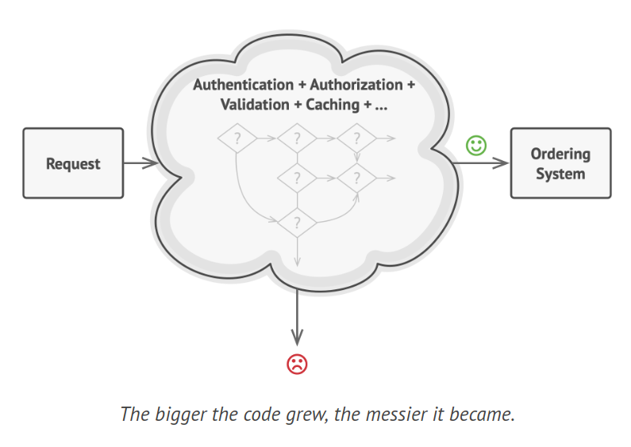
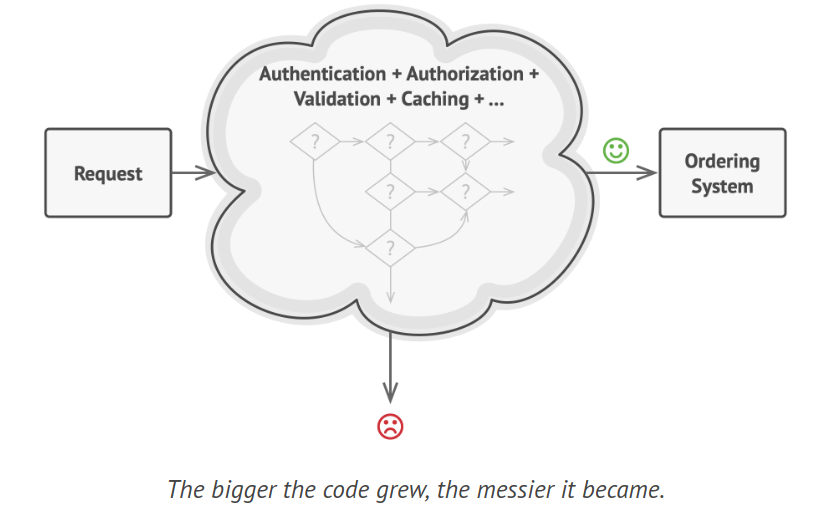
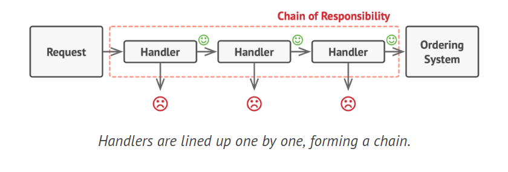
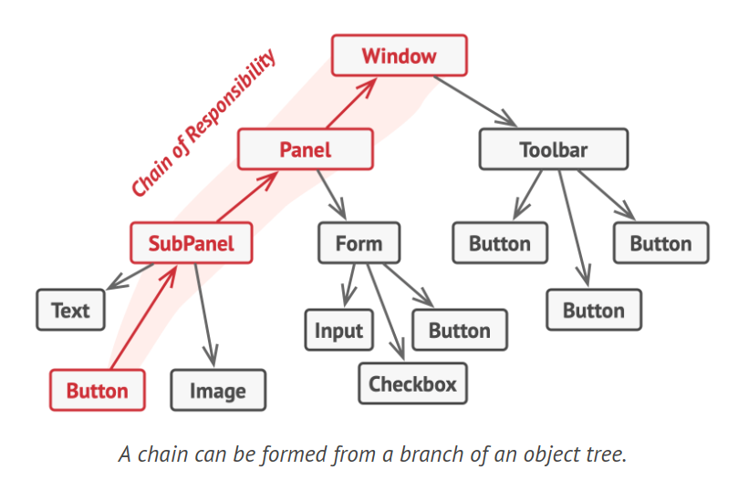
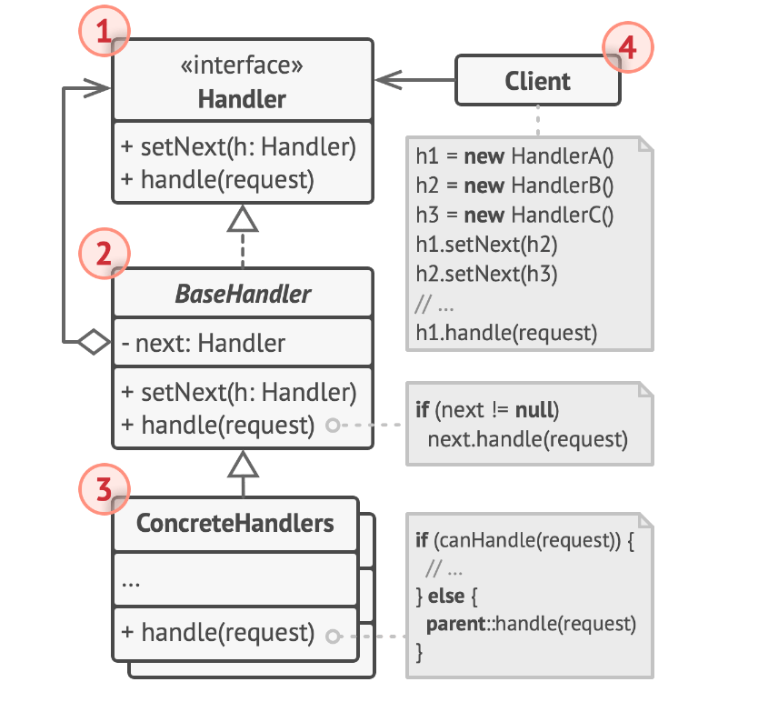
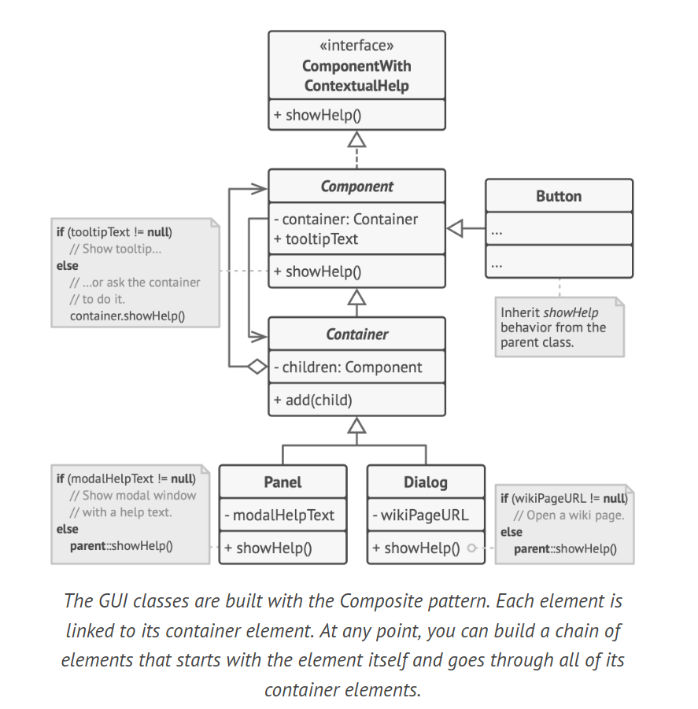

# Chain of Responsibility

Chain of Responsibility is a behavioral design pattern that lets you pass requests along a chain of handlers. Upon receiving a request, each handler decides either to process the request or to pass it to the next handler in the chain.

## Problem

Consider a scenario where you're developing an online ordering system. You need to ensure that only authenticated users can create orders, and users with administrative privileges should have unrestricted access to all orders.

After some planning, you realize that these checks need to be executed in a sequence. The system should attempt to authenticate a user whenever it receives a request with the user's credentials. If the credentials are incorrect and authentication fails, there's no need to continue with further checks.

The request must pass through a series of checks before the ordering system can process it. Over the next few months, you implement several more sequential checks:



- A colleague points out the risk of passing unfiltered data directly to the ordering system. So, you add an extra validation step to sanitize the request data.

- Later, a vulnerability to brute force password attacks is discovered. To counter this, you add a check to filter out repeated failed requests from the same IP address.

- Another suggestion is to improve system performance by returning cached results for repeated requests with the same data. So, you add another check to bypass the system if a suitable cached response is available.



As the codebase grows, it becomes increasingly disorganized. The checks, which were already complex, become even more convoluted with each new feature. Changes to one check sometimes affect others. When you try to reuse the checks to protect other system components, you find yourself duplicating code because those components require some, but not all, of the checks.

The system becomes difficult to understand and costly to maintain. After struggling with the code for a while, you decide to refactor the entire system.

## Solution

The Chain of Responsibility, like many behavioral design patterns, involves converting specific behaviors into independent objects known as handlers. In this context, each check should be its own class with a single method that carries out the check. The request and its data are passed to this method as an argument.

The pattern recommends linking these handlers into a chain. Each handler in the chain has a field to store a reference to the next handler. Besides processing a request, handlers also pass the request further along the chain. The request continues down the chain until all handlers have had the opportunity to process it.

A handler can choose not to pass the request further, effectively halting any further processing. In the case of the ordering system, a handler performs the processing and then decides whether to pass the request further down the chain. If the request contains the correct data, all handlers can perform their primary function, such as authentication checks or caching.



However, there's an alternative approach where a handler, upon receiving a request, decides if it can process it. If it can, it doesn't pass the request any further. So, either only one handler processes the request, or none at all. This approach is common in GUI event handling.

For example, when a user clicks a button, the event propagates through a chain of GUI elements starting with the button, through its containers, and ending with the main application window. The event is processed by the first element in the chain capable of handling it.



It's important that all handler classes implement the same interface. Each handler should only care about the next one having the execute method. This allows you to compose chains at runtime, using various handlers without coupling your code to their specific classes.

Consider the real-world analogy of installing new hardware on your computer. If the hardware isn't supported by your operating system, you might call tech support. Your call could go through an autoresponder, a live operator, and finally an engineer who provides the solution. This is similar to a request passing through a chain of handlers until it is processed.

## Structure



1. The Handler: This interface is common for all concrete handlers. It typically contains a single method for handling requests and occasionally a method for setting the next handler in the chain.

2. The Base Handler: This optional class can contain common boilerplate code for all handler classes. It usually defines a field for storing a reference to the next handler. Clients can build a chain by passing a handler to the constructor or setter of the previous handler. It may also implement the default handling behavior, passing execution to the next handler after checking its existence.

3. Concrete Handlers: These contain the actual code for processing requests. Each handler must decide whether to process a request and whether to pass it along the chain. Handlers are generally self-contained and immutable, accepting all necessary data once via the constructor.

4. The Client: Depending on the application's logic, the client may compose chains once or dynamically. A request can be sent to any handler in the chain, not necessarily the first one.

## How to Implement

1. Define the handler interface and outline the method signature for handling requests. Decide how the client will pass the request data into the method. The most flexible approach is to transform the request into an object and pass it as an argument to the handling method.

2. To avoid repeating boilerplate code in concrete handlers, consider creating an abstract base handler class derived from the handler interface. This class should have a field to store a reference to the next handler in the chain. If you plan to modify chains at runtime, define a setter to change the value of the reference field. Implement a default behavior for the handling method to forward the request to the next object if it exists. Concrete handlers can use this behavior by calling the parent method.

3. Sequentially create concrete handler subclasses and implement their handling methods. Each handler should decide whether to process the request and whether to pass it along the chain when receiving a request.

4. The client can either assemble chains independently or receive pre-built chains from other objects. In the latter case, implement some factory classes to build chains according to the configuration or environment settings.

5. The client can trigger any handler in the chain, not necessarily the first one. The request will be passed along the chain until a handler refuses to pass it further or it reaches the end of the chain.

6. Due to the chain's dynamic nature, the client should be prepared for the following scenarios: the chain may consist of a single link, some requests may not reach the end of the chain, and others may reach the end of the chain without being handled.

## Example Code



```java
interface HelpHandler {
    void showHelp();
}

// Base component class
abstract class Component implements HelpHandler {
    String tooltipText;
    Container container;

    @Override
    public void showHelp() {
        if (tooltipText != null) {
            System.out.println(tooltipText);
        } else if (container != null) {
            container.showHelp();
        }
    }
}

// Container class
abstract class Container extends Component {
    List<Component> children = new ArrayList<>();

    public void add(Component child) {
        children.add(child);
        child.container = this;
    }
}

// Button class
class Button extends Component {
    public Button(String tooltipText) {
        this.tooltipText = tooltipText;
    }
}

// Panel class
class Panel extends Container {
    String modalHelpText;

    public Panel(String modalHelpText) {
        this.modalHelpText = modalHelpText;
    }

    @Override
    public void showHelp() {
        if (modalHelpText != null) {
            System.out.println(modalHelpText);
        } else {
            super.showHelp();
        }
    }
}

// Dialog class
class Dialog extends Container {
    String wikiPageURL;

    public Dialog(String wikiPageURL) {
        this.wikiPageURL = wikiPageURL;
    }

    @Override
    public void showHelp() {
        if (wikiPageURL != null) {
            System.out.println("Opening wiki page: " + wikiPageURL);
        } else {
            super.showHelp();
        }
    }
}
```

## Applicability

1. Use the Chain of Responsibility pattern when your program needs to handle various types of requests in different ways, and the exact types and sequences of requests are not known in advance. The pattern allows you to link multiple handlers into a chain and, upon receiving a request, each handler can be queried if it can process it. This gives all handlers an opportunity to process the request.

2. Employ the pattern when it's crucial to execute multiple handlers in a specific order. Since handlers can be linked in any order in the chain, all requests will traverse the chain exactly as planned.

3. Apply the Chain of Responsibility pattern when the set of handlers and their order need to change at runtime. By providing setters for a reference field inside the handler classes, you can dynamically insert, remove, or reorder handlers.
