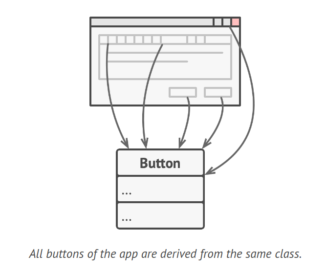
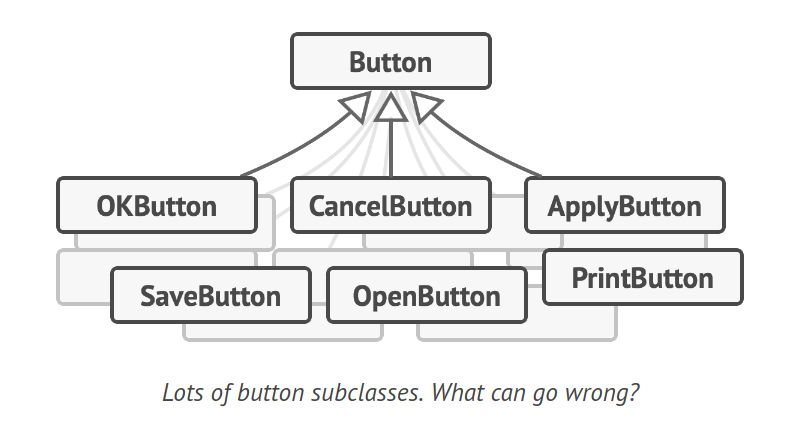
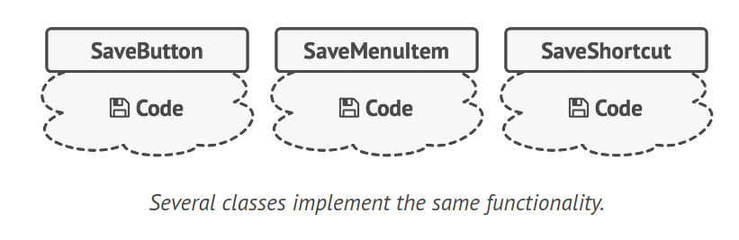
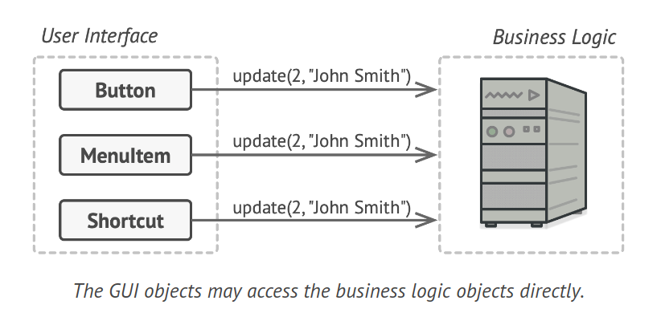
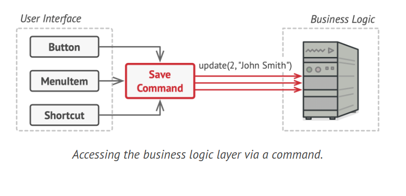
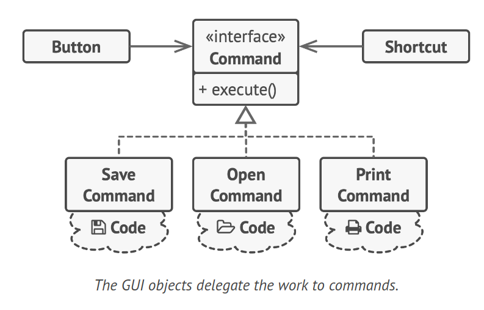
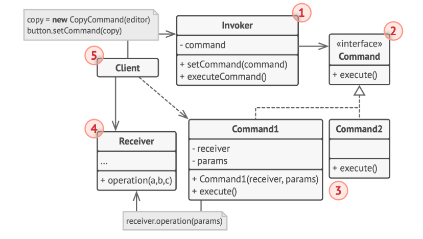
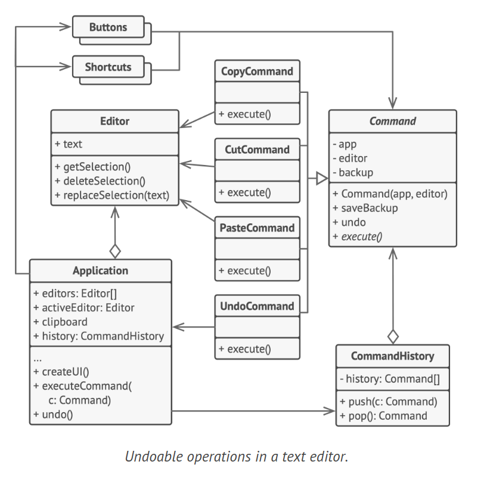

# Command Design Pattern

The Command design pattern is a behavioral pattern that encapsulates a request as an independent object, encompassing all the request's details. This encapsulation allows for the passing of requests as method arguments, the postponement or queuing of request execution, and the facilitation of operations that can be undone.

## Problem

Consider that you're developing a new text-editor application. Your current task involves creating a toolbar with numerous buttons, each performing different operations in the editor. You've developed a versatile Button class that can be utilized for toolbar buttons and generic buttons in various dialogs. All application buttons are derived from this class.



While these buttons appear similar, they're intended to perform different actions. Where would you place the code for the various click handlers of these buttons? The simplest solution might seem to be creating numerous subclasses for each location where the button is used. These subclasses would contain the code to be executed upon a button click.



However, this approach soon reveals its flaws. Firstly, you end up with a vast number of subclasses, which could be manageable if not for the risk of breaking the code in these subclasses each time you modify the base Button class. In essence, your GUI code becomes uncomfortably dependent on the volatile code of the business logic.



The situation worsens when some operations, such as copy/paste, need to be invoked from multiple places. A user could click a "Copy" button on the toolbar, use the context menu, or simply press Ctrl+C on the keyboard.

Initially, when our app only had a toolbar, it was acceptable to place the implementation of various operations into the button subclasses. For instance, having the code for copying text inside the CopyButton subclass was fine. However, when you implement context menus, shortcuts, and other features, you either have to duplicate the operation's code in many classes or make menus dependent on buttons, which is an even worse option.

## Solution

Effective software design often adheres to the principle of separation of concerns, typically resulting in an application being divided into layers. A common example is a layer for the graphical user interface (GUI) and another for business logic. The GUI layer is tasked with rendering visuals on the screen, capturing user input, and displaying the results of user and application actions. However, for significant tasks like calculating the moon's trajectory or compiling an annual report, the GUI layer delegates the work to the business logic layer.

In code, this might appear as a GUI object calling a business logic object's method, passing it some arguments. This process is often described as one object sending a request to another.



The Command pattern suggests that GUI objects shouldn't send these requests directly. Instead, all request details, such as the object being called, the method name, and the list of arguments, should be extracted into a separate command class with a single method that triggers this request.

Command objects act as links between various GUI and business logic objects. The GUI object no longer needs to know which business logic object will receive the request and how it will be processed. The GUI object simply triggers the command, which handles all the details.



The next step is to have your commands implement the same interface, usually with a single execution method that takes no parameters. This interface allows you to use various commands with the same request sender, without coupling it to specific command classes. As a bonus, you can now switch command objects linked to the sender, effectively changing the sender's behavior at runtime.

One missing piece of the puzzle is the request parameters. A GUI object might have supplied the business-layer object with some parameters. Since the command execution method doesn't have any parameters, how do we pass the request details to the receiver? The command should either be pre-configured with this data or capable of obtaining it independently.



Returning to our text editor example, after applying the Command pattern, we no longer need all those button subclasses to implement various click behaviors. It's sufficient to put a single field into the base Button class that stores a reference to a command object and make the button execute that command on a click.

You'll implement a bunch of command classes for every possible operation and link them with specific buttons, depending on the buttons' intended behavior.

Other GUI elements, such as menus, shortcuts, or entire dialogs, can be implemented similarly. They'll be linked to a command which gets executed when a user interacts with the GUI element. As you've probably guessed by now, elements related to the same operations will be linked to the same commands, preventing any code duplication.

As a result, commands become a convenient middle layer that reduces coupling between the GUI and business logic layers. And that's just a fraction of the benefits that the Command pattern can offer!

A real-world analogy is making an order in a restaurant. After a long city walk, you arrive at a nice restaurant and sit at a window table. A friendly waiter takes your order, writing it down on a piece of paper. The waiter goes to the kitchen and sticks the order on the wall. After a while, the order gets to the chef, who reads it and cooks the meal accordingly. The cook places the meal on a tray along with the order. The waiter finds the tray, checks the order to ensure everything is as you wanted it, and brings everything to your table.

The paper order serves as a command. It remains in a queue until the chef is ready to serve it. The order contains all the relevant information required to cook the meal. It allows the chef to start cooking right away instead of running around clarifying the order details from you directly.

## Structure



1. The Sender class, also known as the invoker, initiates requests. It has a field to store a reference to a command object and triggers that command instead of sending the request directly to the receiver. The sender does not create the command object; it typically receives a pre-created command from the client via the constructor.

2. The Command interface usually declares a single method for executing the command.

3. Concrete Commands implement different types of requests. They are not meant to perform the work independently but to pass the call to one of the business logic objects. For code simplification, these classes can be merged. Parameters required to execute a method on a receiving object can be declared as fields in the concrete command. Command objects can be made immutable by only allowing the initialization of these fields via the constructor.

4. The Receiver class contains some business logic. Almost any object can act as a receiver. Most commands only handle the details of how a request is passed to the receiver, while the receiver itself does the actual work.

5. The Client creates and configures concrete command objects. The client must pass all of the request parameters, including a receiver instance, into the command's constructor. Afterward, the resulting command may be associated with one or multiple senders.

## How to Implement

1. Define the command interface with a single method for execution.

2. Begin transitioning requests into concrete command classes that implement the command interface. Each class should have fields for storing request arguments and a reference to the actual receiver object. These values should be initialized through the command's constructor.

3. Identify classes that will serve as senders. Add fields for storing commands to these classes. Senders should interact with their commands solely through the command interface. Typically, senders do not create command objects themselves but receive them from the client code.

4. Modify the senders to execute the command instead of directly sending a request to the receiver.

5. The client should initialize objects in this order:

    - Create receivers.
    - Create commands and link them with receivers if necessary.
    - Create senders and associate them with specific commands.

## Example Code



```java
interface Command {
    void execute();
    void undo();
}

// Concrete Command Classes
class CopyCommand implements Command {
    private Application app;
    private Editor editor;

    public CopyCommand(Application app, Editor editor) {
        this.app = app;
        this.editor = editor;
    }

    @Override
    public void execute() {
        app.clipboard = editor.getSelection();
    }

    @Override
    public void undo() {
        // No undo operation for CopyCommand
    }
}

class CutCommand implements Command {
    private Application app;
    private Editor editor;
    private String backup;

    public CutCommand(Application app, Editor editor) {
        this.app = app;
        this.editor = editor;
    }

    @Override
    public void execute() {
        backup = editor.getText();
        app.clipboard = editor.getSelection();
        editor.deleteSelection();
    }

    @Override
    public void undo() {
        editor.setText(backup);
    }
}

// Concrete Command Classes
class PasteCommand implements Command {
    private Application app;
    private Editor editor;
    private String backup;

    public PasteCommand(Application app, Editor editor) {
        this.app = app;
        this.editor = editor;
    }

    @Override
    public void execute() {
        System.out.println("Executing PasteCommand");
        backup = editor.getText();
        editor.replaceSelection(app.clipboard);
    }

    @Override
    public void undo() {
        System.out.println("Undoing PasteCommand");
        editor.setText(backup);
    }
}

// Receiver Classes
class Application {
    String clipboard;
    Editor activeEditor;
    CommandHistory history;

    // Initialize history in the constructor
    Application() {
        this.history = new CommandHistory();
    }

    void executeCommand(Command command) {
        System.out.println("Executing command");
        if (command != null) {
            command.execute();
            history.push(command);
        }
    }

    void undo() {
        System.out.println("Undoing command");
        Command command = history.pop();
        if (command != null) {
            command.undo();
        }
    }
}

class Editor {
    String text;

    String getText() {
        return text;
    }

    void setText(String text) {
        this.text = text;
    }

    String getSelection() {
        // Return selected text
        return "";
    }

    void deleteSelection() {
        // Delete selected text
    }

    void replaceSelection(String text) {
        // Replace selected text with input text
    }
}

// Command History Class
class CommandHistory {
    private Stack<Command> history = new Stack<>();

    void push(Command command) {
        history.push(command);
    }

    Command pop() {
        return history.pop();
    }
}
```

## Applicability

1. Use the Command pattern when you want to parameterize objects with operations. This pattern can transform a specific method call into a standalone object, allowing for various uses such as passing commands as method arguments, storing them inside other objects, and switching linked commands at runtime. For instance, when developing a GUI component like a context menu, the Command pattern allows users to configure menu items that trigger operations upon user interaction.

2. Use the Command pattern when you want to queue operations, schedule their execution, or execute them remotely. Commands can be serialized, meaning they can be converted into a string for easy storage in a file or database. This allows for delayed and scheduled command execution, as well as queuing, logging, or sending commands over a network.

3. Use the Command pattern when you want to implement reversible operations. While there are various ways to implement undo/redo functionality, the Command pattern is a popular choice. To revert operations, you need to maintain a history of performed operations. This history is a stack containing all executed command objects and related backups of the application's state.

4. However, there are two main drawbacks to this method. Firstly, saving an application's state can be challenging due to potential private data, although this can be mitigated with the Memento pattern. Secondly, state backups may consume a significant amount of RAM. An alternative implementation could involve the command performing the inverse operation instead of restoring the past state, although this can be difficult or even impossible to implement.

