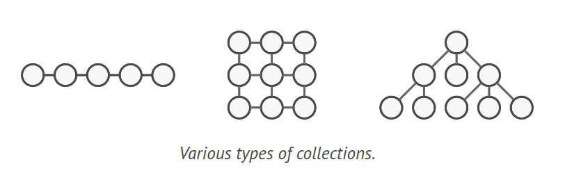
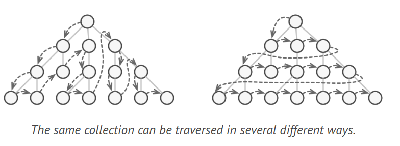
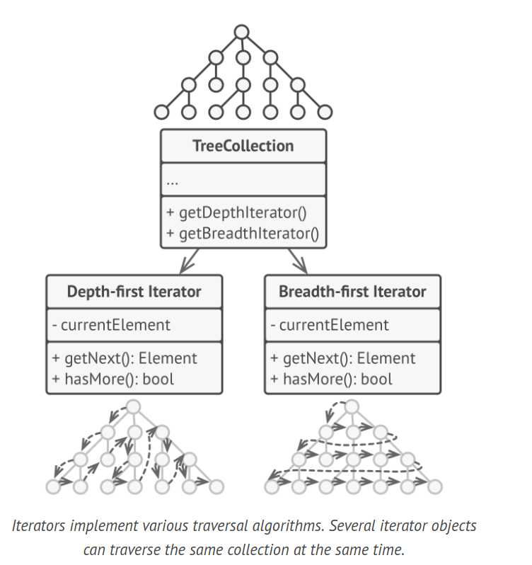
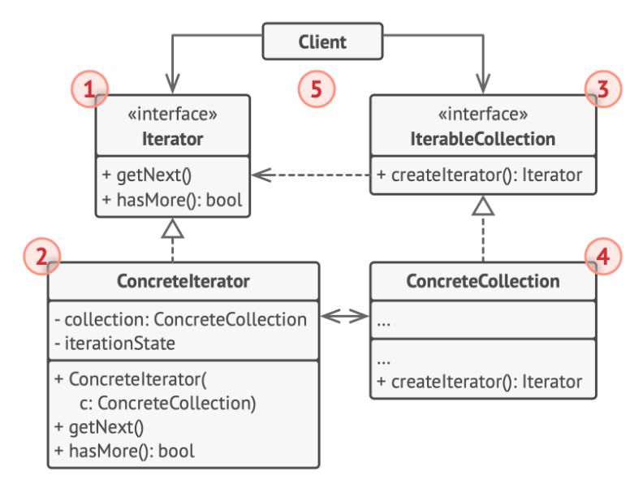
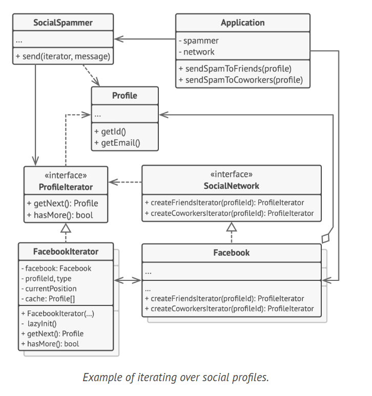

# Iterator Design Pattern

The Iterator is a type of behavioral design pattern which allows you to navigate through elements of a collection, while keeping its underlying structure (such as a list, stack, tree, etc.) hidden.

## Problem

Collections are widely used data structures that hold groups of objects. They can be based on simple lists or more complex structures like stacks, trees, or graphs. Regardless of their structure, collections need to provide a way to access their elements for use by other code. This involves iterating over each element without repetition.



While iterating over a list-based collection might be straightforward, traversing complex structures like trees can be challenging. Different traversal methods may be needed at different times, such as depth-first, breadth-first, or even random access.



The ability to traverse a collection in various ways can complicate the collection's primary role of efficient data storage. Including specific traversal algorithms in a generic collection class can be inappropriate, especially if they are tailored for a specific application.

Client code working with different collections may not be concerned with how they store their elements. However, as collections provide different ways to access their elements, the client code must couple with specific collection classes.

## Solution

The Iterator pattern's core concept is to separate a collection's traversal behavior into an independent object, known as an iterator. This iterator not only implements the traversal algorithm but also encapsulates all traversal details, such as the current position and remaining elements.



This separation allows multiple iterators to traverse the same collection simultaneously, independently of each other. Typically, iterators offer a primary method to fetch collection elements. The client can repeatedly call this method until it returns nothing, indicating that the iterator has traversed all elements.

All iterators should implement the same interface, making the client code compatible with any collection type or traversal algorithm, provided there's a suitable iterator. If a unique traversal method is needed, a new iterator class can be created without altering the collection or the client.

Consider the real-world analogy of exploring Rome. You could wander aimlessly, use a virtual guide app, or hire a local guide. Each option acts as an iterator over Rome's collection of sights, providing different ways to traverse the attractions.

## Structure



1. The Iterator interface outlines the necessary operations for traversing a collection, such as fetching the next element, getting the current position, and restarting the iteration.

2. Concrete Iterators implement specific traversal algorithms for a collection. The iterator object should independently track its own traversal progress, allowing multiple iterators to traverse the same collection independently.

3. The Collection interface defines one or more methods to obtain iterators compatible with the collection. The return type of these methods should be declared as the iterator interface, allowing concrete collections to return different types of iterators.

4. Concrete Collections return new instances of a specific concrete iterator class each time the client requests one. The rest of the collection's code should be in the same class, but these details are not crucial to the pattern and are therefore omitted.

5. The Client interacts with both collections and iterators through their interfaces, preventing coupling to concrete classes and allowing various collections and iterators to be used with the same client code. Clients typically obtain iterators from collections, but in some cases, they may create one directly, such as when the client needs a custom iterator.

## How to Implement

1. Define the iterator interface. At a minimum, it should include a method for retrieving the next element from a collection. For added convenience, consider adding additional methods, such as retrieving the previous element, tracking the current position, and checking if the iteration has ended.

2. Define the collection interface and include a method for obtaining iterators. The return type should match the iterator interface. If you anticipate having several distinct groups of iterators, you may declare similar methods.

3. Implement concrete iterator classes for the collections that you want to be traversable with iterators. An iterator object should be associated with a single collection instance, typically established through the iterator's constructor.

4. Implement the collection interface in your collection classes. The primary goal is to provide the client with a shortcut for creating iterators, customized for a specific collection class. The collection object should pass itself to the iterator's constructor to establish a link between them.

5. Review the client code and replace all collection traversal code with the use of iterators. The client should fetch a new iterator object each time it needs to iterate over the collection elements.

## Example Code



```java

```

## Applicability

1. The Iterator pattern is useful when you have a collection with a complex underlying data structure that you want to keep hidden from clients for convenience or security reasons. The iterator encapsulates the complexities of interacting with a complex data structure, offering the client simple methods to access collection elements. This not only simplifies the client's interaction but also safeguards the collection from potential careless or harmful actions that could occur if the client directly interacted with the collection.

2. The pattern is also beneficial in reducing the duplication of traversal code throughout your application. Non-trivial iteration algorithms can be bulky and, when placed within an app's business logic, can obscure the original code's responsibility and reduce maintainability. Moving the traversal code to dedicated iterators can streamline the application code.

3. Use the Iterator pattern when you want your code to traverse different data structures or when the types of these structures are not known in advance. The pattern provides generic interfaces for both collections and iterators. As your code uses these interfaces, it will continue to work with various types of collections and iterators that implement these interfaces.
