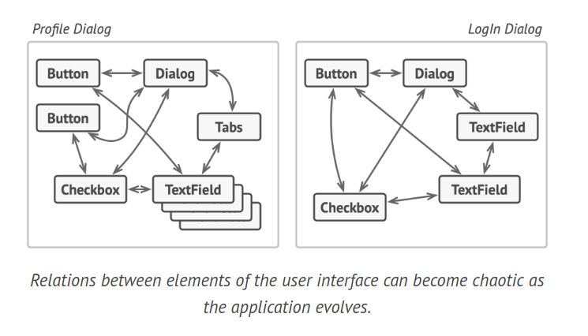
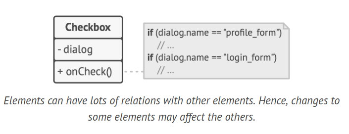
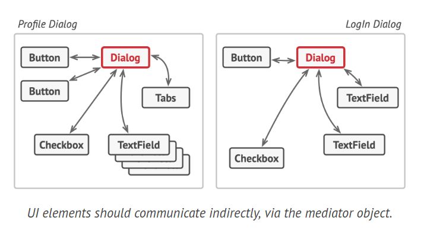
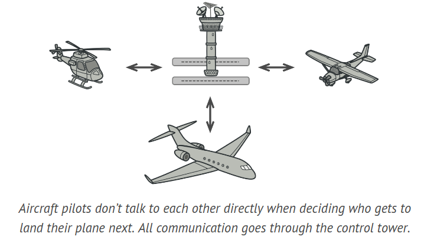
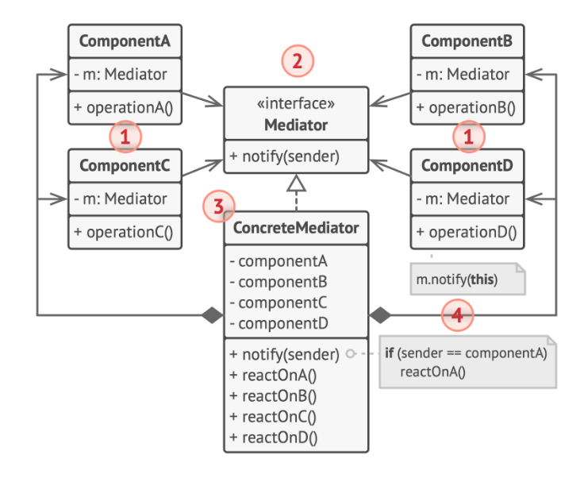

# Mediator Design Pattern

The Mediator is a behavioral design pattern that simplifies complex interactions and dependencies between objects. This pattern limits direct communication between objects, requiring them to interact solely through a mediator object.

## Problem

Consider a dialog used for creating and editing customer profiles. This dialog includes various form controls such as text fields, checkboxes, buttons, etc. As the application grows, the relationships between these user interface elements can become increasingly complex.



Certain form elements may interact with others. For example, selecting the "I have a dog" checkbox could unveil a hidden text field for inputting the dog's name. Another example is the submit button, which needs to validate all field values before saving the data.

These elements can have numerous relationships with other elements, meaning changes to one element can impact others.



If this logic is directly implemented within the form elements' code, it makes these elements' classes more difficult to reuse in other forms within the app. For instance, the checkbox class can't be used in another form because it's tied to the dog's text field. You would either have to use all the classes involved in rendering the profile form or none at all, limiting reusability.

## Solution

The Mediator pattern proposes that you should halt all direct communication between components that you want to decouple. Instead, these components should collaborate indirectly via a special mediator object that reroutes the calls to the appropriate components. Consequently, the components only depend on a single mediator class rather than being linked to numerous colleagues.



In the context of our profile editing form example, the dialog class itself could act as the mediator. Since the dialog class is likely already aware of all its sub-elements, there may not be a need to introduce new dependencies into this class.

The most significant change occurs to the actual form elements. Take the submit button for instance. Previously, each time a user clicked the button, it had to validate the values of all individual form elements. Now, its sole job is to notify the dialog about the click. The dialog then performs the validations or delegates the task to the individual elements. Thus, instead of being tied to multiple form elements, the button is only dependent on the dialog class.

You can further loosen this dependency by extracting a common interface for all types of dialogs. This interface would declare the notification method that all form elements can use to notify the dialog about events. Therefore, our submit button should now be able to work with any dialog that implements this interface.

The Mediator pattern allows you to encapsulate a complex network of relationships between various objects within a single mediator object. The fewer dependencies a class has, the easier it is to modify, extend, or reuse that class.



Consider the real-world analogy of aircraft pilots. They don't communicate directly with each other when deciding who gets to land their plane next. All communication goes through the control tower. Without the air traffic controller, pilots would need to be aware of every plane in the vicinity of the airport, discussing landing priorities with a committee of dozens of other pilots. The control tower doesn't need to control the entire flight. It exists only to enforce constraints in the terminal area because the number of involved actors there might be overwhelming to a pilot.

## Structure



1. Components are various classes that carry out business logic. Each component holds a reference to a mediator, defined by the mediator interface type. The component is unaware of the mediator's actual class, allowing for component reuse in other programs by connecting it to a different mediator.

2. The Mediator interface outlines communication methods with components, typically including a single notification method. Components can pass any context as arguments of this method, including their own objects, as long as it doesn't result in coupling between the receiving component and the sender's class.

3. Concrete Mediators encapsulate relationships between different components. They often hold references to all components they manage and sometimes even oversee their lifecycle.

4. Components should not be aware of other components. If a significant event occurs within or to a component, it should only notify the mediator. Upon receiving the notification, the mediator can identify the sender, which may be sufficient to determine which component should be triggered in response. From a component's perspective, it's like a black box. The sender doesn't know who will handle its request, and the receiver doesn't know who sent the request.

## How to Implement

Identify a set of closely linked classes that would benefit from increased independence, such as for easier maintenance or simpler reuse of these classes.

Define the mediator interface and outline the desired communication protocol between mediators and various components. Typically, a single method for receiving notifications from components is enough. This interface is essential when you want to reuse component classes in different contexts. As long as the component interacts with its mediator via the generic interface, you can link the component with a different mediator implementation.

Implement the concrete mediator class. This class would find it beneficial to store references to all of the components it manages.

You can take it a step further and make the mediator responsible for the creation and destruction of component objects. After this, the mediator might resemble a factory or a facade.

Components should keep a reference to the mediator object. The connection is usually established in the component’s constructor, where a mediator object is passed as an argument.

Modify the components’ code so they call the mediator's notification method instead of methods on other components. Move the code that involves calling other components into the mediator class. Execute this code whenever the mediator receives notifications from that component.

## Example Code

```java
interface Mediator {
    void notify(Component sender, String event);
}

class AuthenticationDialog implements Mediator {
    private String title;
    private Checkbox loginOrRegisterChkBx;
    private Textbox loginUsername, loginPassword;
    private Textbox registrationUsername, registrationPassword, registrationEmail;
    private Button okBtn, cancelBtn;

    public AuthenticationDialog() {
        // Create all component objects and pass the current mediator into their constructors to establish links.
    }

    public void notify(Component sender, String event) {
        if (sender.equals(loginOrRegisterChkBx) && event.equals("check")) {
            if (loginOrRegisterChkBx.checked) {
                title = "Log in";
                // Show login form components and hide registration form components.
            } else {
                title = "Register";
                // Show registration form components and hide login form components.
            }
        }

        if (sender.equals(okBtn) && event.equals("click")) {
            if (loginOrRegisterChkBx.checked) {
                // Try to find a user using login credentials.
                // If not found, show an error message above the login field.
                // Else, create a user account using data from the registration fields and log that user in.
            }
        }
    }
}

class Component {
    protected Mediator dialog;

    public Component(Mediator dialog) {
        this.dialog = dialog;
    }

    public void click() {
        dialog.notify(this, "click");
    }

    public void keypress() {
        dialog.notify(this, "keypress");
    }
}

class Button extends Component {

    public Button(Mediator dialog) {
        super(dialog);
        //TODO Auto-generated constructor stub
    }
    // Button specific code...
}

class Textbox extends Component {

    public Textbox(Mediator dialog) {
        super(dialog);
        //TODO Auto-generated constructor stub
    }
    // Textbox specific code...
}

class Checkbox extends Component {
    public Checkbox(Mediator dialog) {
        super(dialog);
        //TODO Auto-generated constructor stub
    }

    public boolean checked;

    public void check() {
        dialog.notify(this, "check");
    }
    // Checkbox specific code...
}
```

## Applicability

1. Implement the Mediator pattern when it becomes challenging to modify certain classes due to their tight coupling with numerous other classes. This pattern allows you to extract all relationships between classes into a separate class, isolating any changes to a specific component from the rest of the components.

2. Use the Mediator pattern when a component can't be reused in a different program because it's heavily dependent on other components. After applying the Mediator, individual components become unaware of other components. They can still communicate with each other, albeit indirectly, through a mediator object. To reuse a component in a different app, you need to provide it with a new mediator class.

3. The Mediator pattern is useful when you find yourself creating a multitude of component subclasses just to reuse some basic behavior in various contexts.

4. Since all relations between components are contained within the mediator, it's easy to define entirely new ways for these components to collaborate by introducing new mediator classes, without having to change the components themselves.
