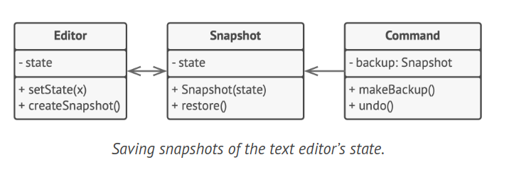

# Memento Design Pattern

The Memento design pattern is a behavioral pattern that allows you to capture and externalize an object's internal state so that it can be restored later, all without violating encapsulation. This pattern provides a mechanism to keep track of an object's state, enabling the ability to revert to a previous state when needed, without exposing the specifics of the object's implementation.

## Problem

Consider that you're developing a text editor application. This application not only allows basic text editing but also provides features like text formatting, inline image insertion, and so forth.

You decide to incorporate an 'undo' feature, a functionality that has become so ubiquitous that users now expect it in every application. For the implementation, you opt for a straightforward approach. Before any operation is performed, the application records the state of all objects and stores it. Later, when a user decides to undo an action, the application retrieves the most recent snapshot from the history and uses it to restore the state of all objects.


However, creating these state snapshots poses a challenge. You would likely need to traverse all the fields in an object and copy their values for storage. This approach would only be feasible if the object allowed easy access to its contents. Unfortunately, most objects encapsulate their significant data in private fields, making them inaccessible.

Ignoring this issue for now, let's assume that our objects are open and keep their state public. While this would solve the immediate problem and allow you to create snapshots of objects' states freely, it introduces other complications. In the future, you might decide to refactor some of the editor classes or modify some of the fields. This would necessitate changes to the classes responsible for copying the state of the affected objects.


Moreover, consider the actual "snapshots" of the editor's state. They must contain the actual text, cursor coordinates, current scroll position, etc. To create a snapshot, you'd need to gather these values and store them in a container.

You're likely to store many of these container objects within a list representing the history. Therefore, the containers would probably be objects of a single class. This class would have few methods but many fields that reflect the editor's state. To allow other objects to write and read data to and from a snapshot, you'd likely need to make its fields public. This would expose all the editor's states, whether private or not. Other classes would become dependent on every minor change to the snapshot class, which would otherwise occur within private fields and methods without affecting external classes.

It seems we've reached an impasse: you either expose all internal details of classes, making them overly fragile, or limit access to their state, making it impossible to create snapshots. Is there an alternative way to implement the 'undo' feature?

## Solution

The issues we've encountered stem from a violation of encapsulation. Some objects are overstepping their boundaries, intruding into the private space of other objects to gather the data needed for certain actions, rather than allowing these objects to perform the action themselves.

The Memento pattern addresses this by assigning the responsibility of creating state snapshots to the actual owner of that state, the originator object. This means that instead of other objects attempting to replicate the editor's state from the "outside", the editor class itself can create the snapshot as it has full access to its own state.

The pattern recommends storing the copy of the object's state in a specific object known as a memento. The contents of the memento are not accessible to any other object except the one that created it. Other objects must interact with mementos using a limited interface, which may allow retrieving the snapshot's metadata (such as creation time, the name of the executed operation, etc.), but not the original object's state contained in the snapshot.


This restrictive approach allows you to store mementos within other objects, typically referred to as caretakers. As the caretaker interacts with the memento solely via the limited interface, it cannot alter the state stored inside the memento. However, the originator has access to all fields within the memento, enabling it to restore its previous state whenever necessary.

In the context of our text editor example, we could create a separate history class to act as the caretaker. Each time the editor is about to perform an operation, a stack of mementos stored inside the caretaker will grow. This stack could even be displayed within the application's UI, showing the history of previously executed operations to the user.

When a user initiates the undo command, the history retrieves the most recent memento from the stack and returns it to the editor, requesting a rollback. As the editor has full access to the memento, it modifies its own state with the values retrieved from the memento.

## Structure

### Implementation based on nested classes


1. The Originator class has the ability to create snapshots of its own state and can also revert its state using these snapshots when necessary.

2. The Memento acts as a value object that serves as a snapshot of the originator's state. It is a common practice to make the memento immutable and to provide it with data only once, during the construction phase.

3. The Caretaker is aware of "when" and "why" to capture the originator's state, as well as when the state should be restored. The Caretaker can maintain a history of the originator by storing a stack of mementos. When the originator needs to revert to a previous state, the Caretaker retrieves the most recent memento from the stack and passes it to the originator's restoration method.

4. In this particular implementation, the Memento class is nested within the Originator. This allows the Originator to access the Memento's fields and methods, even if they are declared as private. Conversely, the Caretaker has very limited access to the Memento's fields and methods, which allows it to store mementos in a stack without being able to modify their state.

### Implementation based on an intermediate interface


1. If nested classes are not an option, you can limit access to the memento's fields by establishing a rule that caretakers can only interact with a memento through a specifically declared intermediary interface. This interface would only declare methods related to the memento's metadata.

2. Conversely, originators can directly interact with a memento object, accessing fields and methods declared in the memento class. The drawback of this method is that all members of the memento need to be declared as public.

### Implementation with even stricter encapsulation


1. This implementation allows for multiple types of originators and mementos. Each originator is associated with a specific memento class. Both originators and mementos do not expose their state to any other entity.

2. Caretakers are explicitly prohibited from altering the state stored in mementos. Furthermore, the caretaker class becomes independent from the originator as the restoration method is now defined within the memento class.

3. Each memento is connected to the originator that created it. The originator passes itself along with its state values to the memento's constructor. Due to the close relationship between these classes, a memento can restore the state of its originator, provided the originator has defined the necessary setters.

## How to Implement

1. Identify which class will act as the originator. It's crucial to determine whether the program utilizes one central object of this type or multiple smaller ones.

2. Develop the memento class. Sequentially, declare a set of fields that reflect the fields declared inside the originator class.

3. Ensure the memento class is immutable. A memento should receive data only once, through the constructor. The class should not have any setters.

4. If your programming language supports nested classes, nest the memento inside the originator. If not, extract a blank interface from the memento class and have all other objects use it to refer to the memento. You can add some metadata operations to the interface, but avoid anything that exposes the originator's state.

5. Incorporate a method for generating mementos into the originator class. The originator should transfer its state to the memento via one or more arguments of the memento's constructor. The return type of the method should be of the interface you extracted earlier (assuming you did extract it). Internally, the memento-producing method should interact directly with the memento class.

6. Include a method for restoring the originator's state in its class. This method should take a memento object as an argument. If you extracted an interface earlier, use it as the type of the parameter. In this case, you'll need to typecast the incoming object to the memento class, as the originator requires full access to that object.

7. The caretaker, whether it's a command object, a history, or something else entirely, should know when to request new mementos from the originator, how to store them, and when to restore the originator with a specific memento.

8. The connection between caretakers and originators can be moved into the memento class. In this scenario, each memento must be linked to the originator that created it. The restoration method would also move to the memento class. However, this only makes sense if the memento class is nested within the originator or if the originator class provides sufficient setters for overriding its state.

## Example Code



```java
class Editor {
    private String text;
    private int curX, curY, selectionWidth;

    public void setText(String text) {
        this.text = text;
    }

    public void setCursor(int x, int y) {
        this.curX = x;
        this.curY = y;
    }

    public void setSelectionWidth(int width) {
        this.selectionWidth = width;
    }

    public Snapshot createSnapshot() {
        return new Snapshot(this, text, curX, curY, selectionWidth);
    }
}

class Snapshot {
    private Editor editor;
    private String text;
    private int curX, curY, selectionWidth;

    public Snapshot(Editor editor, String text, int curX, int curY, int selectionWidth) {
        this.editor = editor;
        this.text = text;
        this.curX = curX;
        this.curY = curY;
        this.selectionWidth = selectionWidth;
    }

    public void restore() {
        editor.setText(text);
        editor.setCursor(curX, curY);
        editor.setSelectionWidth(selectionWidth);
    }
}

class Command {
    private Snapshot backup;

    public void makeBackup(Editor editor) {
        backup = editor.createSnapshot();
    }

    public void undo() {
        if (backup != null) {
            backup.restore();
        }
    }
}
```


## Applicability

1. The Memento pattern is useful when you need to create snapshots of an object's state to facilitate the restoration of a previous state.

2. This pattern allows you to create complete copies of an object's state, including private fields, and store them separately from the object. While the "undo" use case is a common application of this pattern, it is also crucial for handling transactions, particularly when an operation needs to be rolled back due to an error.

3. The Memento pattern should be used when direct access to the object's fields/getters/setters compromises its encapsulation.

4. The Memento pattern assigns the responsibility of creating a snapshot of its state to the object itself. This ensures that no other object can access the snapshot, thereby keeping the original object's state data secure.
