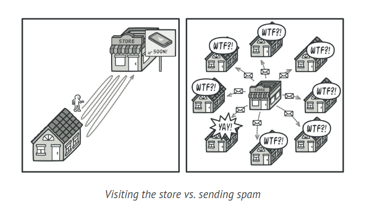
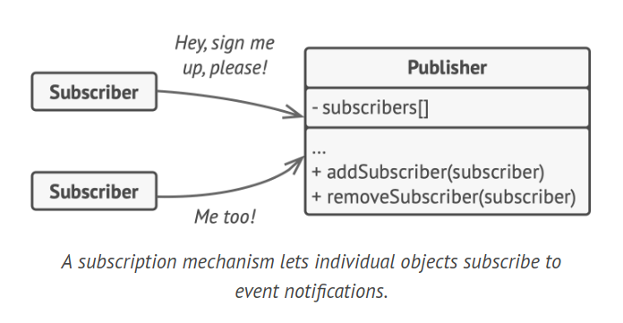
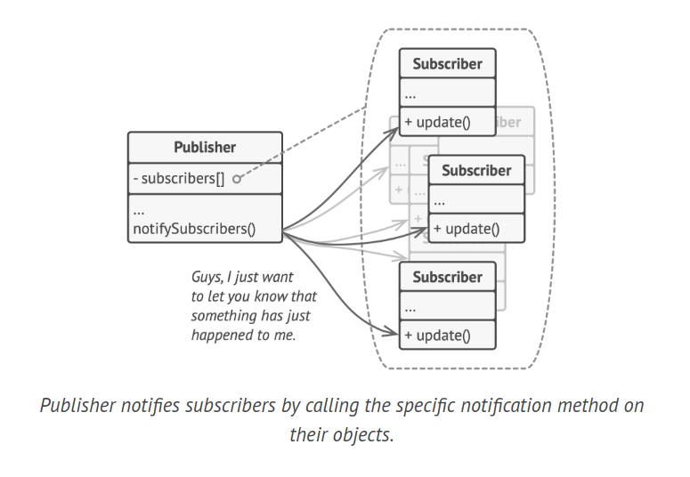
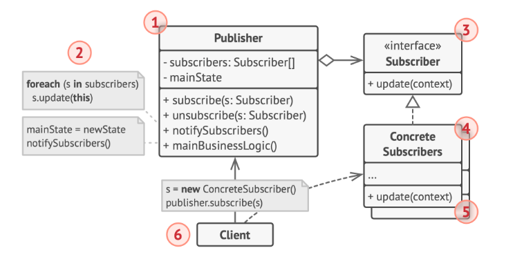
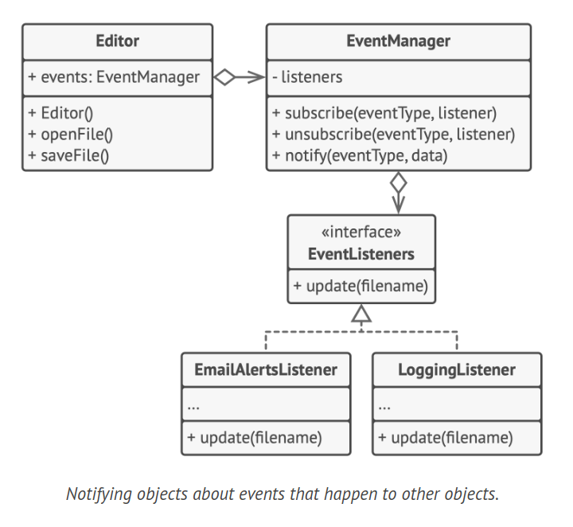

# Observer Design Pattern

Observer is a behavioral design pattern that allows you to establish a subscription system to alert numerous objects about any events occurring to the object they are monitoring.

## Problem

Consider a scenario where you have two types of entities: a Customer and a Store. The Customer is keenly interested in a specific brand of product (for instance, the latest iPhone model) which is expected to be in stock at the Store soon.

The Customer could make daily trips to the Store to check if the product has arrived. However, until the product is actually in stock, these visits would largely be in vain.

Alternatively, the Store could send out mass emails to all customers whenever a new product arrives. This approach could save some customers the hassle of unnecessary trips to the Store. However, it could also annoy other customers who have no interest in new products and view these emails as spam.



This situation presents a dilemma. Either the Customer wastes time frequently checking product availability, or the Store expends resources sending notifications to uninterested customers.

## Solution

In software design, we often encounter situations where a state change in one object needs to be communicated to other objects. In such scenarios, we can use the Observer design pattern.

In this pattern, the object whose state is of interest is known as the 'publisher'. Other objects that need to keep track of this state are known as 'subscribers'.

The Observer pattern proposes adding a subscription mechanism to the publisher class. This allows individual objects to subscribe to, or unsubscribe from, a stream of events emanating from the publisher.

This subscription mechanism is quite straightforward. It consists of an array field to store a list of references to subscriber objects, and several public methods to add or remove subscribers from this list.



When an important event occurs in the publisher, it iterates over its subscribers and calls a specific notification method on their objects.

In real-world applications, there might be many different subscriber classes interested in tracking events of the same publisher class. To avoid coupling the publisher to all these classes, it's important that all subscribers implement the same interface. The publisher should communicate with them only via this interface. This interface should declare the notification method and a set of parameters that the publisher can use to pass some contextual data along with the notification.



If your application has several different types of publishers and you want your subscribers to be compatible with all of them, you can make all publishers follow the same interface. This interface would only need to describe a few subscription methods, allowing subscribers to observe publishers' states without being coupled to their concrete classes.

A real-world analogy of this pattern is magazine and newspaper subscriptions. When you subscribe to a newspaper or magazine, you don't need to go to the store to check if the next issue is available. Instead, the publisher sends new issues directly to your mailbox. The publisher maintains a list of subscribers and knows which magazines they're interested in. Subscribers can leave the list at any time when they wish to stop receiving new magazine issues.

## Structure



1. The Publisher is an object that issues events of interest to other objects when its state changes or certain actions are performed. It maintains a subscription infrastructure that allows new subscribers to join and existing subscribers to leave.

2. When an event occurs, the publisher iterates over the subscription list and calls the notification method, as declared in the subscriber interface, on each subscriber object.

3. The Subscriber interface defines the notification interface. Typically, it consists of a single 'update' method. This method may have several parameters, allowing the publisher to pass some event details along with the update.

4. Concrete Subscribers are objects that perform specific actions in response to notifications issued by the publisher. All these classes must implement the same interface to ensure the publisher isn't coupled to concrete classes.

5. Subscribers often need some contextual information to handle the update correctly. Therefore, publishers commonly pass some context data as arguments of the notification method. The publisher can even pass itself as an argument, allowing the subscriber to fetch any required data directly.

6. The Client is responsible for creating publisher and subscriber objects separately and then registering subscribers for publisher updates.

## How to Implement

1. Analyze your business logic and divide it into two parts: the core functionality, which is independent of other code, will act as the publisher; the remaining code will become a set of subscriber classes.

2. Define the subscriber interface. At the very least, it should declare a single 'update' method.

3. Define the publisher interface and describe a pair of methods for adding and removing a subscriber object from the list. Keep in mind that publishers should interact with subscribers solely through the subscriber interface.

4. Decide where to place the actual subscription list and the implementation of subscription methods. Typically, this code is the same for all types of publishers, so it makes sense to place it in an abstract class derived directly from the publisher interface. Concrete publishers extend this class, inheriting the subscription behavior. However, if you're applying the pattern to an existing class hierarchy, consider a composition-based approach: place the subscription logic in a separate object and have all real publishers use it.

5. Create concrete publisher classes. Whenever something significant occurs within a publisher, it must notify all its subscribers.

6. Implement the 'update' notification methods in concrete subscriber classes. Most subscribers will need some context data about the event. This data can be passed as an argument of the notification method. Alternatively, upon receiving a notification, the subscriber can fetch any data directly from the notification. In this case, the publisher must pass itself via the 'update' method. A less flexible option is to permanently link a publisher to the subscriber via the constructor.

7. The client is responsible for creating all necessary subscribers and registering them with the appropriate publishers.

## Example Code



```java
interface EventListener {
    void update(String filename);
}

class EventManager {
    Map<String, List<EventListener>> listeners = new HashMap<>();

    public void subscribe(String eventType, EventListener listener) {
        List<EventListener> users = listeners.get(eventType);
        if (users == null) {
            users = new ArrayList<>();
            listeners.put(eventType, users);
        }
        users.add(listener);
    }

    public void unsubscribe(String eventType, EventListener listener) {
        List<EventListener> users = listeners.get(eventType);
        if (users != null) {
            users.remove(listener);
        }
    }

    public void notify(String eventType, String data) {
        List<EventListener> users = listeners.get(eventType);
        for (EventListener listener : users) {
            listener.update(data);
        }
    }
}

class Editor {
    public EventManager events;
    private String file;

    public Editor() {
        this.events = new EventManager();
    }

    public void openFile(String path) {
        this.file = path;
        events.notify("open", file);
    }

    public void saveFile() {
        events.notify("save", file);
    }
}

class LoggingListener implements EventListener {
    private String log;
    private String message;

    public LoggingListener(String log, String message) {
        this.log = log;
        this.message = message;
    }

    public void update(String filename) {
        System.out.println(log + ": " + message.replace("%s", filename));
    }
}

class EmailAlertsListener implements EventListener {
    private String email;
    private String message;

    public EmailAlertsListener(String email, String message) {
        this.email = email;
        this.message = message;
    }

    public void update(String filename) {
        System.out.println("Email sent to " + email + ": " + message.replace("%s", filename));
    }
}
```

## Applicability

1. The Observer pattern is useful when changes in one object's state necessitate changes in other objects, and the exact set of objects is either unknown in advance or changes dynamically.This situation often arises when working with graphical user interface classes. For instance, suppose you've created custom button classes and want to allow clients to attach custom code to your buttons, which will be triggered whenever a user presses a button.

2. The Observer pattern enables any object that implements the subscriber interface to subscribe to event notifications in publisher objects. You can incorporate the subscription mechanism into your buttons, allowing clients to connect their custom code via custom subscriber classes.

3. Use the Observer pattern when certain objects in your application need to observe others, but only temporarily or in specific situations. The subscription list is dynamic, meaning subscribers can join or leave the list as needed.
