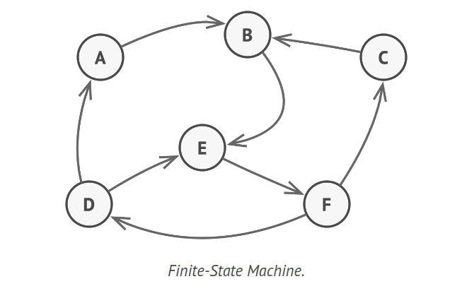
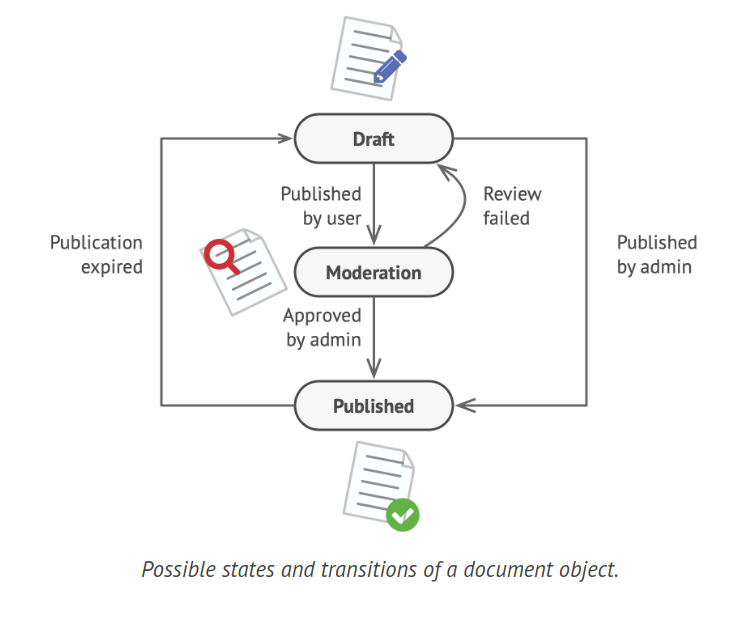
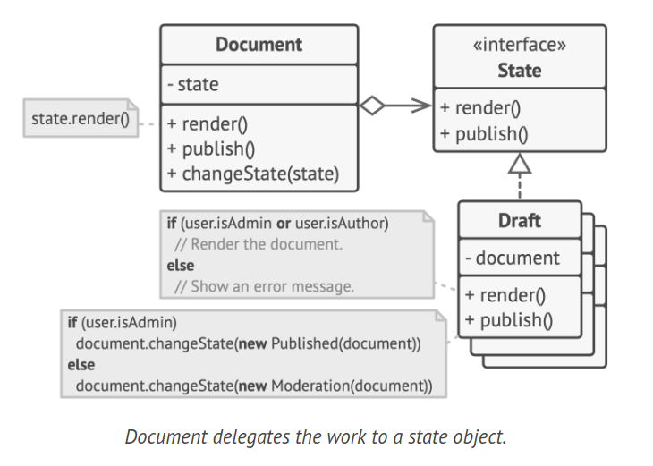
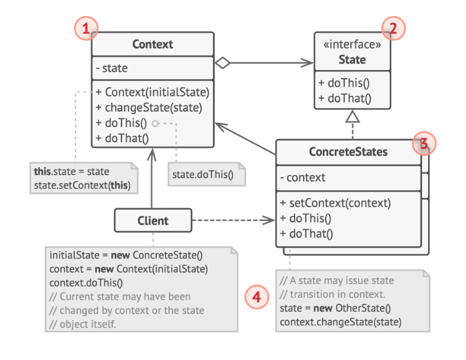
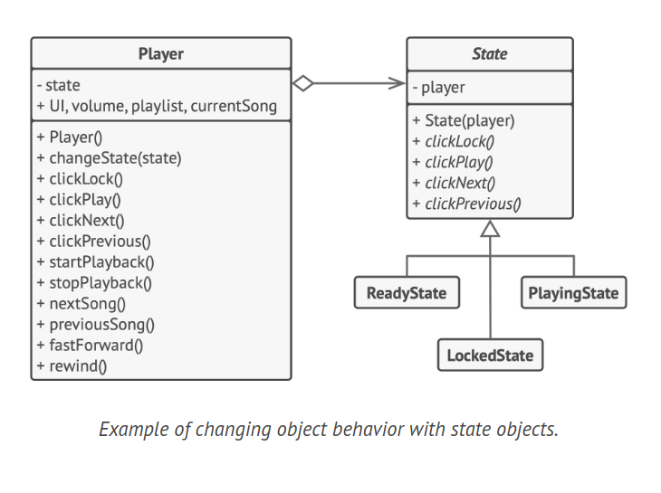

# State Design Pattern

The State is a behavioral design pattern that allows an object to modify its behavior when its internal state is altered. This gives the impression that the object's class has been changed.

## Problem

The State pattern is intrinsically linked to the concept of a Finite-State Machine. The core principle is that a program can be in a limited number of states at any given time. The program's behavior varies within each unique state, and it can instantaneously switch from one state to another. However, the program may or may not transition to certain states depending on its current state. These transition rules are also finite and predetermined.



This concept can also be applied to objects. For instance, consider a Document class. A document can exist in one of three states: Draft, Moderation, and Published. The publish method of the document behaves differently in each state:

In Draft, it transitions the document to moderation.
In Moderation, it makes the document public, but only if the current user is an administrator.
In Published, it doesn't perform any action.



State machines are typically implemented with numerous conditional operators (if or switch) that determine the appropriate behavior based on the object's current state. This "state" is usually a set of the object's field values. Even if you're unfamiliar with finite-state machines, you've likely implemented a state at least once.

```java
public class Document {
    private String state;
    private User currentUser;

    public Document(User currentUser) {
        this.state = "draft";
        this.currentUser = currentUser;
    }

    public void publish() {
        switch (state) {
            case "draft":
                state = "moderation";
                break;
            case "moderation":
                if (currentUser.getRole().equals("admin")) {
                    state = "published";
                }
                break;
            case "published":
                // Do nothing.
                break;
            default:
                // Handle other states if necessary.
                break;
        }
    }
}
```

The primary drawback of a state machine based on conditionals becomes apparent when we begin to add more states and state-dependent behaviors to the Document class. Most methods will contain large conditionals that select the appropriate behavior of a method according to the current state. This type of code is challenging to maintain because any change to the transition logic may require modifying state conditionals in every method.

The problem tends to escalate as a project progresses. Predicting all possible states and transitions at the design stage is challenging. Therefore, a lean state machine built with a limited set of conditionals can evolve into a cumbersome mess over time.

## Solution

The State pattern recommends creating new classes for all potential states of an object and moving all state-specific behaviors into these classes.

Instead of implementing all behaviors itself, the original object, known as the context, holds a reference to one of the state objects that represents its current state, and delegates all state-related tasks to that object. For example, a Document delegates tasks to a state object.



To transition the context into a different state, replace the active state object with another object representing the new state. This is feasible only if all state classes adhere to the same interface and the context interacts with these objects through this interface.

This structure might resemble the Strategy pattern, but there's a key difference. In the State pattern, the specific states may be aware of each other and initiate transitions from one state to another, whereas strategies almost never know about each other.

Real-World Analogy:

The buttons and switches on your smartphone behave differently based on the device's current state:

- When the phone is unlocked, pressing buttons executes various functions.
- When the phone is locked, pressing any button leads to the unlock screen.
- When the phone's battery is low, pressing any button displays the charging screen.

## Structure



1. The Context holds a reference to one of the concrete state objects and delegates all state-specific tasks to it. The Context interacts with the state object through the state interface. The Context provides a setter for receiving a new state object.

2. The State interface defines the state-specific methods. These methods should be applicable to all concrete states because you don't want some of your states to have redundant methods that will never be invoked.

3. Concrete States offer their own implementations for the state-specific methods. To prevent repetition of similar code across multiple states, you might provide intermediate abstract classes that encapsulate some common behavior. State objects may hold a backreference to the context object. Through this reference, the state can retrieve any necessary information from the context object, as well as initiate state transitions.

4. Both the Context and concrete states can determine the context's next state and execute the actual state transition by replacing the state object associated with the context.

## How to Implement

1. Determine which class will serve as the context. This could be an existing class that already contains state-dependent code, or a new class if the state-specific code is spread across multiple classes.

2. Declare the state interface. While it might reflect all the methods declared in the context, aim only for those that may contain state-specific behavior.

3. For each actual state, create a class that derives from the state interface. Then review the methods of the context and extract all code related to that state into your newly created class. While transferring the code to the state class, you might find that it relies on private members of the context. There are several solutions:
    - Make these fields or methods public.
    - Convert the behavior you're extracting into a public method in the context and call it from the state class. This approach is quick but not ideal, and you can always refine it later.
    - Nest the state classes within the context class, but only if your programming language supports nested classes.

4. In the context class, add a reference field of the state interface type and a public setter that allows changing the value of that field.

5. Review the method of the context again and replace empty state conditionals with calls to corresponding methods of the state object.

6. To change the state of the context, create an instance of one of the state classes and pass it to the context. This can be done within the context itself, in various states, or in the client. Wherever this is done, the class becomes dependent on the concrete state class that it instantiates.

## Example Code



```java
interface State {
    void clickLock();
    void clickPlay();
    void clickNext();
    void clickPrevious();
}

class AudioPlayer {
    private State state;
    // Other fields like UI, volume, playlist, currentSong can be added here

    public AudioPlayer() {
        this.state = new ReadyState(this);
        // Initialize other fields here
    }

    public void changeState(State state) {
        this.state = state;
    }

    public void clickLock() {
        state.clickLock();
    }

    public void clickPlay() {
        state.clickPlay();
    }

    public void clickNext() {
        state.clickNext();
    }

    public void clickPrevious() {
        state.clickPrevious();
    }

    // Other methods like startPlayback, stopPlayback, nextSong, previousSong, fastForward, rewind can be added here
}

class LockedState implements State {
    private AudioPlayer player;

    public LockedState(AudioPlayer player) {
        this.player = player;
    }

    public void clickLock() {
        // Implement behavior here
    }

    public void clickPlay() {
        // Implement behavior here
    }

    public void clickNext() {
        // Implement behavior here
    }

    public void clickPrevious() {
        // Implement behavior here
    }
}

class ReadyState implements State {
    private AudioPlayer player;

    public ReadyState(AudioPlayer player) {
        this.player = player;
    }

    public void clickLock() {
        // Implement behavior here
    }

    public void clickPlay() {
        // Implement behavior here
    }

    public void clickNext() {
        // Implement behavior here
    }

    public void clickPrevious() {
        // Implement behavior here
    }
}

class PlayingState implements State {
    private AudioPlayer player;

    public PlayingState(AudioPlayer player) {
        this.player = player;
    }

    public void clickLock() {
        // Implement behavior here
    }

    public void clickPlay() {
        // Implement behavior here
    }

    public void clickNext() {
        // Implement behavior here
    }

    public void clickPrevious() {
        // Implement behavior here
    }
}
```

## Applicability

1. Use the State pattern when an object's behavior varies based on its current state, the number of states is large, and the state-specific code frequently changes. The pattern recommends extracting all state-specific code into a set of separate classes. As a result, you can add new states or modify existing ones independently, reducing maintenance costs.

2. Use the pattern when a class is cluttered with extensive conditionals that change the class's behavior based on the current values of the class's fields. The State pattern allows you to extract branches of these conditionals into methods of corresponding state classes. In the process, you can also clear temporary fields and helper methods involved in state-specific code from your main class.

3. Use the State pattern when there is a lot of duplicate code across similar states and transitions of a condition-based state machine. The State pattern allows you to compose hierarchies of state classes and reduce duplication by extracting common code into abstract base classes.
