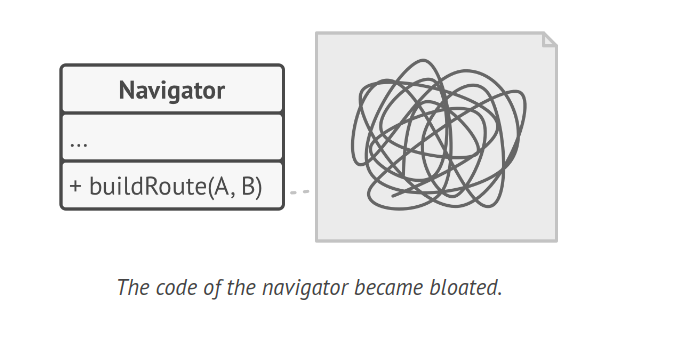
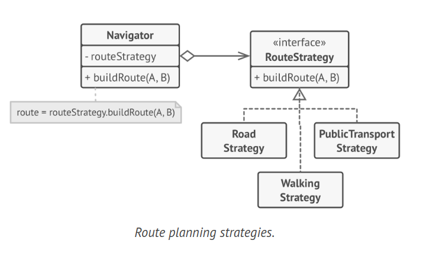
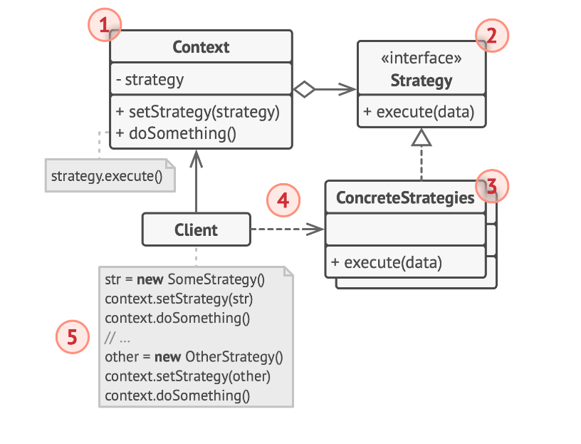

# Strategy Design Pattern

The Strategy design pattern is a type of behavioral pattern that allows you to establish a set of algorithms, encapsulate each one in a distinct class, and ensure their instances can be swapped interchangeably.

## Problem

Once upon a time, you decided to develop a navigation application aimed at casual travelers. The core feature of the app was a visually appealing map that allowed users to easily navigate any city.

A highly sought-after feature was automatic route planning. Users could input an address and the app would display the quickest route to that destination on the map.

The initial version of the app only supported route planning for roads, which was a hit among car travelers. However, it became apparent that not all vacationers preferred to drive. So, in the next update, you incorporated an option for pedestrian-friendly routes. This was quickly followed by an update that allowed users to plan routes using public transportation.

But this was just the start. You had plans to introduce route planning for cyclists and, later on, an option to plan routes that included all of a city's tourist attractions. As a result, the navigator's code became increasingly complex.



From a business standpoint, the app was a success, but it posed numerous technical challenges. Each addition of a new routing algorithm caused the navigator's main class to double in size. Eventually, the code became too unwieldy to manage.

Even minor changes to any of the algorithms, such as bug fixes or minor adjustments to the street score, affected the entire class. This increased the risk of introducing errors into the existing, functional code.

Furthermore, collaboration became inefficient. Your colleagues, who were hired following the app's successful launch, reported spending excessive time resolving merge conflicts. The implementation of new features necessitated changes to the same large class, leading to conflicts with code written by others.

## Solution

The Strategy pattern recommends that you take a class that performs a specific function in multiple ways and extract all these algorithms into separate classes, known as strategies.

The original class, now referred to as the context, should have a field to store a reference to one of the strategies. Instead of executing the work itself, the context delegates the task to the associated strategy object.

The context isn't tasked with choosing the appropriate algorithm for the job. Instead, the client provides the desired strategy to the context. In reality, the context doesn't know much about the strategies. It interacts with all strategies through the same generic interface, which only reveals a single method to trigger the algorithm encapsulated in the chosen strategy.

This approach makes the context independent of specific strategies, allowing you to add new algorithms or modify existing ones without altering the context's code or other strategies.



In our navigation app, each routing algorithm can be extracted into its own class with a single buildRoute method. This method takes an origin and destination and returns a set of the route's checkpoints.

Even though each routing class might construct a different route given the same arguments, the main navigator class isn't concerned with which algorithm is chosen. Its primary role is to display a set of checkpoints on the map. The class has a method to switch the active routing strategy, allowing its clients, such as the buttons in the user interface, to replace the current routing behavior with another one.


Real-World Analogy: Consider the various strategies for getting to the airport. You could take a bus, hail a cab, or ride your bicycle. These are your transportation strategies. Depending on factors like budget or time constraints, you can choose one of these strategies.

## Structure



1. The Context holds a reference to one of the concrete strategies and interacts with this object solely through the strategy interface.

2. The Strategy interface, common to all concrete strategies, defines a method that the context uses to execute a strategy.

3. Concrete Strategies are responsible for implementing different versions of an algorithm used by the context.

4. Whenever the context needs to run the algorithm, it calls the execution method on the associated strategy object. The context is unaware of the type of strategy it's working with or how the algorithm is executed.

5. The Client constructs a specific strategy object and passes it to the context. The context provides a setter that allows clients to change the strategy linked with the context at runtime.

## How to Implement

1. Identify an algorithm within the context class that is subject to frequent changes. This could also be a large conditional that selects and executes a variant of the same algorithm at runtime.

2. Define the strategy interface that is common to all versions of the algorithm.

3. Gradually, extract all algorithms into their own classes. Each of these should implement the strategy interface.

4. Add a field in the context class to store a reference to a strategy object. Provide a setter to change the values of that field. The context should interact with the strategy object solely through the strategy interface. The context may also define an interface that allows the strategy to access its data.

5. The context's clients must link it with an appropriate strategy that aligns with how they expect the context to execute its primary function.

## Example Code

```java
// Strategy Interface
interface Strategy {
    int execute(int a, int b);
}

// Concrete Strategy Classes
class ConcreteStrategyAdd implements Strategy {
    public int execute(int a, int b) {
        return a + b;
    }
}

class ConcreteStrategySubtract implements Strategy {
    public int execute(int a, int b) {
        return a - b;
    }
}

class ConcreteStrategyMultiply implements Strategy {
    public int execute(int a, int b) {
        return a * b;
    }
}

// Context Class
class Context {
    private Strategy strategy;

    public void setStrategy(Strategy strategy) {
        this.strategy = strategy;
    }

    public int executeStrategy(int a, int b) {
        return strategy.execute(a, b);
    }
}
```

## Applicability

1. Employ the Strategy pattern when you have numerous similar classes that differ only in how they execute a certain behavior. The Strategy pattern allows you to extract this varying behavior into a separate class hierarchy, consolidating the original classes into one and thus minimizing redundant code.

2. Use the pattern to separate a class's business logic from the implementation details of algorithms that might not be as significant in the context of that logic. The Strategy pattern enables you to isolate the code, internal data, and dependencies of different algorithms from the rest of the code. Various clients are provided with a simple interface to execute the algorithms and switch them at runtime.

3. Apply the pattern when your class contains a large conditional operator that switches between different versions of the same algorithm. The Strategy pattern allows you to eliminate such a conditional by extracting all algorithms into separate classes, all of which implement the same interface. The original object delegates execution to one of these objects, rather than implementing all versions of the algorithm.
