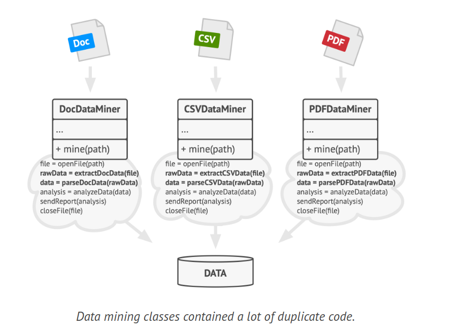
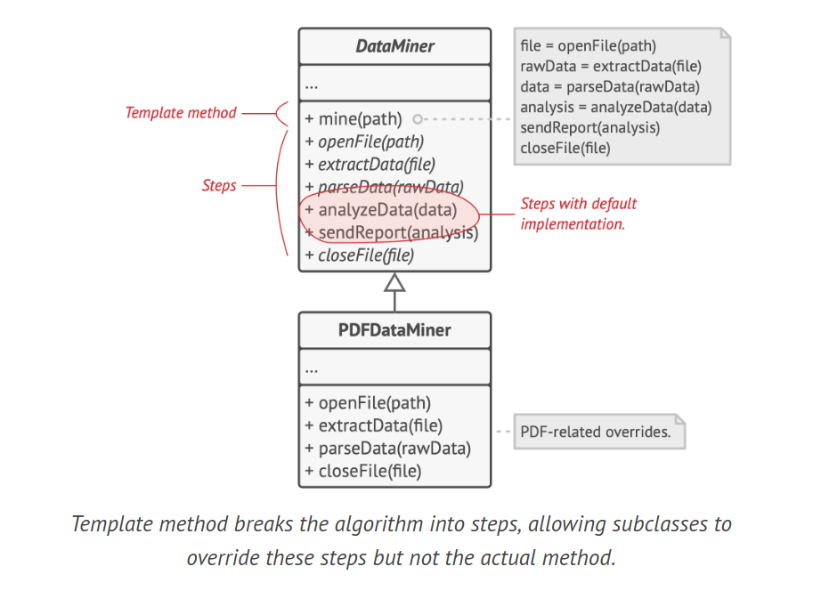
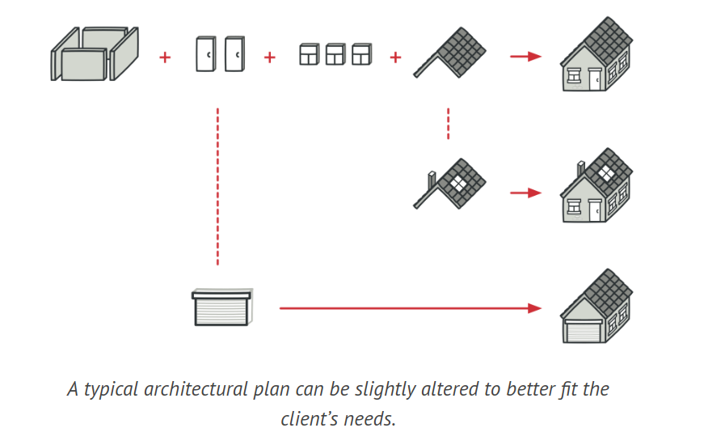
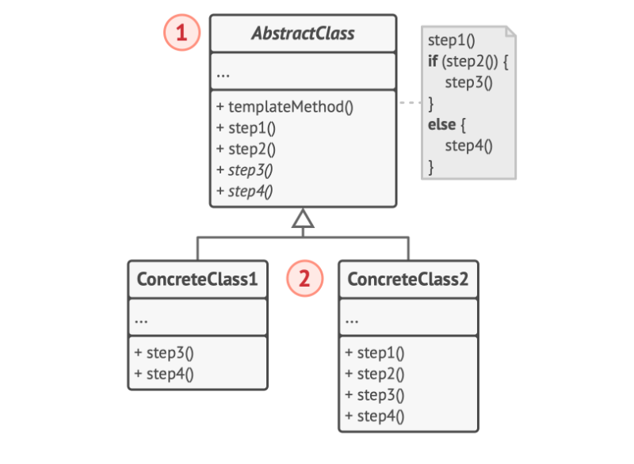
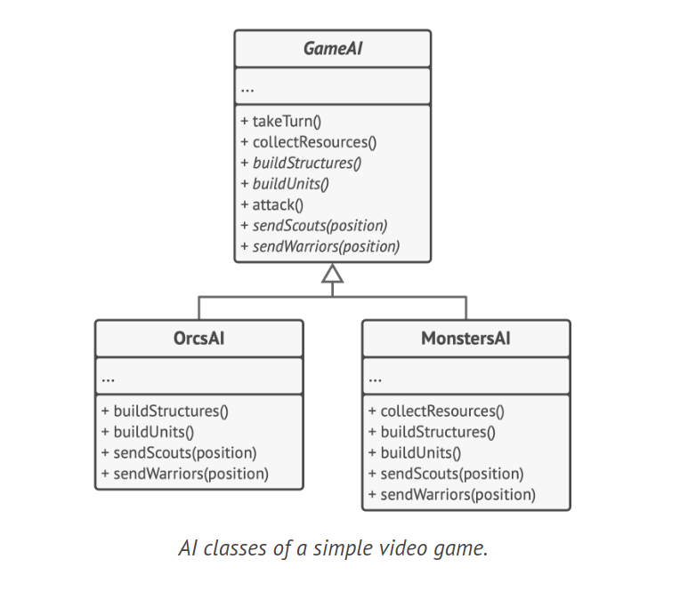

# Template Method Design Pattern

The Template Method is a behavioral design pattern that establishes the framework of an algorithm in the superclass, while allowing subclasses to modify certain steps of the algorithm without altering its overall structure.

## Problem

Consider that you're developing a data mining application that scrutinizes corporate documents. The application accepts documents in various formats (PDF, DOC, CSV), and attempts to extract meaningful data from these documents in a consistent format.

The initial version of the application was only compatible with DOC files. In the subsequent version, it gained the ability to support CSV files. A month later, you enhanced it to extract data from PDF files. The data mining classes contained a significant amount of duplicated code.



Eventually, you observed that all three classes shared a lot of similar code. While the code for handling different data formats was entirely unique in each class, the code for data processing and analysis was nearly identical. It would be beneficial to eliminate the code duplication while preserving the structure of the algorithm.

There was an additional issue related to the client code that utilized these classes. It contained numerous conditionals that selected an appropriate action based on the class of the processing object. If all three processing classes shared a common interface or a base class, you could remove the conditionals in the client code and employ polymorphism when invoking methods on a processing object.

## Solution

The Template Method pattern proposes that you decompose an algorithm into a sequence of steps, convert these steps into methods, and arrange a series of calls to these methods within a single template method. The steps can either be abstract or have a default implementation. To utilize the algorithm, the client should provide its own subclass, implement all abstract steps, and override some of the optional ones if necessary (but not the template method itself).

Let's apply this to our data mining application. We can establish a base class for all three parsing algorithms. This class outlines a template method composed of a series of calls to various document-processing steps.

Initially, we can declare all steps as abstract, compelling the subclasses to provide their own implementations for these methods. In our scenario, subclasses already possess all necessary implementations, so the only adjustment we might need is to align the methods' signatures with those of the superclass.

The template method dissects the algorithm into steps, permitting subclasses to override these steps but not the actual method.



Now, let's address the duplicate code. It appears that the code for opening/closing files and extracting/parsing data varies for different data formats, so there's no need to modify those methods. However, the implementation of other steps, such as analyzing the raw data and composing reports, is quite similar and can be moved up into the base class, allowing subclasses to share that code.

We have two types of steps:

- Abstract steps must be implemented by every subclass
- Optional steps already have a default implementation but can still be overridden if necessary

There's another type of step, known as hooks. A hook is an optional step with an empty body. A template method would function even if a hook isn't overridden. Typically, hooks are positioned before and after crucial steps of algorithms, offering subclasses additional extension points for an algorithm.



A real-world analogy of the template method can be seen in mass housing construction. The architectural plan for building a standard house may contain several extension points that allow a potential owner to adjust some details of the resulting house. Each building step, such as laying the foundation, framing, building walls, installing plumbing and wiring for water and electricity, etc., can be slightly altered to make the resulting house slightly different from others.

## Structure



1. The Abstract Class defines methods that serve as stages of an algorithm, along with the actual template method that invokes these methods in a particular sequence. The stages can either be declared abstract or possess a default implementation.

1. Concrete Classes have the ability to override all of the stages, but not the template method itself.

## How to Implement

1. Examine the target algorithm to determine if it can be divided into steps. Identify which steps are common to all subclasses and which ones will always be distinct.

2. Establish the abstract base class and declare the template method along with a set of abstract methods that represent the algorithm's steps. Define the algorithm's structure in the template method by executing corresponding steps. Consider making the template method final to prevent subclasses from overriding it.

3. It's acceptable if all the steps turn out to be abstract. However, some steps might benefit from a default implementation. Subclasses aren't required to implement these methods.

4. Consider adding hooks between the critical steps of the algorithm.

5. For each variation of the algorithm, create a new concrete subclass. It must implement all of the abstract steps, but it can also override some of the optional ones.

## Example Code



```java
abstract class GameAI {
    public void turn() {
        collectResources();
        buildStructures();
        buildUnits();
        attack();
    }

    public void collectResources() {
        System.out.println("Collecting resources...");
    }

    public abstract void buildStructures();
    public abstract void buildUnits();

    public void attack() {
        String enemy = closestEnemy();
        if (enemy == null) {
            sendScouts("map.center");
        } else {
            sendWarriors(enemy);
        }
    }

    public String closestEnemy() {
        // Logic to find closest enemy
        return "Enemy1";
    }

    public abstract void sendScouts(String position);
    public abstract void sendWarriors(String position);
}

class OrcsAI extends GameAI {
    public void buildStructures() {
        System.out.println("Orcs building structures...");
    }

    public void buildUnits() {
        System.out.println("Orcs building units...");
    }

    public void sendScouts(String position) {
        System.out.println("Orcs sending scouts to " + position);
    }

    public void sendWarriors(String position) {
        System.out.println("Orcs sending warriors to " + position);
    }
}

class MonstersAI extends GameAI {
    public void collectResources() {
        System.out.println("Monsters don't collect resources.");
    }

    public void buildStructures() {
        System.out.println("Monsters don't build structures.");
    }

    public void buildUnits() {
        System.out.println("Monsters don't build units.");
    }

    public void sendScouts(String position) {
        System.out.println("Monsters don't send scouts.");
    }

    public void sendWarriors(String position) {
        System.out.println("Monsters don't send warriors.");
    }
}
```

## Applicability

1. Employ the Template Method pattern when you want to allow clients to extend only specific steps of an algorithm, without altering the entire algorithm or its structure.

2. The Template Method enables you to transform a monolithic algorithm into a sequence of individual steps that can be easily extended by subclasses, while maintaining the structure defined in a superclass.

3. Use the pattern when you have multiple classes that contain nearly identical algorithms with minor differences. As a result, you might need to modify all classes when the algorithm changes.

4. Subclasses can also override some operations with a default implementation. For instance, in a class like MonstersAI that extends GameAI, methods like collectResources(), buildStructures(), and buildUnits() may not be applicable as monsters don't collect resources, build structures, or build units.

5. When you convert such an algorithm into a template method, you can also elevate the steps with similar implementations into a superclass, thereby eliminating code duplication. Code that varies between subclasses can remain in subclasses.
