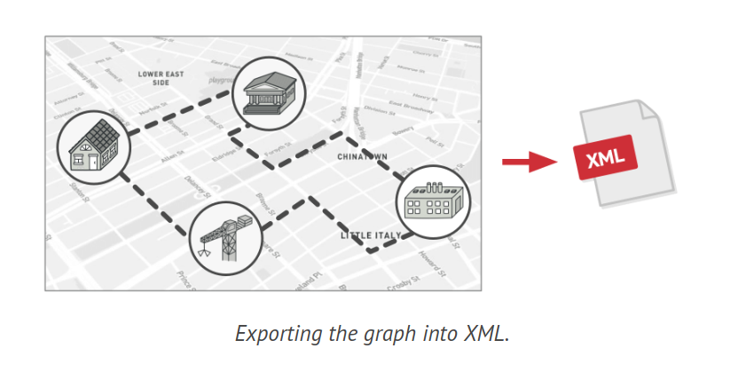
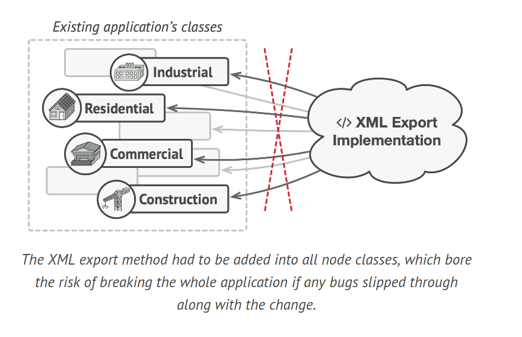
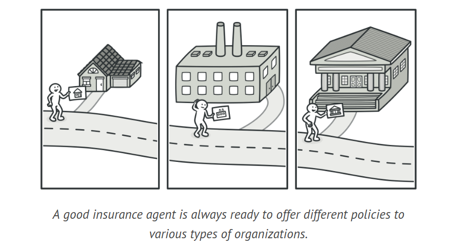
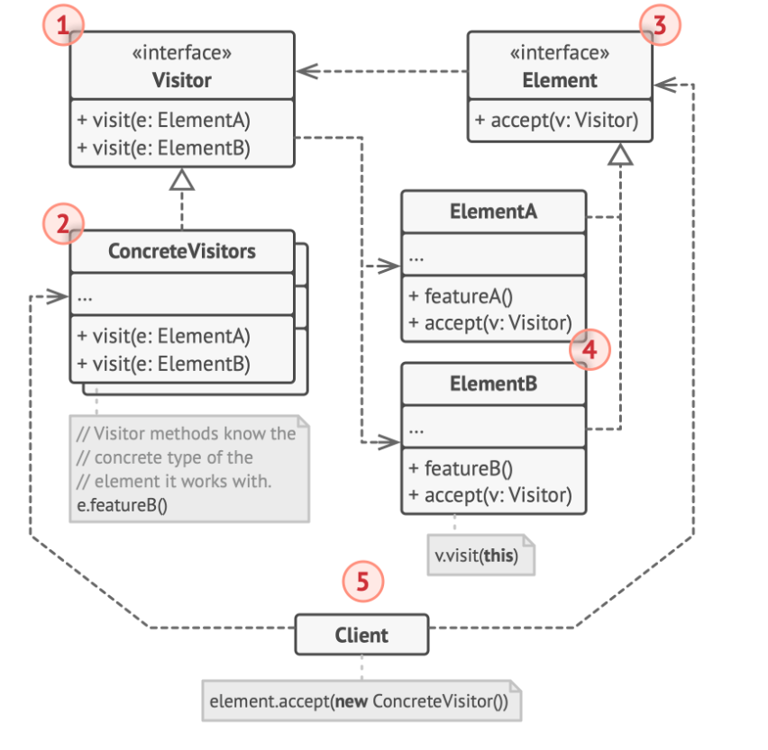
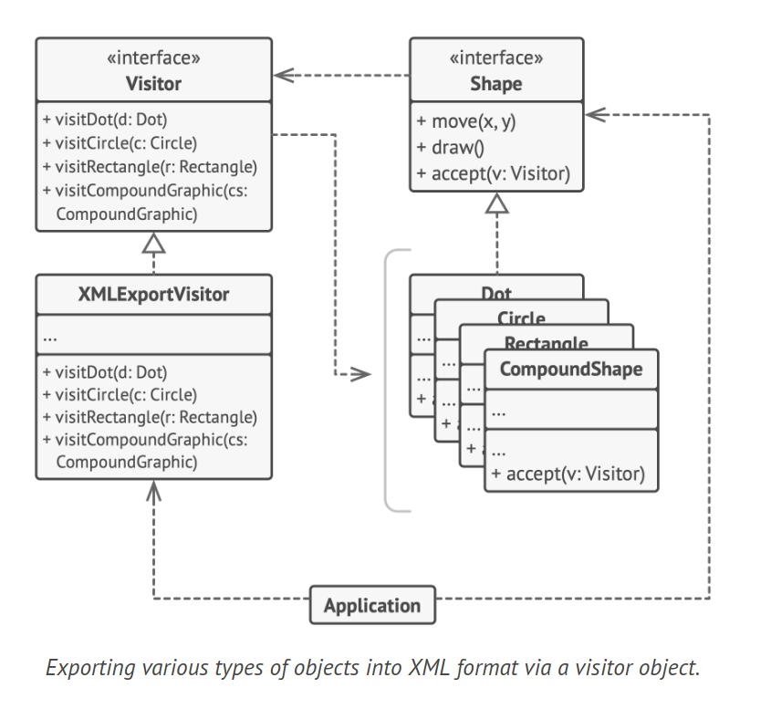

# Visitor Design Pattern

Visitor is a behavioral design pattern that allows you to decouple algorithms from the objects they operate on.

## Problem

Consider a scenario where your team is developing an application that handles geographic information structured as a large graph. Each node of the graph could represent a complex entity like a city, or more granular elements like industries, sightseeing areas, etc. Nodes are interconnected if there's a road between the real-world objects they represent. Internally, each node type is represented by its own class, while each specific node is an object.

You were tasked with implementing a feature to export the graph into XML format. Initially, the task seemed straightforward. You intended to add an export method to each node class and then use recursion to traverse each node of the graph, executing the export method. This solution was simple and elegant: polymorphism allowed you to avoid coupling the code that called the export method to the concrete classes of nodes.



However, the system architect disallowed you from modifying existing node classes. He explained that the code was already in production, and he didn't want to risk introducing potential bugs that could break it.

Adding the XML export method to all node classes carried the risk of breaking the entire application if any bugs were introduced with the change.



Furthermore, he questioned the appropriateness of having the XML export code within the node classes. The primary function of these classes was to handle geodata, so the XML export functionality would seem out of place.

Another reason for his refusal was the likelihood that, once this feature was implemented, someone from the marketing department might request the ability to export in a different format or ask for some other unusual feature. This would necessitate changing those crucial and delicate classes again.

## Solution

The Visitor pattern proposes that you introduce the new behavior in a separate class, known as a visitor, rather than integrating it into existing classes. The original object, which was supposed to perform the behavior, is now passed as an argument to one of the visitor's methods, granting the method access to all necessary data within the object.

What if the behavior needs to be executed over objects of different classes? For instance, in our scenario with XML export, the actual implementation might vary slightly across different node classes. Therefore, the visitor class might define a set of methods, each capable of taking arguments of different types, like so:

```java
class ExportVisitor implements Visitor {
    void doForCity(City c) { ... }
    void doForIndustry(Industry f) { ... }
    void doForSightSeeing(SightSeeing ss) { ... }
    // ...
}
```

But how would we call these methods, especially when dealing with the entire graph? These methods have different signatures, so we can't use polymorphism. To select a suitable visitor method capable of processing a given object, we'd need to check its class. Doesn't this sound like a nightmare?

You might wonder, why not use method overloading? That's when you give all methods the same name, even if they support different sets of parameters. Unfortunately, even if our programming language supports it (like Java and C#), it won't help us. Since the exact class of a node object is unknown in advance, the overloading mechanism won't be able to determine the correct method to execute. It'll default to the method that takes an object of the base Node class.

However, the Visitor pattern solves this problem. It employs a technique called Double Dispatch, which helps execute the correct method on an object without cumbersome conditionals. Instead of letting the client select a suitable version of the method to call, why not delegate this choice to the objects we're passing to the visitor as an argument?

Since the objects are aware of their own classes, they'll be able to select a suitable method on the visitor less awkwardly. They "accept" a visitor and tell it which visiting method should be executed.

```java
foreach (Node node in graph) {
    node.accept(exportVisitor);
}
```

I admit, we had to modify the node classes after all. But at least the change is trivial and allows us to add further behaviors without altering the code again.

Now, if we extract a common interface for all visitors, all existing nodes can work with any visitor you introduce into the app. If you find yourself introducing a new behavior related to nodes, all you have to do is implement a new visitor class.

Consider a seasoned insurance agent eager to acquire new customers. He can visit every building in a neighborhood, attempting to sell insurance to everyone he meets. Depending on the type of organization that occupies the building, he can offer specialized insurance policies:



- If it's a residential building, he sells medical insurance.
- If it's a bank, he sells theft insurance.
- If it's a coffee shop, he sells fire and flood insurance.

## Structure



1. The Visitor interface defines a set of visiting methods that can accept concrete elements of an object structure as arguments. If the program is written in a language that supports overloading, these methods may share the same names, but their parameter types must differ.

2. Each Concrete Visitor implements multiple versions of the same behaviors, each version tailored for different concrete element classes.

3. The Element interface declares a method for "accepting" visitors. This method should have one parameter of the visitor interface type.

4. Each Concrete Element must implement the acceptance method. The purpose of this method is to redirect the call to the appropriate visitor's method corresponding to the current element class. Even if a base element class implements this method, all subclasses must still override this method in their own classes and call the appropriate method on the visitor object.

5. The Client usually represents a collection or another complex object (for example, a Composite tree). Typically, clients aren't aware of all the concrete element classes because they work with objects from that collection via an abstract interface.

## How to Implement

1. Define the visitor interface with a set of "visiting" methods, one for each concrete element class that exists in the program.

2. Define the element interface. If you're working with an existing element class hierarchy, add the abstract "acceptance" method to the base class of the hierarchy. This method should accept a visitor object as an argument.

3. Implement the acceptance methods in all concrete element classes. These methods should simply redirect the call to a visiting method on the incoming visitor object that matches the class of the current element.

4. The element classes should interact with visitors only through the visitor interface. However, visitors must be aware of all concrete element classes, as these are referenced as parameter types of the visiting methods.

5. For each behavior that can't be implemented within the element hierarchy, create a new concrete visitor class and implement all of the visiting methods. In situations where the visitor needs access to some private members of the element class, you can either make these fields or methods public, compromising the element's encapsulation, or nest the visitor class in the element class. The latter is only possible if your programming language supports nested classes.

6. The client must create visitor objects and pass them into elements via "acceptance" methods.

## Example Code



```java
interface Shape {
    void move(int x, int y);
    void draw();
    void accept(Visitor v);
}

class Dot implements Shape {
    public void move(int x, int y) {
        System.out.println("Dot moved to " + x + ", " + y);
    }

    public void draw() {
        System.out.println("Dot drawn.");
    }

    public void accept(Visitor v) {
        v.visitDot(this);
    }
}

class Circle implements Shape {
    public void move(int x, int y) {
        System.out.println("Circle moved to " + x + ", " + y);
    }

    public void draw() {
        System.out.println("Circle drawn.");
    }

    public void accept(Visitor v) {
        v.visitCircle(this);
    }
}

class Rectangle implements Shape {
    public void move(int x, int y) {
        System.out.println("Rectangle moved to " + x + ", " + y);
    }

    public void draw() {
        System.out.println("Rectangle drawn.");
    }

    public void accept(Visitor v) {
        v.visitRectangle(this);
    }
}

class CompoundShape implements Shape {
    public void move(int x, int y) {
        System.out.println("CompoundShape moved to " + x + ", " + y);
    }

    public void draw() {
        System.out.println("CompoundShape drawn.");
    }

    public void accept(Visitor v) {
        v.visitCompoundShape(this);
    }
}

interface Visitor {
    void visitDot(Dot d);
    void visitCircle(Circle c);
    void visitRectangle(Rectangle r);
    void visitCompoundShape(CompoundShape cs);
}

class XMLExportVisitor implements Visitor {
    public void visitDot(Dot d) {
        System.out.println("Exporting the dot's details in XML format.");
    }

    public void visitCircle(Circle c) {
        System.out.println("Exporting the circle's details in XML format.");
    }

    public void visitRectangle(Rectangle r) {
        System.out.println("Exporting the rectangle's details in XML format.");
    }

    public void visitCompoundShape(CompoundShape cs) {
        System.out.println("Exporting the CompoundShape's details in XML format.");
    }
}

class Application {
    Shape[] allShapes;

    void export() {
        XMLExportVisitor xmlExportVisitor = new XMLExportVisitor();
        for (Shape shape : allShapes) {
            shape.accept(xmlExportVisitor);
        }
    }
}
```

## Applicability

1. Use the Visitor pattern when you need to carry out an operation on all elements of a complex object structure, such as an object tree. The Visitor pattern allows you to execute an operation across a set of objects from different classes by having a visitor object implement several versions of the same operation, each corresponding to a target class.

2. Employ the Visitor pattern to streamline the business logic of auxiliary behaviors. The pattern enables you to make the primary classes of your application more focused on their main tasks by extracting all other behaviors into a set of visitor classes.

3. Use the pattern when a behavior is relevant only in some classes of a class hierarchy, but not in others. You can extract this behavior into a separate visitor class and implement only those visiting methods that accept objects of relevant classes, leaving the rest empty.
