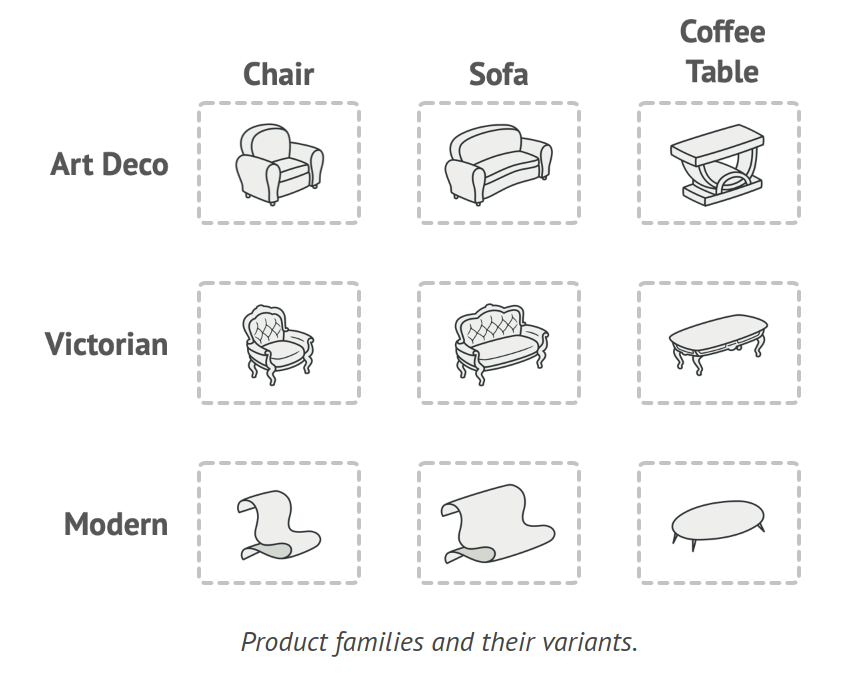
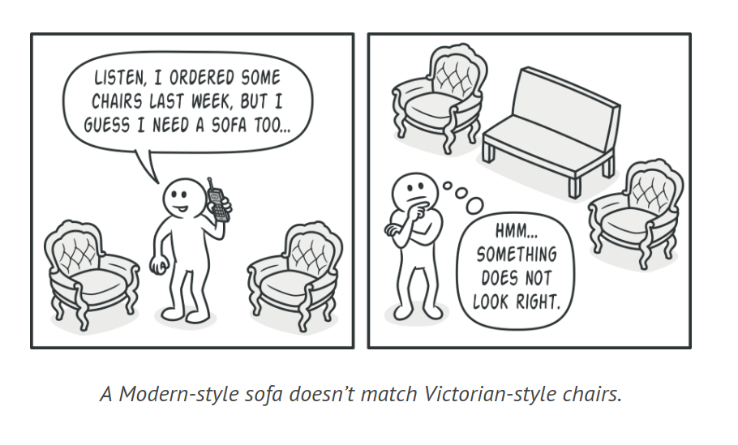
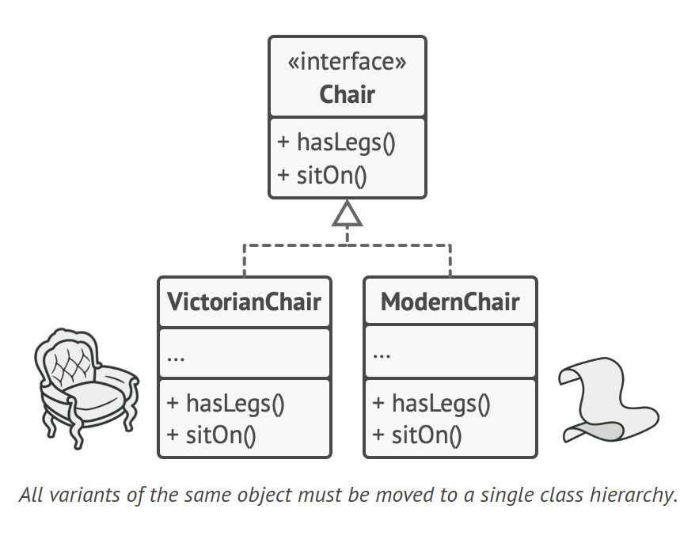
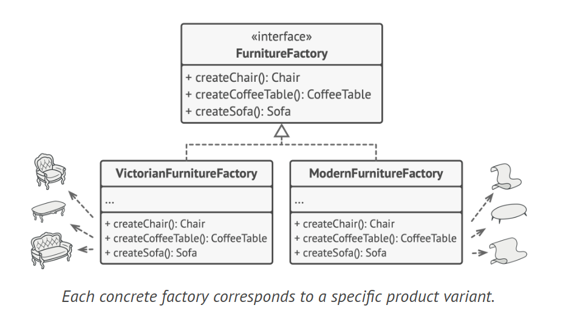
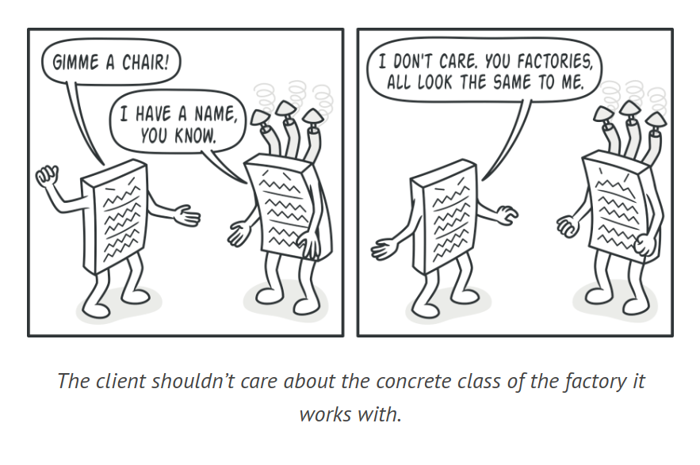
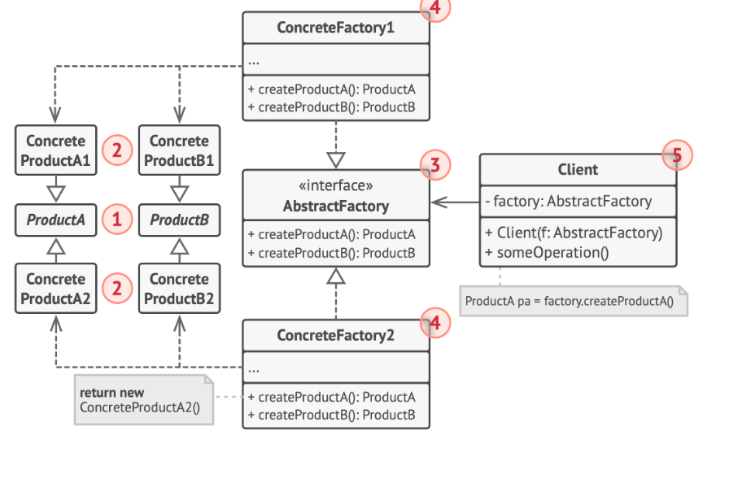

# Abstract Factory Method

The Abstract Factory is a design pattern that allows the creation of related object families without the need to define their specific classes.

## Problem

In a furniture shop simulator, you have:

1. A family of related products: Chair, Sofa, CoffeeTable.
2. Variants of this family: Modern, Victorian, ArtDeco.



You need to create furniture objects that match others in the same family, as mismatched furniture upsets customers. You also want to avoid changing existing code when adding new products or product families, as furniture catalogs frequently update.



## Solution

The Abstract Factory pattern suggests defining interfaces for each product in a family (e.g., chair, sofa, coffee table), with all product variants implementing these interfaces.



Next, declare an Abstract Factory interface with creation methods for all products in the family. These methods return abstract product types represented by the interfaces.

For each product family variant, create a separate factory class based on the AbstractFactory interface. Each factory class returns products of a specific kind.



The client code interacts with both factories and products via their abstract interfaces, allowing the factory type and product variant to change without breaking the client code.

The client doesn't need to know the factory's concrete class or the kind of product it gets. The client treats all products in the same manner, using the abstract interface.



The application creates a concrete factory object at initialization, selecting the factory type based on configuration or environment settings.

## Structure



1. Abstract Products define interfaces for a product family of related but distinct items.
2. Concrete Products are different implementations of abstract products, grouped by variants. Each abstract product must be implemented in all given variants.
3. The Abstract Factory interface defines methods for creating each abstract product.
4. Concrete Factories implement the creation methods of the abstract factory. Each factory corresponds to a specific product variant and creates only those product variants.
5. Concrete factories instantiate concrete products, but their creation methods must return the corresponding abstract products. This prevents client code from coupling to a specific product variant, allowing it to work with any factory/product variant via abstract interfaces.

## How to Implement

1. Create a matrix of distinct product types and their variants.
2. Define abstract product interfaces for all product types and have all concrete product classes implement these interfaces.
3. Define the abstract factory interface with creation methods for all abstract products.
4. Implement concrete factory classes for each product variant.
5. In the app, create factory initialization code that instantiates a concrete factory class based on the application configuration or current environment. Pass this factory object to all classes that construct products.
6. In the code, replace all direct calls to product constructors with calls to the relevant creation method on the factory object.

## Example Code

```java
// Step 2: Define abstract product interfaces
interface Chair {
    void sitOn();
}

interface Sofa {
    void lieOn();
}

// Concrete product classes implementing these interfaces
class ModernChair implements Chair {
    public void sitOn() {
        System.out.println("Sitting on a modern chair");
    }
}

class VictorianSofa implements Sofa {
    public void lieOn() {
        System.out.println("Lying on a victorian sofa");
    }
}

// Step 3: Define the abstract factory interface
interface FurnitureFactory {
    Chair createChair();
    Sofa createSofa();
}

// Step 4: Implement concrete factory classes
class ModernFurnitureFactory implements FurnitureFactory {
    public Chair createChair() {
        return new ModernChair();
    }

    public Sofa createSofa() {
        return new VictorianSofa();
    }
}

// Step 5: Factory initialization code in the app
class Application {
    private Chair chair;
    private Sofa sofa;

    public Application(FurnitureFactory factory) {
        chair = factory.createChair();
        sofa = factory.createSofa();
    }

    public void useFurniture() {
        chair.sitOn();
        sofa.lieOn();
    }
}

// Step 6: Replace direct calls to product constructors with calls to the factory object
public class Main {
    public static void main(String[] args) {
        FurnitureFactory factory = new ModernFurnitureFactory();
        Application app = new Application(factory);
        app.useFurniture();
    }
}
```

## Applicability

1. Use the Abstract Factory when your code needs to interact with different families of related products, but you want to avoid dependency on their concrete classes for flexibility and future extensibility.
2. The Abstract Factory provides an interface for creating objects from each product family class, ensuring your code doesn't create a product variant that doesn't match those already created by your app.
3. The application selects the factory type based on the current configuration or environment settings and creates it at runtime, typically at the initialization stage.
Implement the Abstract Factory when you have a class with multiple Factory Methods that obscure its main responsibility.
4. In a well-designed program, each class should only be responsible for one thing. If a class deals with multiple product types, consider extracting its factory methods into a separate factory class or a full Abstract Factory implementation.
