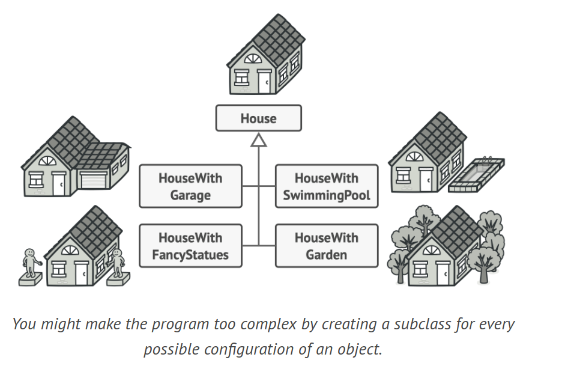
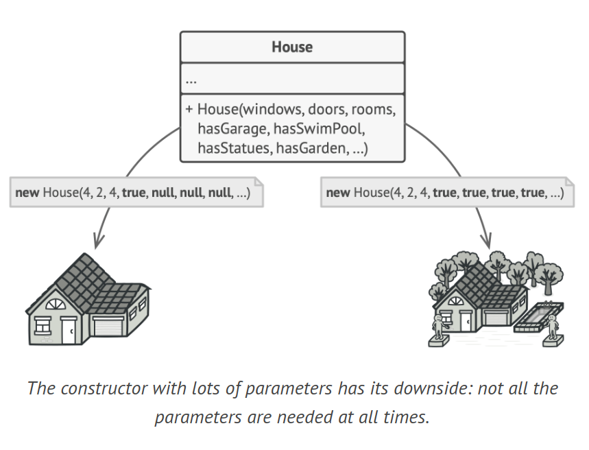
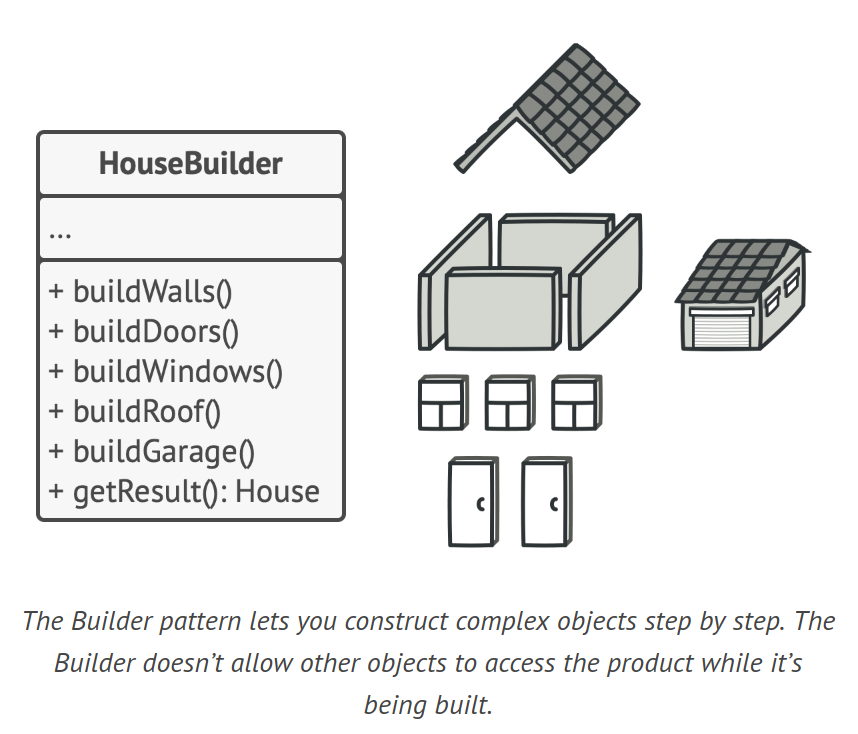
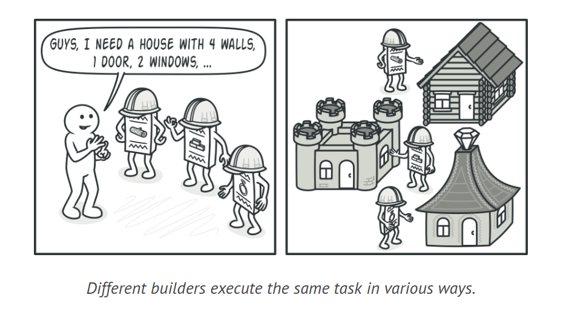
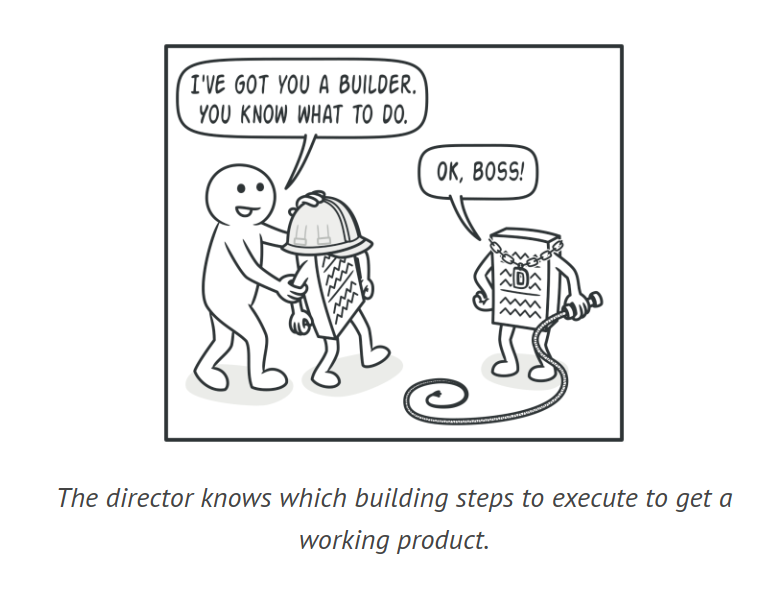
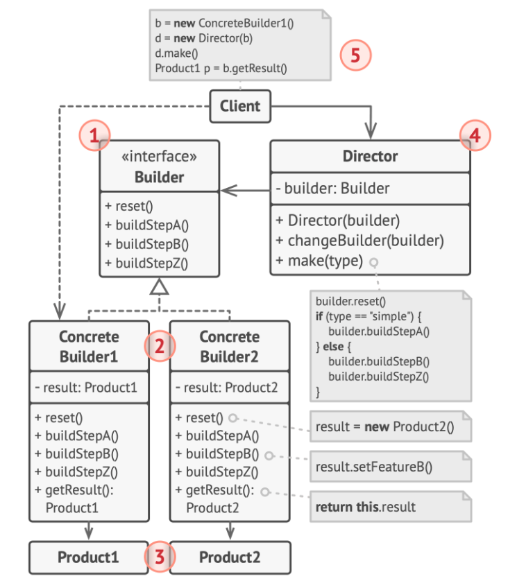

# Builder Design Pattern

The Builder is a creational design pattern that enables the step-by-step construction of complex objects. This pattern allows for the creation of various types and representations of an object using identical construction code.

## Problem

Creating a complex object often requires a tedious, step-by-step initialization of many fields and nested objects. This can lead to a large constructor with many parameters or scattered initialization code. Creating a subclass for every possible configuration of an object can overly complicate the program.

For instance, building a House object can have many variations and parameters. Extending the base House class to cover all combinations can result in a large number of subclasses.



An alternative is to have a large constructor in the base House class, but this can lead to many unused parameters, making the constructor calls unattractive.



## Solution

The Builder pattern recommends extracting the object construction code into separate builder objects, allowing for step-by-step construction of complex objects. This pattern organizes construction into a series of steps, and you can choose to execute only the necessary steps for a specific object configuration.



Different builder classes can implement the same steps differently to create various representations of the product. For example, different builders can use different materials to build walls.



A separate class, called the director, can be used to define the order of the building steps, while the builders provide the implementation. The director class can hide the details of product construction from the client code, making it easier to manage and reuse construction routines. The client only needs to associate a builder with a director, initiate the construction with the director, and retrieve the result from the builder.



## Structure



1. The Builder interface outlines the construction steps common to all builder types.
2. Concrete Builders offer distinct implementations of these steps and may create products that don't adhere to a common interface.
3. Products are the end results, and they don't necessarily belong to the same class hierarchy or interface, even when constructed by different builders.
4. The Director class determines the sequence of construction steps, enabling the creation and reuse of specific product configurations.
5. The Client links a builder object with the director, typically done once via the director's constructor parameters. The director then uses this builder for all subsequent constructions. Alternatively, the client can pass the builder object to the director's production method, allowing for a different builder to be used each time.

## How to Implement

1. Ensure that common construction steps for all product representations are clearly defined.
2. Declare these steps in the base builder interface.
3. For each product representation, create a concrete builder class and implement their construction steps. Include a method to retrieve the construction result.
4. Consider creating a director class to encapsulate various construction methods using the same builder object.
5. The client code creates the builder and director objects. The client must pass a builder object to the director before construction begins.
6. If all products follow the same interface, the construction result can be obtained directly from the director. Otherwise, the client should fetch the result from the builder.

```java
// Product 1
class Car {
    // A car can have a GPS, trip computer and some number of seats.
    // Different models of cars (sports car, SUV, cabriolet) might have different features installed or enabled.
}

// Product 2
class Manual {
    // Each car should have a user manual that corresponds to the car's configuration and describes all its features.
}

// Builder interface
interface Builder {
    void reset();
    void setSeats(int number);
    void setEngine(Engine engine);
    void setTripComputer(boolean hasTripComputer);
    void setGPS(boolean hasGPS);
}

// Concrete builder 1
class CarBuilder implements Builder {
    private Car car;

    public CarBuilder() {
        this.reset();
    }

    public void reset() {
        this.car = new Car();
    }

    public void setSeats(int number) {
        // Set the number of seats in the car.
    }

    public void setEngine(Engine engine) {
        // Install a given engine.
    }

    public void setTripComputer(boolean hasTripComputer) {
        // Install a trip computer.
    }

    public void setGPS(boolean hasGPS) {
        // Install a global positioning system.
    }

    public Car getProduct() {
        Car product = this.car;
        this.reset();
        return product;
    }
}

// Concrete builder 2
class CarManualBuilder implements Builder {
    private Manual manual;

    public CarManualBuilder() {
        this.reset();
    }

    public void reset() {
        this.manual = new Manual();
    }

    public void setSeats(int number) {
        // Document car seat features.
    }

    public void setEngine(Engine engine) {
        // Add engine instructions.
    }

    public void setTripComputer(boolean hasTripComputer) {
        // Add trip computer instructions.
    }

    public void setGPS(boolean hasGPS) {
        // Add GPS instructions.
    }

    public Manual getProduct() {
        Manual product = this.manual;
        this.reset();
        return product;
    }
}

// Director
class Director {
    private Builder builder;

    public void setBuilder(Builder builder) {
        this.builder = builder;
    }

    public void constructSportsCar(Builder builder) {
        builder.reset();
        builder.setSeats(2);
        builder.setEngine(new SportEngine());
        builder.setTripComputer(true);
        builder.setGPS(true);
    }

    public void constructSUV(Builder builder) {
        // ...
    }
}

// Client code
class Application {
    public void makeCar() {
        Director director = new Director();

        CarBuilder builder = new CarBuilder();
        director.constructSportsCar(builder);
        Car car = builder.getProduct();

        CarManualBuilder manualBuilder = new CarManualBuilder();
        director.constructSportsCar(manualBuilder);
        Manual manual = manualBuilder.getProduct();
    }
}
```

## Applicability

1. Use the Builder pattern to avoid "telescopic constructors" with many optional parameters.
2. The Builder pattern allows building objects step by step, using only necessary steps, eliminating the need for complex constructors.
3. Apply the Builder pattern when you need to create different representations of a product, like stone and wooden houses.
4. The Builder pattern is useful when constructing various product representations involves similar steps that differ only in details.
The Builder pattern can be used to construct Composite trees or other complex objects.
5. The Builder pattern allows deferring some steps without affecting the final product and can call steps recursively, useful for building object trees.
6. A builder doesn't expose the unfinished product during construction steps, preventing the client code from fetching an incomplete result.
