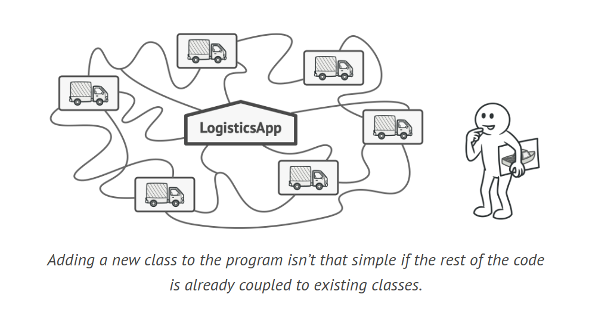
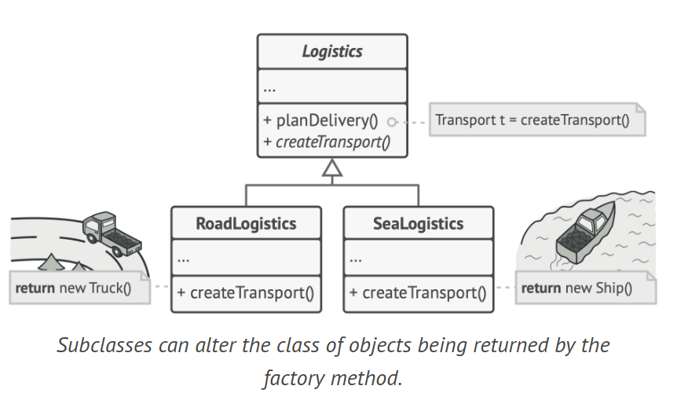
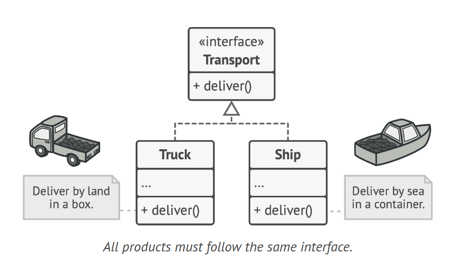
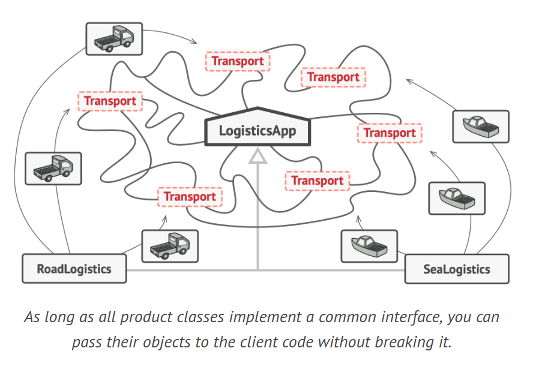
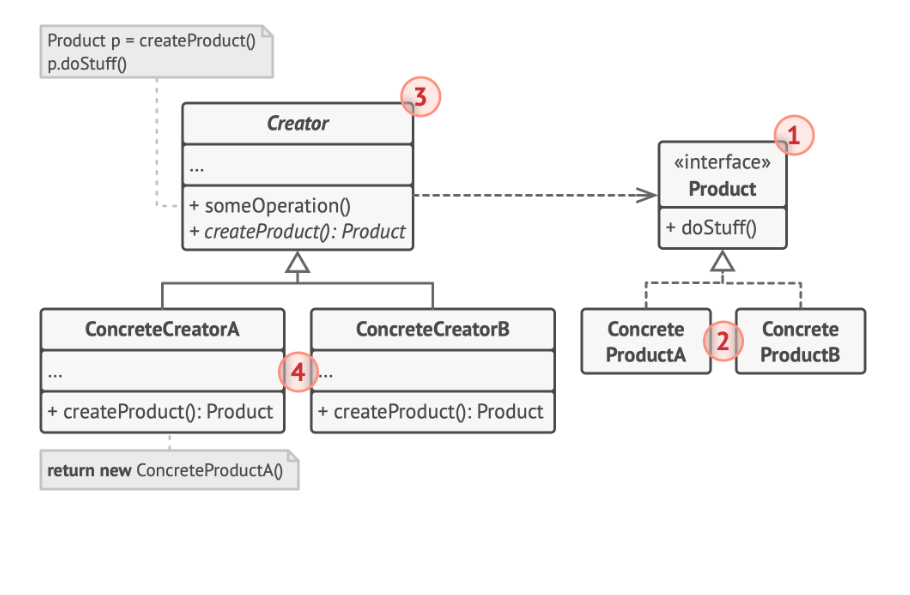

# Factory Method Design Pattern

The Factory Method is a creational design pattern that provides an interface for creating objects in a superclass, but allows subclasses to alter the type of objects that will be created.

## Problem

You're developing a logistics app initially supporting only truck transport. As the app gains popularity, requests to include sea logistics increase. However, your code is tightly coupled with the Truck class. Adding Ships would require extensive codebase modifications. This approach leads to a cluttered codebase, filled with conditionals that switch the app's behavior based on the transportation object class, making it hard to maintain and understand.



## Solution

The Factory Method pattern suggests replacing direct object construction calls (using the new operator) with calls to a specific factory method. The objects are still created via the new operator, but it's called within the factory method. These objects are often referred to as "products".

Subclasses can modify the class of objects returned by the factory method. This might seem trivial, but it allows you to override the factory method in a subclass and change the class of products being created.



However, there's a limitation: subclasses can return different types of products only if these products share a common base class or interface. The factory method in the base class should have its return type declared as this interface.



For instance, both Truck and Ship classes should implement the Transport interface, which declares a deliver method. The RoadLogistics class's factory method returns truck objects, while the SeaLogistics class's factory method returns ships.



The client code, which uses the factory method, doesn't see a difference between the actual products returned by various subclasses. As long as all product classes implement a common interface, their objects can be passed to the client code without breaking it. The client knows all transport objects are supposed to have the deliver method, but how it works isn't important to the client.

## Structure



1. The Product defines the interface common to all objects that the creator and its subclasses can produce.
2. Concrete Products are various implementations of the product interface.
3. The Creator class has a factory method that returns new product objects. The return type of this method should match the product interface. The factory method can be declared as abstract, requiring all subclasses to implement their own versions of the method. Alternatively, the base factory method can return a default product type. Despite its name, the primary responsibility of the creator isn't product creation. The creator class usually has core business logic related to products. The factory method helps decouple this logic from the concrete product classes.
4. Concrete Creators override the base factory method to return a different type of product. The factory method doesn't always have to create new instances. It can also return existing objects from a cache, an object pool, or another source.

## How to Implement

1. Ensure all products follow the same interface, with methods that are applicable to every product.
Add an empty factory method in the creator class with a return type that matches the common product interface.
2. Replace all references to product constructors in the creator's code with calls to the factory method, moving the product creation code into the factory method.
3. Create a set of creator subclasses for each type of product in the factory method, override the factory method in the subclasses, and move the relevant construction code from the base method.
4. If there are many product types and creating subclasses for all of them is impractical, reuse the control parameter from the base class in subclasses.
5. If the base factory method is empty after all extractions, make it abstract. If there's remaining code, make it the default behavior of the method.

## Example

```java
// Step 1: Common product interface
interface Product {
    void use();
}

// Step 2: Concrete Products
class ConcreteProductA implements Product {
    public void use() {
        System.out.println("Using product A");
    }
}

class ConcreteProductB implements Product {
    public void use() {
        System.out.println("Using product B");
    }
}

// Step 3: Creator class with factory method
abstract class Creator {
    public void someOperation() {
        Product product = factoryMethod();
        product.use();
    }

    protected abstract Product factoryMethod();
}

// Step 4: Concrete Creators
class ConcreteCreatorA extends Creator {
    protected Product factoryMethod() {
        return new ConcreteProductA();
    }
}

class ConcreteCreatorB extends Creator {
    protected Product factoryMethod() {
        return new ConcreteProductB();
    }
}
```

## Applicability

1. Use the Factory Method when the exact types and dependencies of the objects your code should work with are unknown beforehand.
2. The Factory Method separates product construction code from the code that uses the product, making it easier to extend the product construction code independently.
3. To add a new product type to the app, create a new creator subclass and override the factory method in it.
4. Use the Factory Method when you want to provide users of your library or framework with a way to extend its internal components.
5. The solution to extending the default behavior of a library or framework is to reduce the code that constructs components into a single factory method and allow anyone to override this method in addition to extending the component itself.
6. Use the Factory Method when you want to save system resources by reusing existing objects instead of rebuilding them each time, especially when dealing with large, resource-intensive objects such as database connections, file systems, and network resources.
7. To reuse an existing object, create a storage to keep track of all created objects, look for a free object inside that pool when someone requests an object, and return it to the client code. If there are no free objects, create a new one and add it to the pool.
8. This code should be placed in a regular method capable of creating new objects as well as reusing existing ones, which is essentially a factory method.
