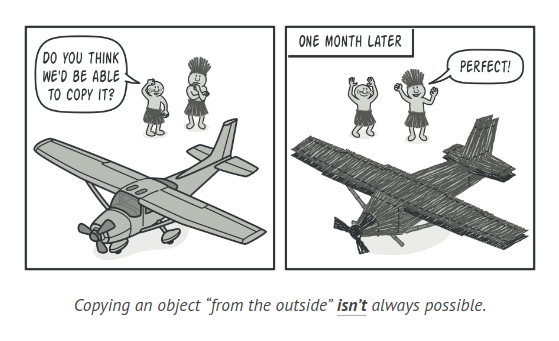
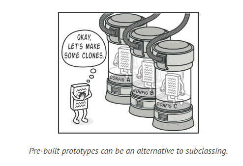
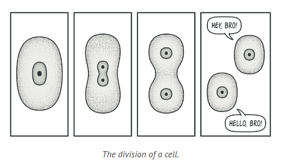
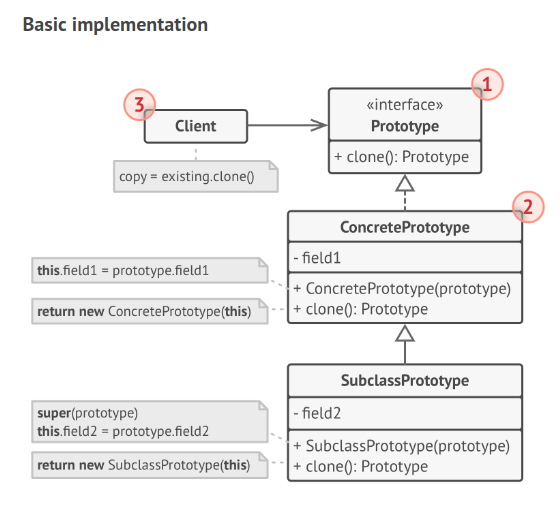
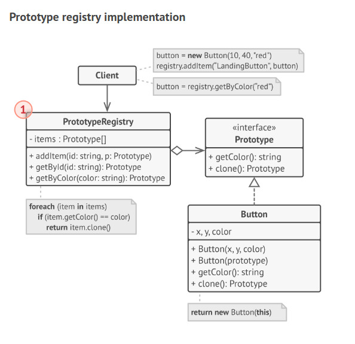

# Prototype Design Pattern

The Prototype is a design pattern used for object creation that allows for the duplication of existing instances without making the code reliant on their specific classes.

## Problem

Suppose you have an object and you want to create an exact duplicate of it. How would you go about it? Initially, you might think of creating a new object of the same class and then copying the values of all fields from the original object to the new one.

However, this approach has its limitations. Not all objects can be copied in this manner as some of the object's fields may be private, making them inaccessible from outside the object itself. Therefore, copying an object "from the outside" is not always feasible.



Moreover, this direct approach has another drawback. To create a duplicate, you need to know the object's class, which makes your code dependent on that class. If this additional dependency doesn't concern you, there's yet another issue to consider. There may be situations where you only know the interface that the object adheres to, but not its concrete class. This can occur, for instance, when a method parameter accepts any objects that conform to a certain interface.


## Solution

The Prototype pattern assigns the responsibility of cloning to the objects being cloned themselves. It establishes a common interface for all cloneable objects, allowing an object to be cloned without tying your code to its class. Typically, this interface includes a single clone method.

The clone method's implementation is generally similar across all classes. It creates a new object of the current class and transfers all field values from the old object to the new one. Even private fields can be copied, as most programming languages allow objects to access other objects' private fields within the same class.

Objects that support cloning are referred to as prototypes. When your objects have numerous fields and hundreds of potential configurations, cloning can serve as an alternative to subclassing.



Here's how it operates: you create a set of objects configured in various ways. When you need an object similar to one you've configured, you clone a prototype instead of creating a new object from scratch.

In the real world, prototypes are used for various tests before mass production begins. However, these prototypes don't participate in actual production and play a passive role.

A more accurate analogy to the Prototype pattern is the process of mitotic cell division in biology. After mitotic division, a pair of identical cells is formed. The original cell serves as a prototype and actively participates in creating the copy.



## Structure



1. The Prototype interface, which typically includes a single clone method, is responsible for declaring the methods for cloning.

2. The Concrete Prototype class is tasked with implementing the cloning method. This method not only copies the data from the original object to the clone, but it may also manage certain edge cases related to the cloning process, such as cloning linked objects and resolving recursive dependencies.

3. The Client has the ability to create a duplicate of any object that adheres to the prototype interface.



1. The Prototype Registry serves as a convenient repository for accessing commonly used prototypes. It houses a collection of pre-constructed objects that are primed for duplication. The most basic form of a prototype registry is a hash map that maps names to prototypes. However, if your search requirements extend beyond a simple name, you can construct a more sophisticated version of the registry.

## How to Implement

1. Establish the prototype interface and include the clone method in it. Alternatively, if you already have a class hierarchy, you can add the method to all classes within it.

2. A prototype class should have an alternate constructor that takes an object of the same class as a parameter. This constructor should copy the values of all fields from the provided object into the new instance. If you're modifying a subclass, call the parent constructor to allow the superclass to clone its private fields. If your programming language doesn't support method overloading, you can create a special method for copying object data. However, the constructor is a more convenient place for this as it provides the resulting object immediately after calling the new operator.

3. The cloning method typically involves just one line: executing a new operator with the prototypical version of the constructor. Note that each class must explicitly override the cloning method and use its own class name with the new operator. Otherwise, the cloning method might generate an object of a parent class.

4. Optionally, establish a centralized prototype registry to keep a catalog of frequently used prototypes.

5. You can implement the registry as a new factory class or include it in the base prototype class with a static method for retrieving the prototype. This method should find a prototype based on search criteria provided by the client code. The criteria could be a simple string tag or a complex set of search parameters. Once the appropriate prototype is found, the registry should clone it and return the copy to the client.

6. Finally, substitute direct calls to the subclasses' constructors with calls to the factory method of the prototype registry.

## Example

```java
abstract class Shape {
    int X;
    int Y;
    String color;

    Shape() {
        // ...
    }

    Shape(Shape source) {
        this.X = source.X;
        this.Y = source.Y;
        this.color = source.color;
    }

    abstract Shape clone();
}

class Rectangle extends Shape {
    int width;
    int height;

    Rectangle(Rectangle source) {
        super(source);
        this.width = source.width;
        this.height = source.height;
    }

    @Override
    Shape clone() {
        return new Rectangle(this);
    }
}

class Circle extends Shape {
    int radius;

    Circle(Circle source) {
        super(source);
        this.radius = source.radius;
    }

    @Override
    Shape clone() {
        return new Circle(this);
    }
}

class Application {
    ArrayList<Shape> shapes = new ArrayList<>();

    Application() {
        Circle circle = new Circle();
        circle.X = 10;
        circle.Y = 10;
        circle.radius = 20;
        shapes.add(circle);

        Circle anotherCircle = (Circle) circle.clone();
        shapes.add(anotherCircle);

        Rectangle rectangle = new Rectangle();
        rectangle.width = 10;
        rectangle.height = 20;
        shapes.add(rectangle);
    }

    void businessLogic() {
        ArrayList<Shape> shapesCopy = new ArrayList<>();

        for (Shape s : shapes) {
            shapesCopy.add(s.clone());
        }

        // shapesCopy now contains exact copies of the shape array's children
    }
}
```

## Applicability

1. Employ the Prototype pattern when your code should not rely on the specific classes of objects that need to be copied. This is common when your code interacts with objects received from third-party code through an interface. The specific classes of these objects are unknown, making it impossible to depend on them.

2. The Prototype pattern offers a general interface for working with all objects capable of cloning. This interface decouples the client code from the specific classes of the objects it clones.

3. Use the pattern to minimize the number of subclasses that only vary in how they initialize their objects. These subclasses may have been created to generate objects with a specific configuration.

4. The Prototype pattern allows the use of a collection of pre-configured objects as prototypes. Instead of creating an instance of a subclass that aligns with a certain configuration, the client can simply find a suitable prototype and clone it.