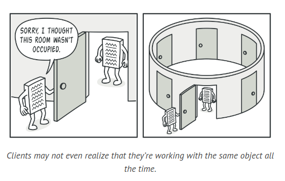
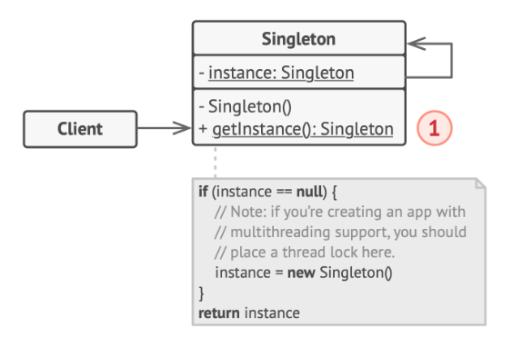

# Singleton Design Pattern

Singleton is a design pattern used in object creation which guarantees that a class has only a single instance, and provides a universal access point to this instance.

## Problem

The Singleton design pattern ensures that a class only has one instance and provides a global access point to it, thus solving two problems simultaneously. This pattern is often used to manage access to shared resources like a database or a file. When a new object is requested, the existing instance is returned instead of creating a new one. This behavior differs from a regular constructor which always returns a new object.



Singleton also provides a global access point to the instance, similar to a global variable, but safer as it prevents the instance from being overwritten. This pattern centralizes the solution within one class, making it more manageable. Despite violating the Single Responsibility Principle, Singleton has gained popularity and is often used even when only one of these problems needs to be addressed.

## Solution

All Singleton implementations follow these two common steps:

The default constructor is made private. This prevents other objects from creating a new instance of the Singleton class using the new operator.

A static method is created to act as a constructor. Internally, this method invokes the private constructor to create an object and stores it in a static field. Any subsequent calls to this method will return the previously created object.

If your code can access the Singleton class, it can call the Singleton's static method. Therefore, every time this method is called, the same object is consistently returned.

The Singleton pattern can be likened to a government system. A country can only have one official government at a time. Despite the changing individuals who constitute the government, the title "The Government of X" serves as a universal access point that identifies the ruling body. This is similar to how the Singleton pattern provides a single, globally accessible instance.

## Structure



1. The Singleton class defines a static method named getInstance that always returns the same instance of its own class. The constructor of the Singleton class should be inaccessible to the client code. The getInstance method should be the sole method for obtaining the Singleton object.

## How to Implement

1. Introduce a private static field in the class to hold the singleton instance.

2. Create a public static method to access the singleton instance.

3. Implement "lazy initialization" within the static method. This means the method should create a new object during its first call and store it in the static field. For all future calls, this method should return the existing instance.

4. Set the class constructor to private. This allows the static method of the class to call the constructor, but prevents other objects from doing so.

5. Review the client code and replace all direct calls to the singleton's constructor with calls to its static creation method.

## Example Code

```java
class Database {
    // The field for storing the singleton instance should be declared static.
    private static Database instance;

    // The singleton's constructor should always be private to prevent direct construction calls with the `new` operator.
    private Database() {
        // Some initialization code, such as the actual connection to a database server.
        // ...
    }

    // The static method that controls access to the singleton instance.
    public static synchronized Database getInstance() {
        if (instance == null) {
            instance = new Database();
        }
        return instance;
    }

    // Finally, any singleton should define some business logic which can be executed on its instance.
    public void query(String sql) {
        // For instance, all database queries of an app go through this method. Therefore, you can place throttling or caching logic here.
        // ...
        System.out.println("Executing query: " + sql);
    }
}
```

## Applicability

1. Apply the Singleton pattern when your program requires a single instance of a class, accessible to all clients. For instance, a shared database object used across different parts of the program.

2. The Singleton pattern restricts object creation of a class to a specific creation method. This method either generates a new object or returns an existing one if it's already been created.

3. Use the Singleton pattern for more stringent control over global variables.

4. Unlike global variables, the Singleton pattern ensures there's only one instance of a class. Nothing, except the Singleton class itself, can alter the cached instance.

5. Note that this limitation can be adjusted to allow the creation of multiple Singleton instances. The only code that needs modification is the getInstance method's body.
