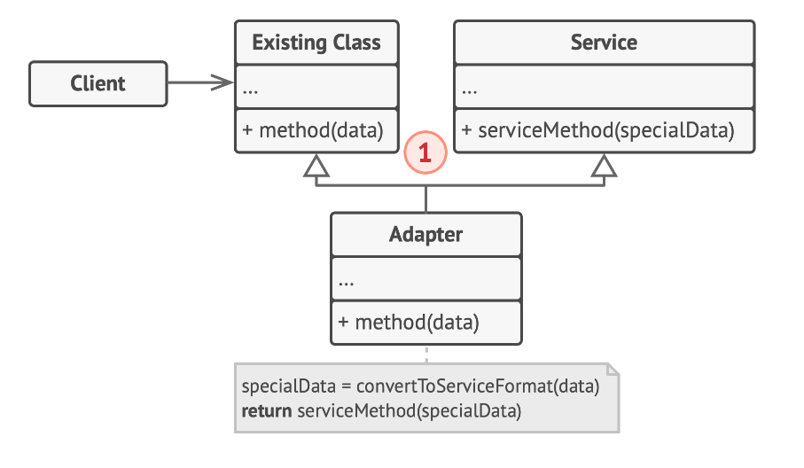

# Adapter Design Pattern

The Adapter is a structural design pattern that enables objects with mismatched interfaces to work together.

## Problem

Suppose you're developing a stock market monitoring app that fetches data from various sources in XML format and presents it through charts and diagrams. You decide to enhance the app by incorporating a third-party analytics library, but it only accepts data in JSON format. Directly using the analytics library isn't feasible due to the incompatible data format. Modifying the library to accept XML could disrupt existing code that relies on it, and you might not have access to the library's source code to make such changes.


## Solution

You can solve this by creating an adapter, a special object that transforms the interface of one object so that another object can comprehend it.

An adapter encapsulates one of the objects, concealing the complexity of the conversion process. The encapsulated object is oblivious to the adapter. For instance, you can encapsulate an object that operates in meters and kilometers with an adapter that converts all data to imperial units like feet and miles.

Adapters can convert data into various formats and facilitate collaboration between objects with different interfaces. Here's how:

1. The adapter receives an interface compatible with one of the existing objects.

2. Using this interface, the existing object can safely call the adapter's methods.

3. When a call is received, the adapter forwards the request to the second object, but in a format and order that the second object expects.

Sometimes, a two-way adapter can be created to convert calls in both directions.


Returning to our stock market app, you can create XML-to-JSON adapters for each class of the analytics library that your code interacts with directly. Then, modify your code to communicate with the library only through these adapters. When an adapter receives a call, it translates the incoming XML data into a JSON structure and forwards the call to the appropriate methods of the encapsulated analytics object.


A real-world analogy is when you travel from the US to Europe for the first time, you may find that your US plug won't fit a German socket due to different power plug and socket standards. This problem can be solved by using a power plug adapter that has an American-style socket and a European-style plug.

## Structure

### Object adapter

This implementation leverages the principle of object composition: the adapter conforms to the interface of one object and encapsulates the other. This can be implemented in all major programming languages.


1. The Client is a class that houses the existing business logic of the application.

2. The Client Interface is a protocol that other classes must adhere to in order to collaborate with the client code.

3. The Service is a useful class, often third-party or legacy. The client cannot use this class directly due to its incompatible interface.

4. The Adapter is a class capable of working with both the client and the service: it conforms to the client interface while encapsulating the service object. The adapter receives calls from the client via the adapter interface and translates them into calls to the encapsulated service object in a format it can comprehend.

5. The client code remains decoupled from the specific adapter class as long as it interacts with the adapter through the client interface. This allows for the introduction of new adapter types into the program without disrupting the existing client code. This is beneficial when the service class's interface is altered or replaced: a new adapter class can be created without modifying the client code.

### Class adapter

This implementation utilizes inheritance: the adapter inherits interfaces from both objects simultaneously. This method can only be implemented in programming languages that support multiple inheritance, like C++.



1. The Class Adapter doesn't need to encapsulate any objects as it inherits behaviors from both the client and the service. The adaptation occurs within the overridden methods. The resulting adapter can be used as a substitute for an existing client class.

## How to Implement

1. Ensure that you have at least two classes with mismatched interfaces:

    - A valuable service class that you can't modify (often third-party, legacy, or with numerous existing dependencies).

    - One or more client classes that would benefit from using the service class.

2. Declare the client interface and outline how clients interact with the service.

3. Create the adapter class and ensure it adheres to the client interface. Initially, leave all the methods empty.

4. Add a field to the adapter class to hold a reference to the service object. It's common to initialize this field via the constructor, but sometimes it's more convenient to pass it to the adapter when calling its methods.

5. Implement all methods of the client interface in the adapter class one by one. The adapter should delegate most of the actual work to the service object, managing only the interface or data format conversion.

6. Clients should interact with the adapter through the client interface. This allows you to modify or extend the adapters without impacting the client code.

## Example Code


```java
class RoundHole {
    private double radius;

    public RoundHole(double radius) {
        this.radius = radius;
    }

    public double getRadius() {
        return this.radius;
    }

    public boolean fits(RoundPeg peg) {
        return this.getRadius() >= peg.getRadius();
    }
}

class RoundPeg {
    private double radius;

    public RoundPeg(double radius) {
        this.radius = radius;
    }

    public double getRadius() {
        return this.radius;
    }
}

class SquarePeg {
    private double width;

    public SquarePeg(double width) {
        this.width = width;
    }

    public double getWidth() {
        return this.width;
    }
}

class SquarePegAdapter extends RoundPeg {
    private SquarePeg peg;

    public SquarePegAdapter(SquarePeg peg) {
        super(0);
        this.peg = peg;
    }

    @Override
    public double getRadius() {
        return peg.getWidth() * Math.sqrt(2) / 2;
    }
}
```

## Applicability

1. Utilize the Adapter class when you want to employ an existing class, but its interface doesn't align with the rest of your code.

2. The Adapter pattern enables you to create an intermediary class that acts as a translator between your code and a legacy class, a third-party class, or any other class with an unconventional interface. Use the pattern when you want to repurpose several existing subclasses that lack some common functionality that can't be added to the superclass.

3. You could extend each subclass and incorporate the missing functionality into new child classes. However, this would require duplicating the code across all these new classes, which is not ideal.

4. A more refined solution would be to incorporate the missing functionality into an adapter class. Then you would encapsulate objects with missing features inside the adapter, gaining needed features dynamically. For this to work, the target classes must have a common interface, and the adapter's field should conform to that interface. This approach bears a strong resemblance to the Decorator pattern.
