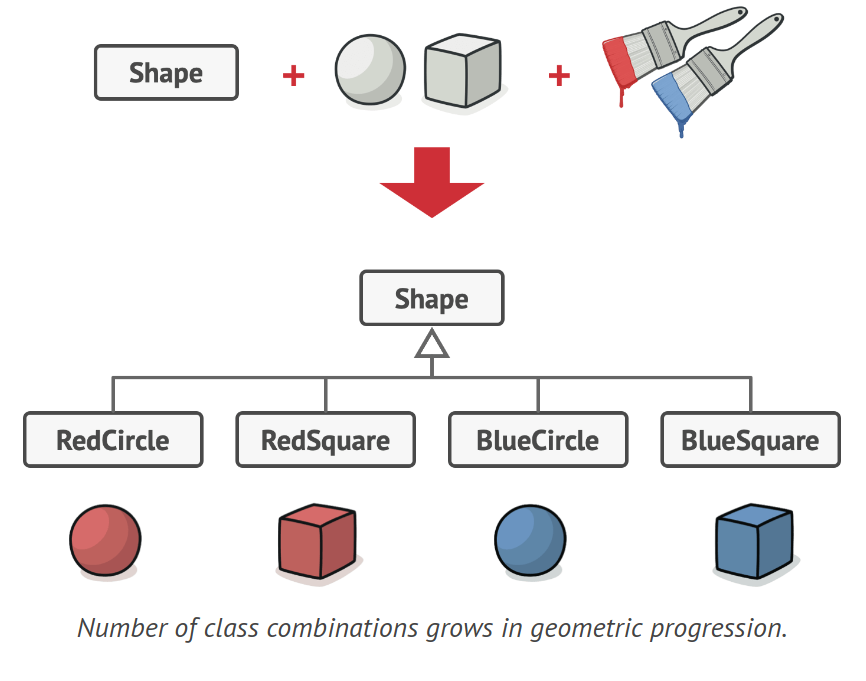
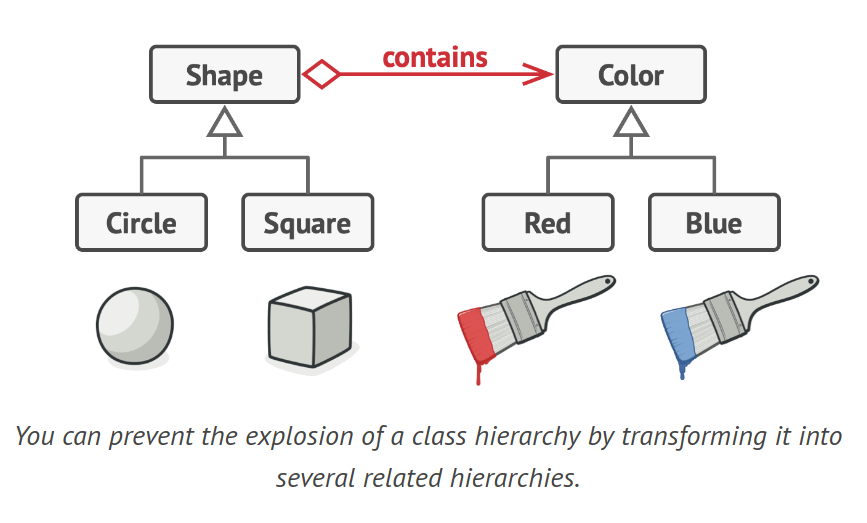
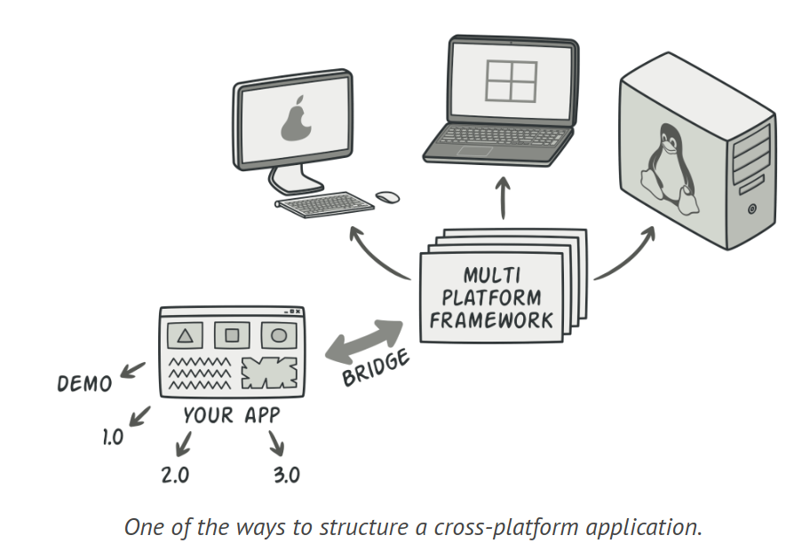
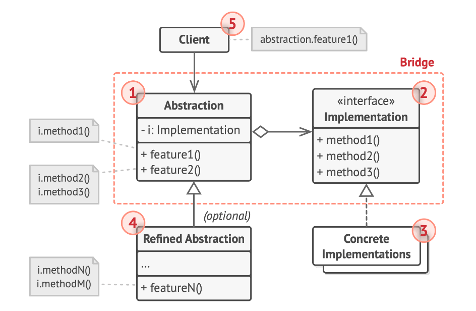

# Bridge Design Pattern

Bridge is a structural design pattern that allows you to divide a large class or a group of closely associated classes into two distinct hierarchies - abstraction and implementation. These hierarchies can be evolved independently of each other.

## Problem

Suppose you have a geometric Shape class with two subclasses: Circle and Square. You want to expand this class hierarchy to include colors, so you plan to create Red and Blue shape subclasses. However, since you already have two subclasses, you'll need to create four class combinations like BlueCircle and RedSquare.



The number of class combinations increases geometrically. Adding new shape types and colors to the hierarchy will cause it to grow exponentially. For instance, to add a triangle shape, you'd need to introduce two subclasses, one for each color. And after that, adding a new color would necessitate creating three subclasses, one for each shape type. The more we progress, the more complex it becomes.

## Solution

This issue arises because we're trying to extend the shape classes in two independent dimensions: form and color. This is a common problem with class inheritance.

The Bridge pattern aims to resolve this issue by transitioning from inheritance to object composition. This means that one of the dimensions is extracted into a separate class hierarchy, so the original classes will reference an object of the new hierarchy, instead of having all of its state and behaviors within one class.

By transforming it into several related hierarchies, you can prevent the explosion of a class hierarchy.



Following this approach, we can extract the color-related code into its own class with two subclasses: Red and Blue. The Shape class then gets a reference field pointing to one of the color objects. Now, the shape can delegate any color-related work to the linked color object. That reference will serve as a bridge between the Shape and Color classes. From this point forward, adding new colors won't require changing the shape hierarchy, and vice versa.

Broadly speaking, you can expand such an application in two independent directions:

- Implement several different GUIs (for example, customized for regular customers or administrators).

- Support several different APIs (for instance, to enable the app to run under Windows, Linux, and macOS).

In the worst-case scenario, this app might resemble a massive spaghetti bowl, where hundreds of conditionals connect different types of GUI with various APIs throughout the code.

Making changes to a monolithic codebase is quite challenging because you need to understand the entire thing very well. However, making changes to smaller, well-defined modules is much easier.

You can bring order to this chaos by extracting the code related to specific interface-platform combinations into separate classes. However, you'll soon find that there are many of these classes. The class hierarchy will grow exponentially because adding a new GUI or supporting a different API would require creating more and more classes.

Let's attempt to solve this issue with the Bridge pattern. It suggests that we split the classes into two hierarchies:

- Abstraction: the GUI layer of the app.

- Implementation: the operating systems' APIs.



The abstraction object manages the app's appearance, delegating the actual work to the linked implementation object. Different implementations are interchangeable as long as they follow a common interface, allowing the same GUI to work under Windows and Linux.

As a result, you can modify the GUI classes without affecting the API-related classes. Furthermore, adding support for another operating system only requires creating a subclass in the implementation hierarchy.

## Structure



1. The Abstraction provides high-level control logic, depending on the implementation object for the actual low-level work.

2. The Implementation declares a common interface for all concrete implementations. The abstraction communicates with an implementation object only through methods declared here.

3. Concrete Implementations contain platform-specific code.

4. Refined Abstractions offer variations of control logic. Like their parent, they work with different implementations via the general implementation interface.

5. Typically, the Client is only interested in working with the abstraction. However, it's the client's responsibility to link the abstraction object with one of the implementation objects.

## Example Code

```java
// The "implementation" interface declares methods common to all concrete implementation classes.
interface Device {
    boolean isEnabled();
    void enable();
    void disable();
    int getVolume();
    void setVolume(int percent);
    int getChannel();
    void setChannel(int channel);
}

// All devices follow the same interface.
class Tv implements Device {

    private boolean on = false;
    private int volume = 30;
    private int channel = 1;
    
    // ...
    @Override
    public void enable() {
        on = true;
        System.out.println("TV is enabled");
    }

    @Override
    public void disable() {
        on = false;
        System.out.println("TV is disabled");
    }

    @Override
    public void setVolume(int volume) {
        // ...
        System.out.println("TV volume set to " + this.volume);
    }

    @Override
    public void setChannel(int channel) {
        // ...
        System.out.println("TV channel set to " + this.channel);
    }

    @Override
    public boolean isEnabled() {
        return on;
    }

    @Override
    public int getVolume() {
        return this.volume;
    }

    @Override
    public int getChannel() {
        return this.channel;
    }
}

class Radio implements Device {

    private boolean on = false;
    private int volume = 50;
    private int channel = 1;
    
    // ...
    @Override
    public void enable() {
        on = true;
        System.out.println("Radio is enabled");
    }

    @Override
    public void disable() {
        on = false;
        System.out.println("Radio is disabled");
    }

    @Override
    public void setVolume(int volume) {
        // ...
        System.out.println("Radio volume set to " + this.volume);
    }

    @Override
    public void setChannel(int channel) {
        // ...
        System.out.println("Radio channel set to " + this.channel);
    }

    @Override
    public boolean isEnabled() {
        return on;
    }

    @Override
    public int getVolume() {
        return this.volume;
    }

    @Override
    public int getChannel() {
        return this.channel;
    }
}
// The "abstraction" defines the interface for the "control" part of the two class hierarchies.
class RemoteControl {
    protected Device device;

    public RemoteControl(Device device) {
        this.device = device;
    }
    
    public void togglePower() {
        if (device.isEnabled()) {
            device.disable();
            System.out.println("Powering down");
        } else {
            device.enable();
            System.out.println("Powering up");
        }
    }

    public void volumeDown() {
        device.setVolume(device.getVolume() - 10);
        System.out.println("Volume down");
    }

    public void volumeUp() {
        device.setVolume(device.getVolume() + 10);
        System.out.println("Volume up");
    }

    public void channelDown() {
        device.setChannel(device.getChannel() - 1);
        System.out.println("Channel down");
    }

    public void channelUp() {
        device.setChannel(device.getChannel() + 1);
        System.out.println("Channel up");
    }
}

// You can extend classes from the abstraction hierarchy independently from device classes.
class AdvancedRemoteControl extends RemoteControl {
    public AdvancedRemoteControl(Device device) {
        super(device);
    }

    public void mute() {
        device.setVolume(0);
    }
}
```

## How to Implement

1. Identify the orthogonal dimensions in your classes. These could be independent concepts like: abstraction/platform, domain/infrastructure, front-end/back-end, or interface/implementation.

2. Determine the operations the client requires and define them in the base abstraction class.

3. Identify the operations available on all platforms. Declare the ones needed by the abstraction in the general implementation interface.

4. Create concrete implementation classes for all platforms in your domain, ensuring they all follow the implementation interface.

5. In the abstraction class, add a reference field for the implementation type. The abstraction delegates most of the work to the implementation object referenced in that field.

6. If you have several variants of high-level logic, create refined abstractions for each variant by extending the base abstraction class.

7. The client code should pass an implementation object to the abstraction's constructor to link them. After that, the client can disregard the implementation and work only with the abstraction object.

## Applicability

1. You want to divide and organize a large class that has several variations of some functionality, such as a class that can work with various database servers.

2. The Bridge pattern allows you to split the large class into several class hierarchies, simplifying code maintenance and minimizing the risk of breaking existing code.

3. You need to extend a class in several orthogonal (independent) dimensions. The Bridge pattern suggests extracting a separate class hierarchy for each dimension. The original class then delegates related work to objects belonging to these hierarchies.

4. You need to switch implementations at runtime. While optional, the Bridge pattern allows you to replace the implementation object inside the abstraction, as simple as assigning a new value to a field.

Remember, a pattern is more than just a way to structure your classes. It also communicates intent and the problem being addressed. This is why the Bridge pattern is often confused with the Strategy pattern.
