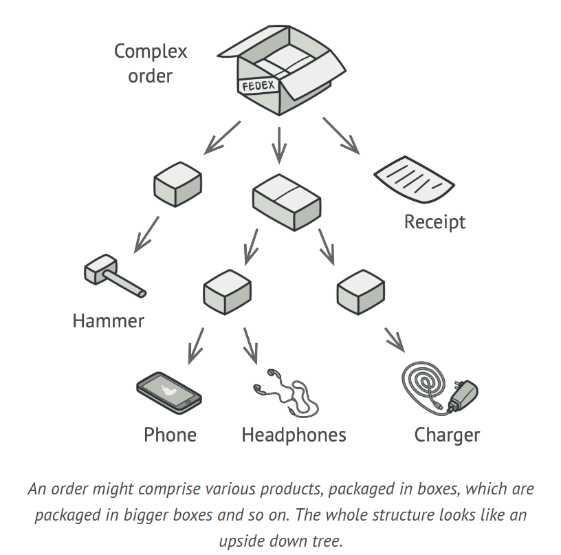
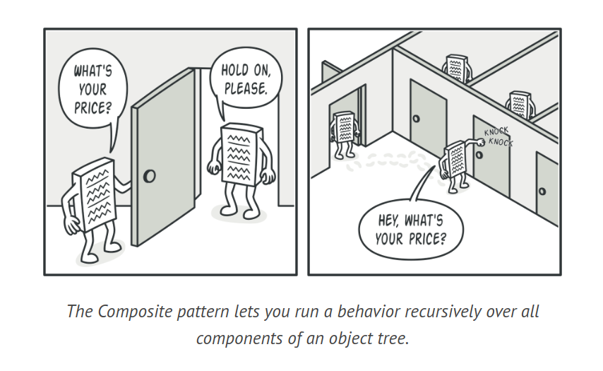
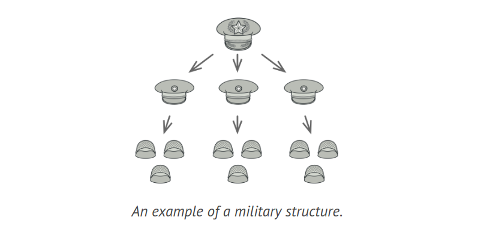
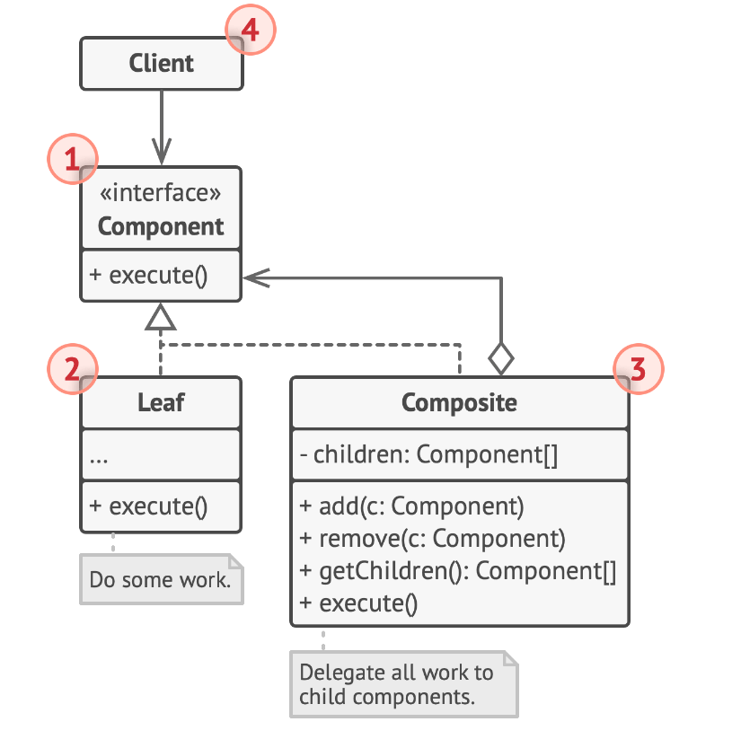
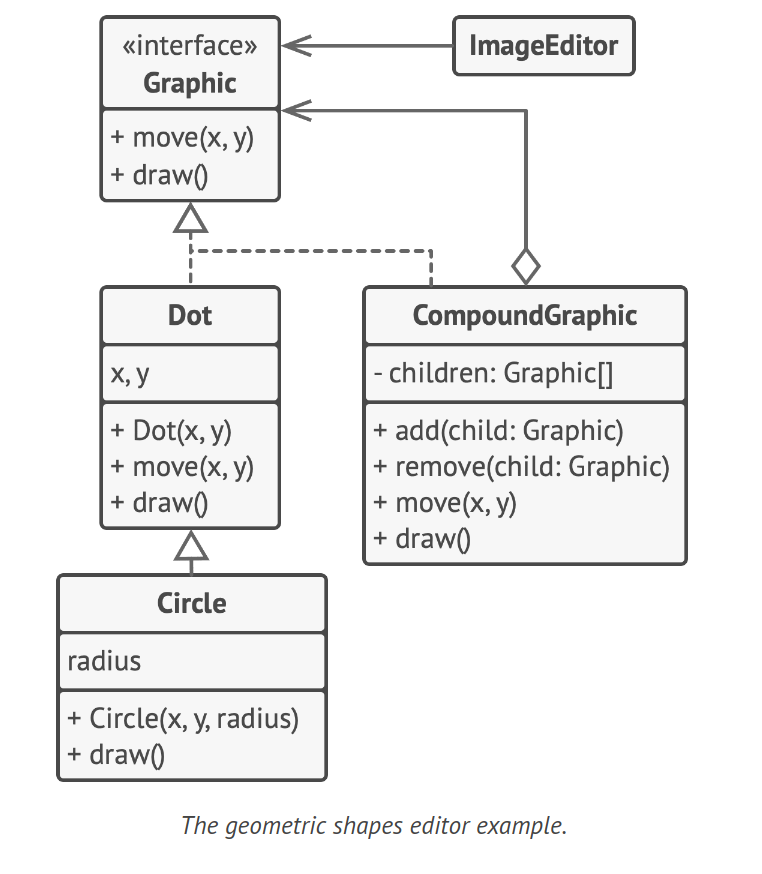

# Composite Design Pattern

The Composite is a type of structural design pattern that allows you to assemble objects into tree-like structures. Once assembled, these structures can be operated on as though they were single entities.

## Problem

The Composite pattern is useful when your application's core model can be depicted as a tree. Consider an example where you have Products and Boxes, where a Box can contain multiple Products and smaller Boxes. This forms a tree-like structure. If you were to create an ordering system with these classes, calculating the total price of an order could be complex due to the nested nature of the boxes. The Composite pattern simplifies this by allowing you to work with individual and composite objects uniformly.



## Solution

The Composite pattern proposes using a common interface for Products and Boxes, which includes a method to calculate the total price. For a Product, this method would return its price. For a Box, it would calculate the total price of its contents, including any smaller Boxes, and could also include additional costs like packaging.



This pattern allows you to apply behaviors recursively across an object tree, without needing to know the specific classes of the objects in the tree. Whether an object is a simple Product or a complex Box, you can interact with them uniformly through the common interface. When a method is called, the objects pass the request down the tree.



A real-world analogy is a military hierarchy. An army is structured into divisions, brigades, platoons, and squads, each containing smaller units. Orders are given at the top and passed down through each level, similar to how requests are passed down in the Composite pattern.

## Structure



1. The Component interface defines operations common to both simple and complex tree elements.

2. The Leaf, a basic tree element, doesn't have sub-elements and usually performs most of the actual work as it can't delegate tasks.

3. The Container, also known as composite, is an element with sub-elements (leaves or other containers). It interacts with its sub-elements through the component interface, delegating work to them, processing intermediate results, and returning the final result to the client.

4. The Client interacts with all elements via the component interface, allowing it to work uniformly with both simple and complex tree elements.

## How to Implement

1. Ensure your application's core model can be depicted as a tree structure. Break it down into simple elements and containers, keeping in mind that containers should be able to hold both simple elements and other containers.

2. Define the component interface with methods that are applicable to both simple and complex components.

3. Develop a leaf class to represent simple elements. There may be several different leaf classes in a program.

4. Develop a container class to represent complex elements. Include an array field in this class to store references to sub-elements. This array should be able to store both leaves and containers, so it should be declared with the component interface type. When implementing the component interface methods, remember that a container should delegate most of the work to its sub-elements.

5. Lastly, define methods for adding and removing child elements in the container class. Note that these operations could be declared in the component interface, but this could violate the Interface Segregation Principle as the methods would be empty in the leaf class. However, this allows the client to treat all elements equally, even when building the tree.

## Example Code



```java
interface Graphic {
    void move(int x, int y);
    void draw();
}

class Dot implements Graphic {
    int x, y;

    Dot(int x, int y) {
        this.x = x;
        this.y = y;
    }

    @Override
    public void move(int x, int y) {
        this.x += x;
        this.y += y;
    }

    @Override
    public void draw() {
        System.out.println("Drawing a dot at (" + x + ", " + y + ")");
    }
}

class Circle extends Dot {
    int radius;

    Circle(int x, int y, int radius) {
        super(x, y);
        this.radius = radius;
    }

    @Override
    public void draw() {
        System.out.println("Drawing a circle at (" + x + ", " + y + ") with radius " + radius);
    }
}

class CompoundGraphic implements Graphic {
    List<Graphic> children = new ArrayList<>();

    void add(Graphic child) {
        children.add(child);
    }

    void remove(Graphic child) {
        children.remove(child);
    }

    @Override
    public void move(int x, int y) {
        for (Graphic child : children) {
            child.move(x, y);
        }
    }

    @Override
    public void draw() {
        for (Graphic child : children) {
            child.draw();
        }
    }
}

class ImageEditor {
    CompoundGraphic all;

    void load() {
        all = new CompoundGraphic();
        all.add(new Dot(1, 2));
        all.add(new Circle(5, 3, 10));
    }

    void groupSelected(List<Graphic> components) {
        CompoundGraphic group = new CompoundGraphic();
        for (Graphic component : components) {
            group.add(component);
            all.remove(component);
        }
        all.add(group);
    }

    void draw() {
        all.draw();
    }
}
```

## Applicability

1. Implement the Composite pattern when you need to create a tree-like structure of objects. This pattern offers two fundamental element types - simple leaves and complex containers, both sharing a common interface. A container can consist of leaves and other containers, enabling you to build a nested recursive object structure similar to a tree.

2. Apply the pattern when you want client code to handle simple and complex elements in a uniform manner. All elements in the Composite pattern share a common interface, allowing the client to interact with objects without concern for their specific classes.
