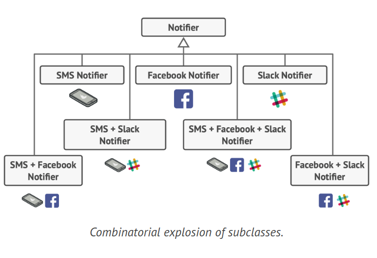
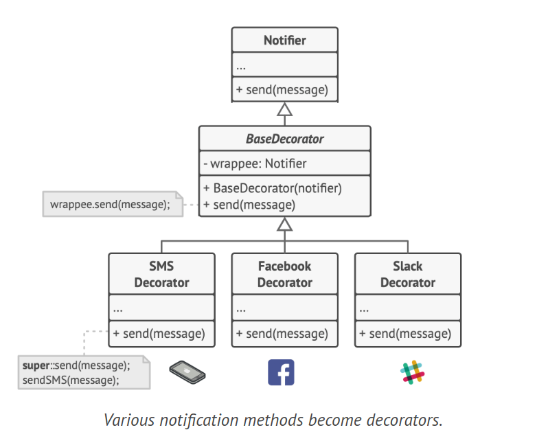
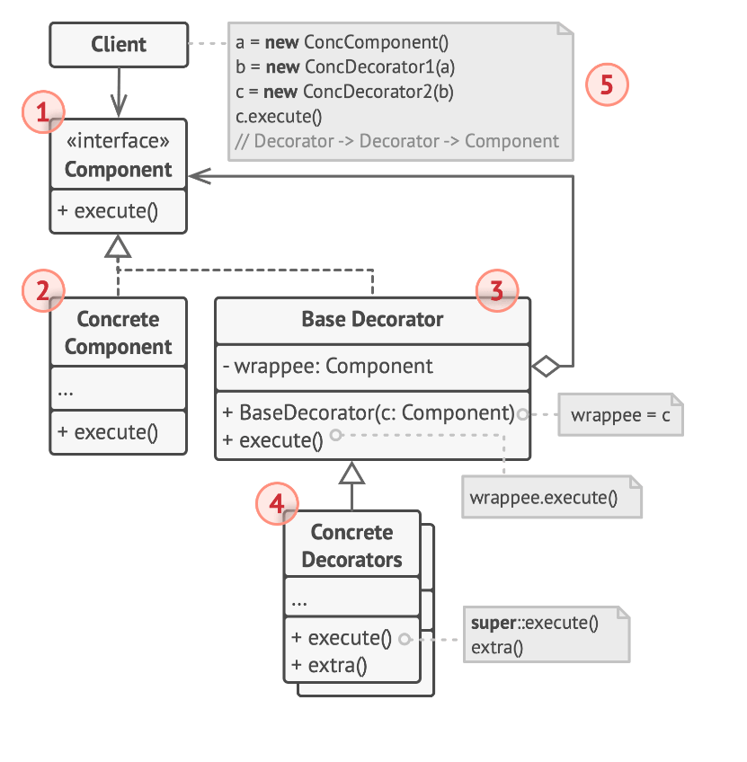
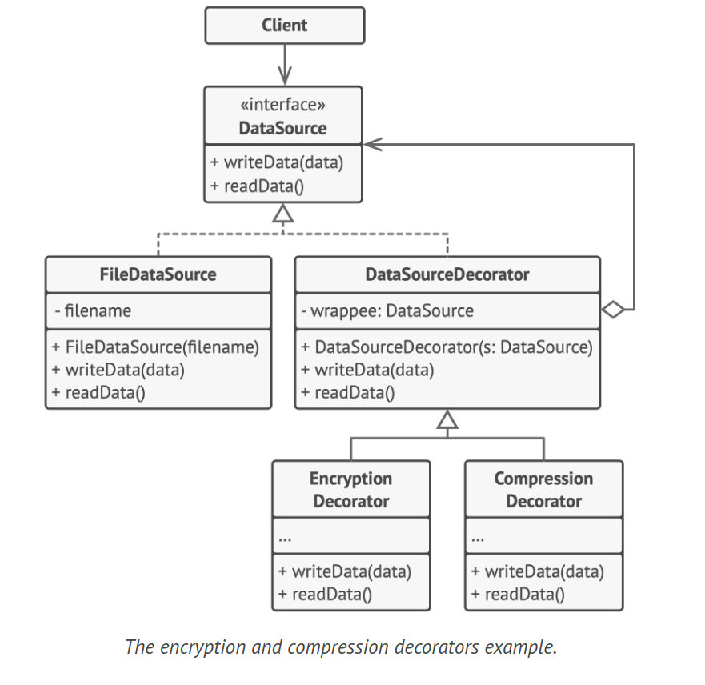

# Decorator Design Pattern

The Decorator is a structural design pattern that allows you to add new behaviors to objects by encapsulating them within special wrapper objects that hold the new behaviors.

## Problem

You're developing a notification library that initially only supported email notifications through a Notifier class. As users' needs evolved, they requested notifications via SMS, Facebook, and Slack. You initially implemented each notification type as a subclass of Notifier. However, when users wanted to use multiple notification types simultaneously, creating subclasses for every combination led to an explosion of subclasses and bloated code. You need to find a more efficient way to structure the notification classes.



## Solution

While inheritance is a common approach to modify an object's behavior, it's static and doesn't allow a class to inherit behaviors from multiple classes. An alternative is using Aggregation or Composition, where one object delegates work to another. This allows behavior substitution at runtime and an object can use behaviors of various classes. This principle is used in many design patterns, including Decorator.

In the Decorator pattern, also known as "Wrapper", an object is linked with a target object. The wrapper delegates all requests to the target but can alter the result. The wrapper becomes a decorator when its reference field accepts any object following the same interface, allowing an object to be covered in multiple wrappers and gain combined behavior.



In the context of a notification system, different notification methods can be decorators. The client wraps a basic notifier object in decorators matching their preferences, creating a stack of objects. The client interacts with the last decorator in the stack, which follows the same interface as the base notifier. This approach can be applied to other behaviors like message formatting or recipient list composition.

A real-world analogy is wearing clothes. You can layer multiple pieces of clothing for combined effects, similar to using decorators.

## Structure



1. The Component sets a common interface for both the wrappers (decorators) and the objects being wrapped.

2. The Concrete Component is the class of objects that are wrapped. It provides the basic behavior that decorators can modify.

3. The Base Decorator class contains a reference to the wrapped object. This reference is declared as the component interface, allowing it to hold both concrete components and decorators. The base decorator passes all operations to the wrapped object.

4. Concrete Decorators add extra behaviors to components dynamically. They override the base decorator's methods and execute their behavior either before or after invoking the parent method.

5. The Client can layer components with multiple decorators, provided it interacts with all objects through the component interface.

## How to Implement

1. Ensure your business domain can be depicted as a core component with multiple optional layers on top.

2. Identify the methods common to the core component and the optional layers. Establish a component interface and define these methods there.

3. Develop a concrete component class and set the base behavior within it.

4. Develop a base decorator class. It should contain a field to store a reference to the wrapped object. The field should be declared with the component interface type to allow linking to both concrete components and decorators. The base decorator should delegate all tasks to the wrapped object.

5. Ensure all classes implement the component interface.

6. Create concrete decorators by extending the base decorator. A concrete decorator should execute its behavior either before or after the call to the parent method (which always delegates to the wrapped object).

7. The client code should be responsible for creating and arranging decorators as needed.

## Example Code



```java
// The component interface defines operations that can be altered by decorators.
interface DataSource {
    void writeData(String data);
    String readData();
}

// Concrete components provide default implementations for the operations.
class FileDataSource implements DataSource {
    private String filename;

    public FileDataSource(String filename) {
        this.filename = filename;
    }

    public void writeData(String data) {
        // Write data to file.
    }

    public String readData() {
        // Read data from file.
        return "data";
    }
}

// The base decorator class follows the same interface as the other components.
class DataSourceDecorator implements DataSource {
    protected DataSource wrappee;

    public DataSourceDecorator(DataSource source) {
        this.wrappee = source;
    }

    public void writeData(String data) {
        wrappee.writeData(data);
    }

    public String readData() {
        return wrappee.readData();
    }
}

// Concrete decorators must call methods on the wrapped object.
class EncryptionDecorator extends DataSourceDecorator {
    public EncryptionDecorator(DataSource source) {
        super(source);
    }

    public void writeData(String data) {
        // 1. Encrypt passed data.
        // 2. Pass encrypted data to the wrappee's writeData method.
        super.writeData(data);
    }

    public String readData() {
        // 1. Get data from the wrappee's readData method.
        // 2. Try to decrypt it if it's encrypted.
        // 3. Return the result.
        return super.readData();
    }
}

class CompressionDecorator extends DataSourceDecorator {
    public CompressionDecorator(DataSource source) {
        super(source);
    }

    public void writeData(String data) {
        // 1. Compress passed data.
        // 2. Pass compressed data to the wrappee's writeData method.
        super.writeData(data);
    }

    public String readData() {
        // 1. Get data from the wrappee's readData method.
        // 2. Try to decompress it if it's compressed.
        // 3. Return the result.
        return super.readData();
    }
}

class Application {
    public static void main(String[] args) {
        DataSource source = new FileDataSource("somefile.dat");
        source.writeData("salaryRecords");
        source = new CompressionDecorator(source);
        source.writeData("salaryRecords");
        source = new EncryptionDecorator(source);
        source.writeData("salaryRecords");
    }
}
```

## Applicability

1. Use the Decorator pattern when you need to add extra behaviors to objects at runtime without disrupting the code that utilizes these objects. The Decorator allows you to organize your business logic into layers, create a decorator for each layer, and assemble objects with various combinations of this logic at runtime. All these objects can be treated the same by the client code, as they all adhere to a common interface.

2. Employ the pattern when extending an object's behavior using inheritance is impractical or impossible. Many programming languages have a 'final' keyword that prevents further extension of a class. For such a final class, the only way to reuse the existing behavior is to wrap the class with your own wrapper, using the Decorator pattern.
