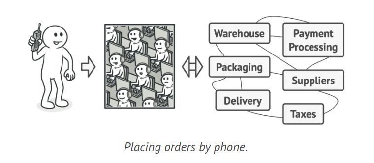
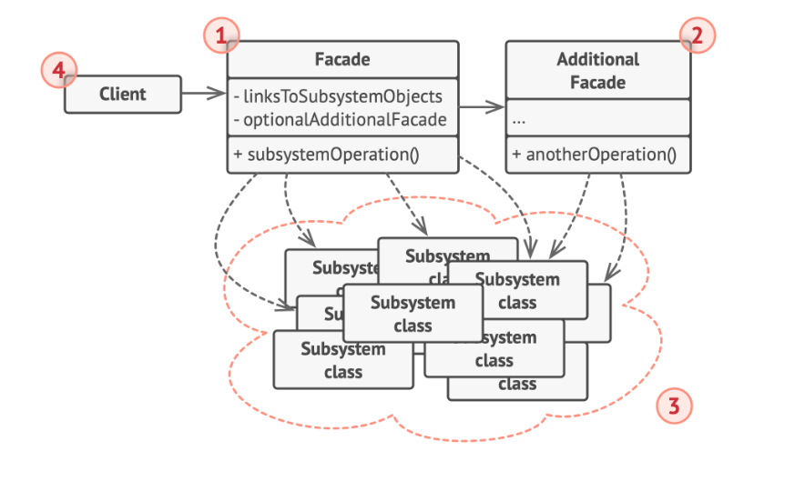
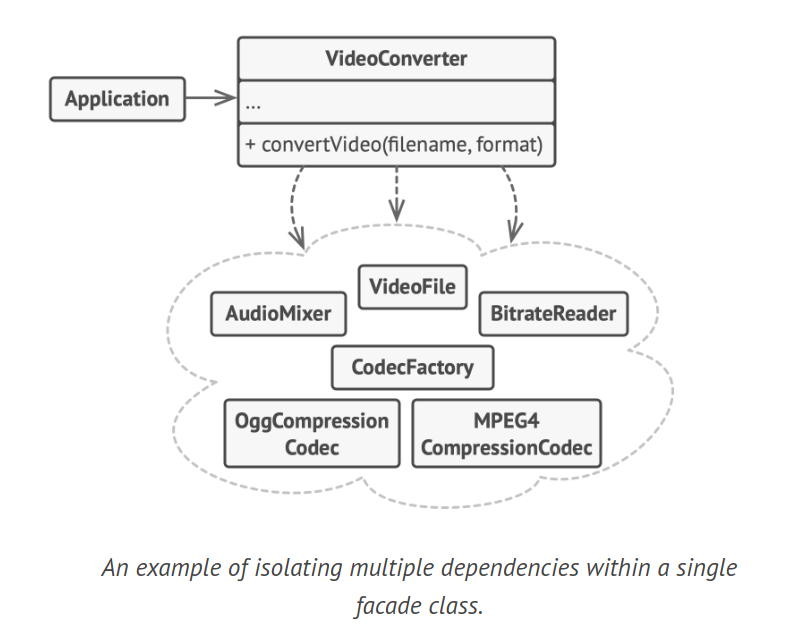

# Facade Design Pattern

The Facade is a structural design pattern that offers a simplified interface to a complex system, such as a library or framework, or a set of intricate classes.

## Problem

Consider a scenario where your code needs to interact with a wide range of objects from a complex library or framework. Typically, you would have to initialize all these objects, manage dependencies, and execute methods in the right sequence, among other tasks. Consequently, your classes' business logic would become closely intertwined with the implementation specifics of third-party classes, making the code difficult to understand and maintain.

## Solution

A facade is a class that offers a straightforward interface to a complex subsystem teeming with numerous components. While a facade might offer less functionality compared to interacting directly with the subsystem, it only includes the features that clients genuinely need.

A facade proves useful when you need to integrate your application with a complex library that has a multitude of features, but you only require a small fraction of its functionality. For example, an application that posts short humorous cat videos on social media could potentially utilize a professional video conversion library. However, all it truly needs is a class with a single method, encode(filename, format). After creating such a class and linking it with the video conversion library, you'll have your initial facade.



Consider the real-world analogy of placing orders via phone. When you call a store to place an order, the operator serves as your facade to all the store's services and departments. The operator offers you a simple voice interface to the order system, payment gateways, and various delivery services.

## Structure



1. The Facade serves as a convenient gateway to a specific portion of the subsystem's functionality. It understands where to route the client's request and how to manage all the moving components.

2. To avoid cluttering a single facade with unrelated features that could make it another complex structure, an additional Facade class can be created. These additional facades can be utilized by both clients and other facades.

3. The Complex Subsystem comprises numerous diverse objects. To make them perform something meaningful, you need to delve into the subsystem's implementation details, such as initializing objects in the right sequence and providing them with data in the correct format. Subsystem classes are oblivious to the facade's existence. They function within the system and interact directly with each other.

4. Instead of directly invoking the subsystem objects, the Client uses the facade.

## Example Code



```java
class VideoFile {
    public VideoFile(String filename) {
        System.out.println("VideoFile created: " + filename);
    }
}

class OggCompressionCodec {
    public OggCompressionCodec() {
        System.out.println("OggCompressionCodec created");
    }
}

class MPEG4CompressionCodec {
    public MPEG4CompressionCodec() {
        System.out.println("MPEG4CompressionCodec created");
    }
}

class CodecFactory {
    public static Object extract(VideoFile file) {
        System.out.println("CodecFactory extracting codec");
        return new Object();
    }
}

class BitrateReader {
    public static Object read(String filename, Object sourceCodec) {
        System.out.println("BitrateReader reading file with codec");
        return new Object();
    }

    public static Object convert(Object buffer, Object destinationCodec) {
        System.out.println("BitrateReader converting bitrate");
        return new Object();
    }
}

class AudioMixer {
    public Object fix(Object result) {
        System.out.println("AudioMixer fixing audio");
        return new Object();
    }
}

// Facade class to hide the framework's complexity
class VideoConverter {
    public File convert(String filename, String format) {
        VideoFile file = new VideoFile(filename);
        Object sourceCodec = CodecFactory.extract(file);
        Object destinationCodec;
        if (format.equals("mp4")) {
            destinationCodec = new MPEG4CompressionCodec();
        } else {
            destinationCodec = new OggCompressionCodec();
        }
        Object buffer = BitrateReader.read(filename, sourceCodec);
        Object result = BitrateReader.convert(buffer, destinationCodec);
        result = (new AudioMixer()).fix(result);
        System.out.println("VideoConverter: conversion complete.");
        return new File("output." + format);
    }
}
```

## How to Implement

1. Evaluate if it's feasible to offer a simpler interface than the one currently provided by an existing subsystem. You're on the right path if this interface allows the client code to be independent from many of the subsystem's classes.

2. Declare and implement this interface in a new facade class. The facade should redirect calls from the client code to the appropriate subsystem objects. The facade should handle the initialization of the subsystem and manage its ongoing lifecycle, unless the client code already handles this.

3. To fully leverage the pattern, ensure all client code interacts with the subsystem solely through the facade. This shields the client code from any changes in the subsystem code. For instance, if a subsystem is upgraded to a new version, you'll only need to modify the code in the facade.

4. If the facade becomes overly large, consider moving part of its behavior to a new, refined facade class.

## Applicability

1. Implement the Facade pattern when you require a simple yet limited interface to a complex subsystem. Subsystems often grow more complex over time, and even the application of design patterns usually results in more classes. While a subsystem may become more flexible and reusable in various contexts, the amount of configuration and boilerplate code it demands from a client tends to increase. The Facade aims to solve this issue by offering a shortcut to the most commonly used features of the subsystem that meet most client needs.

2. Utilize the Facade when you aim to structure a subsystem into layers. Create facades to define entry points to each level of a subsystem. You can minimize coupling between multiple subsystems by requiring them to communicate only through facades.
