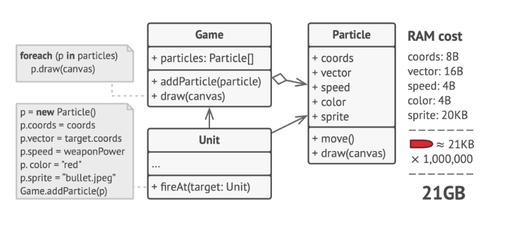
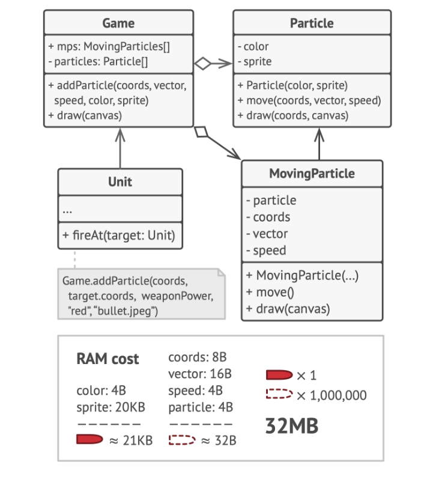
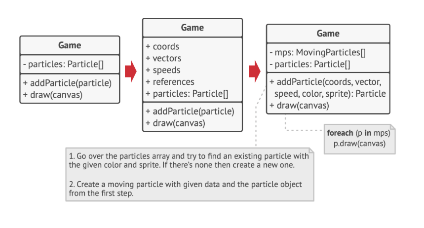
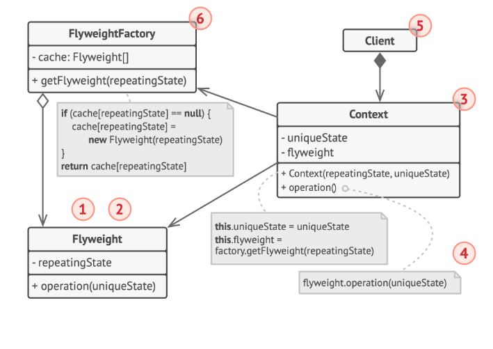
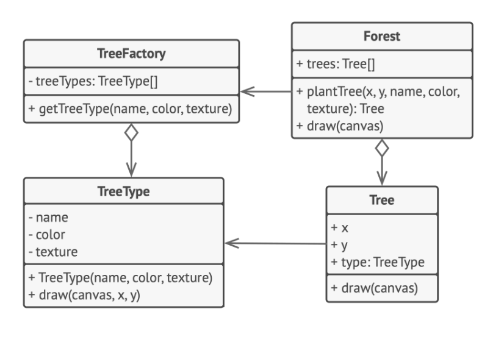

# Flyweight Design Patter

> Also known as: Cache

The Flyweight is a structural design pattern that allows you to accommodate more objects within the available RAM by sharing common state components among multiple objects, rather than storing all data in each individual object.

## Problem

After a long day of work, you decided to unwind by creating a simple video game where players could navigate a map and engage in combat. You decided to incorporate a realistic particle system as a unique feature of the game. This would involve large amounts of bullets, missiles, and explosion debris flying across the map, providing an exciting experience for the player.

Upon finishing the game, you made your final commit, built the game, and sent it to a friend for testing. While the game ran perfectly on your machine, your friend experienced frequent crashes after just a few minutes of gameplay.

After several hours of examining debug logs, you discovered that the crashes were due to insufficient RAM. It turned out that your friend's computer was less powerful than yours, which is why the issue became apparent so quickly on his machine.



The issue was specifically related to your particle system. Each particle, whether a bullet, missile, or piece of shrapnel, was represented by a separate object containing a large amount of data. At the height of the on-screen chaos, the creation of new particles exceeded the available RAM, causing the program to crash.

## Solution

Upon a detailed examination of the Particle class, it becomes apparent that the color and sprite fields consume significantly more memory than other fields. Moreover, these two fields store almost identical data across all particles. For instance, all bullets share the same color and sprite.

Other aspects of a particle's state, such as coordinates, movement vector, and speed, are unique to each particle. These fields change over time, representing the dynamic context in which the particle exists, while the color and sprite remain constant for each particle.

This constant data within an object is typically referred to as the `intrinsic state`. It resides within the object and can only be read, not modified, by other objects. The rest of the object's state, often modified "from the outside" by other objects, is known as the `extrinsic state`.

The Flyweight pattern suggests removing the extrinsic state from the object. Instead, this state should be passed to specific methods that depend on it. Only the intrinsic state remains within the object, allowing it to be reused in different contexts.



As a result, fewer objects are needed since they only differ in the intrinsic state, which has fewer variations than the extrinsic state.

Returning to our game, if we extracted the extrinsic state from our particle class, only three different objects would be needed to represent all particles in the game: a bullet, a missile, and a piece of shrapnel. An object that only stores the intrinsic state is known as a flyweight.

So, where does the extrinsic state go? It usually gets moved to the container object, which aggregates objects before we apply the pattern. In our case, that's the main Game object that stores all particles in the particles field. To move the extrinsic state into this class, you need to create several array fields for storing coordinates, vectors, and speed of each individual particle. Additionally, you need another array for storing references to a specific flyweight that represents a particle. These arrays must be `synchronized` so that you can access all data of a particle using the same index.



A more refined solution is to create a separate context class that stores the extrinsic state along with a reference to the flyweight object. This approach requires only a single array in the container class.

Although this means we will have as many of these contextual objects as we had initially, these objects are much smaller than before. The most memory-consuming fields have been moved to just a few flyweight objects. Now, a thousand small contextual objects can reuse a single heavy flyweight object instead of storing a thousand copies of its data.

Since the same flyweight object can be used in different contexts, it's crucial to ensure that its state can't be modified. It needs to be `immutable`. A flyweight should initialize its state just once, via constructor parameters. It shouldn't expose any setters or public fields to other objects.

For easier access to various flyweights, you can create a `factory method` that manages a pool of existing flyweight objects. The method accepts the intrinsic state of the desired flyweight from a client, looks for an existing flyweight object matching this state, and returns it if found. If not, it creates a new flyweight and adds it to the pool. This method could be placed in a flyweight container, a new factory class, or it could be made static and put inside an actual flyweight class.

## Structure



1. The Flyweight pattern is an optimization technique used to address RAM consumption issues related to having a large number of similar objects in memory simultaneously. It should be applied only when no other meaningful solutions are available to solve this problem.

2. The Flyweight class holds the part of the original object's state that can be shared among multiple objects. This state, known as the intrinsic state, allows the same flyweight object to be used in various contexts.

3. The Context class holds the extrinsic state, which is unique across all original objects. When a context is paired with a flyweight object, it represents the full state of the original object.

4. Typically, the behavior of the original object remains in the flyweight class. When a flyweight's method is called, the appropriate parts of the extrinsic state must be passed into the method's parameters. Alternatively, the behavior can be moved to the context class, which would use the linked flyweight merely as a data object.

5. The Client calculates or stores the extrinsic state of flyweights. From the client's perspective, a flyweight is a template object that can be configured at runtime by passing some contextual data into parameters of its methods.

6. The Flyweight Factory manages a pool of existing flyweights. Clients don't create flyweights directly but call the factory, passing it the intrinsic state of the desired flyweight. The factory reviews previously created flyweights and either returns an existing one that matches the search criteria or creates a new one if nothing is found.

## How to Implement

1. Split the fields of the class that will become a flyweight into two categories:

    - Intrinsic state: These are fields that hold unchanging data duplicated across many objects.

    - Extrinsic state: These are fields that contain contextual data unique to each object.

2. Retain the fields representing the intrinsic state in the class, ensuring they are immutable. These fields should only be initialized within the constructor.

3. Review methods that utilize fields of the extrinsic state. For each field used in the method, introduce a new parameter and use it in place of the field.

4. Optionally, establish a factory class to manage the pool of flyweights. This factory should check for an existing flyweight before creating a new one. Once the factory is set up, clients should only request flyweights through it. They should specify the desired flyweight by passing its intrinsic state to the factory.

5. The client is responsible for storing or calculating values of the extrinsic state (context) in order to call methods of flyweight objects. For convenience, the extrinsic state and the field referencing the flyweight may be moved to a separate context class.

## Example Code



```java
// Flyweight class
class TreeType {
    private String name;
    private String color;
    private String texture;

    public TreeType(String name, String color, String texture) {
        this.name = name;
        this.color = color;
        this.texture = texture;
    }

    public void draw(String canvas, int x, int y) {
        System.out.println("Drawing a " + this.name + " tree of color " + this.color + " and texture " + this.texture + " on canvas at coordinates (" + x + ", " + y + ")");
    }
}

// Flyweight Factory
class TreeFactory {
    private static Map<String, TreeType> treeTypes = new HashMap<>();

    public static TreeType getTreeType(String name, String color, String texture) {
        String key = name + color + texture;
        if(!treeTypes.containsKey(key)) {
            treeTypes.put(key, new TreeType(name, color, texture));
            System.out.println("Creating a new TreeType: " + name + ", " + color + ", " + texture);
        }
        return treeTypes.get(key);
    }
}

// Contextual class
class Tree {
    private int x, y;
    private TreeType type;

    public Tree(int x, int y, TreeType type) {
        this.x = x;
        this.y = y;
        this.type = type;
    }

    public void draw(String canvas) {
        type.draw(canvas, this.x, this.y);
    }
}

// Client class
class Forest {
    private List<Tree> trees = new ArrayList<>();

    public void plantTree(int x, int y, String name, String color, String texture) {
        TreeType type = TreeFactory.getTreeType(name, color, texture);
        Tree tree = new Tree(x, y, type);
        trees.add(tree);
    }

    public void draw(String canvas) {
        for(Tree tree : trees) {
            tree.draw(canvas);
        }
    }
}
```

## Applicability

The Flyweight pattern should only be used when your program needs to support a large number of objects that almost exceed the available RAM. The effectiveness of this pattern greatly depends on its usage context. It proves most beneficial when:

- The application needs to generate a vast number of similar objects.
- This process consumes all available RAM on the target device.
- The objects have redundant states that can be extracted and shared among multiple objects.
