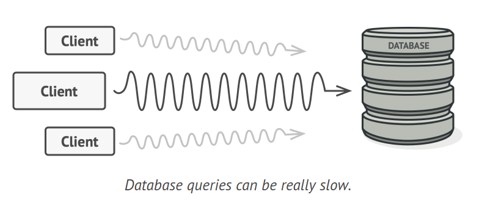
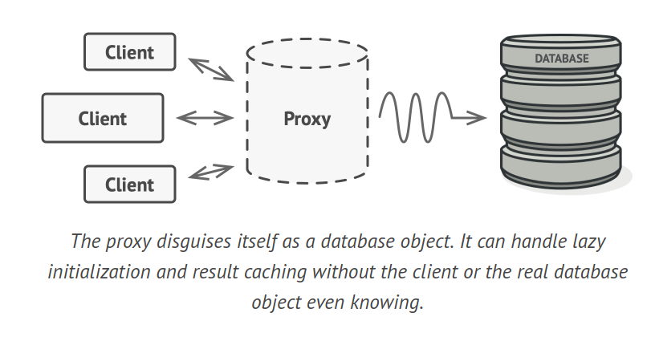
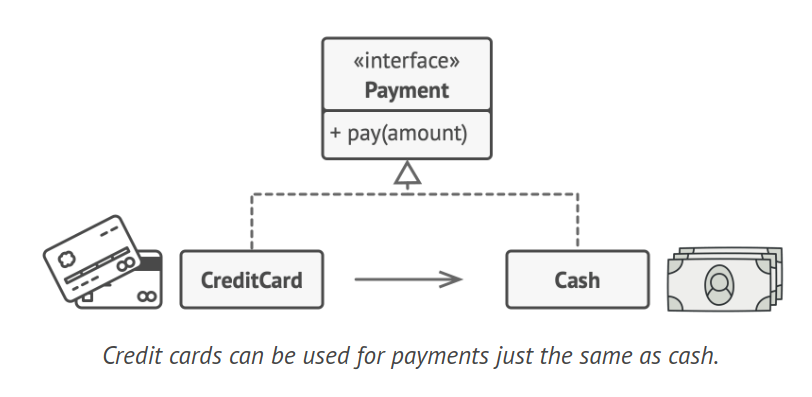
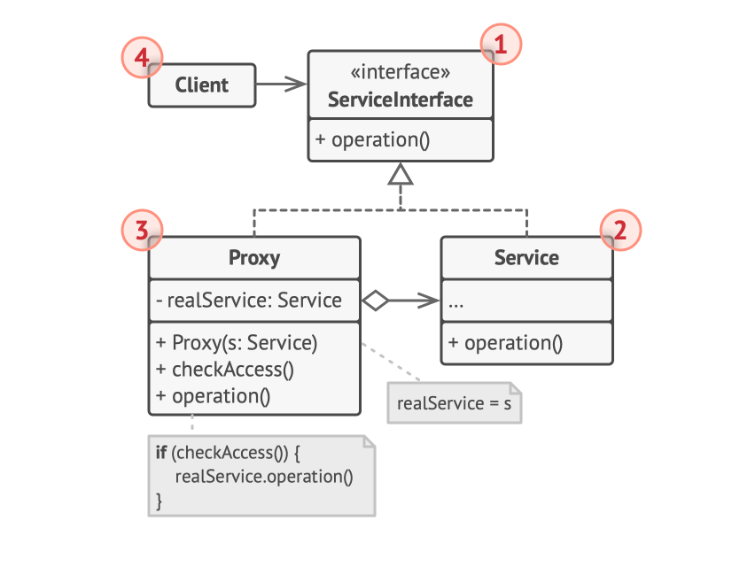
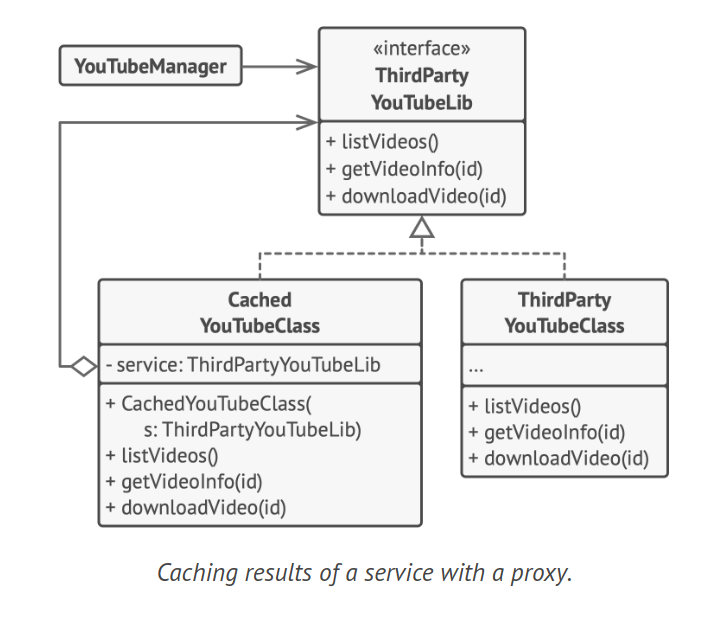

# Proxy Design Pattern

The Proxy is a structural design pattern that allows you to offer a replacement or placeholder for another object. A proxy manages access to the original object, enabling you to execute actions either before or after the request reaches the original object.

## Problem

Why might you need to regulate access to an object? Consider this scenario: you have a large object that uses a significant amount of system resources. You require it occasionally, but not constantly.



One solution could be to implement lazy initialization, creating this object only when it's truly necessary. However, all of the object's clients would have to carry out some deferred initialization code. Regrettably, this could lead to substantial code duplication.

Ideally, we would want to incorporate this code directly into our object's class, but that's not always feasible. For example, the class might be part of a sealed third-party library.

## Solution

The Proxy pattern proposes that you create a new proxy class with the same interface as the original service object. You then modify your application to pass the proxy object to all clients of the original object. When a client sends a request, the proxy generates a real service object and delegates all tasks to it.

The proxy presents itself as a database object. It can manage lazy initialization and result caching without the client or the real database object being aware.



What's the advantage? If you need to perform something either before or after the main logic of the class, the proxy allows you to do this without modifying that class. Since the proxy implements the same interface as the original class, it can be passed to any client that anticipates a real service object.



Credit cards can be used for payments just like cash. A credit card is a proxy for a bank account, which in turn is a proxy for a bundle of cash. Both implement the same interface: they can be used to make a payment. A consumer is pleased because there's no need to carry a lot of cash around. A shop owner is also satisfied as the income from a transaction is added electronically to the shop's bank account, eliminating the risk of losing the deposit or being robbed on the way to the bank.

## Structure



1. The Service Interface outlines the interface of the Service. The proxy needs to adhere to this interface to successfully impersonate a service object.

2. The Service is a class that delivers valuable business logic.

3. The Proxy class contains a reference field that points to a service object. Once the proxy completes its processing (such as lazy initialization, logging, access control, caching, etc.), it forwards the request to the service object. Typically, proxies handle the entire lifecycle of their service objects.

4. The Client should interact with both services and proxies through the same interface. This approach allows you to pass a proxy into any code that expects a service object.

## How to Implement

1. If there isn't an existing service interface, create one to ensure proxy and service objects are interchangeable. Extracting the interface from the service class might not always be feasible, as it would require modifying all of the service's clients to use that interface. An alternative is to make the proxy a subclass of the service class, allowing it to inherit the service's interface.

2. Construct the proxy class. It should have a field to store a reference to the service. Typically, proxies create and manage the entire lifecycle of their services. Occasionally, a service is provided to the proxy via a constructor by the client.

3. Implement the proxy methods based on their functions. In most scenarios, the proxy should delegate the work to the service object after performing some tasks.

4. Think about introducing a creation method that determines whether the client receives a proxy or a real service. This could be a simple static method in the proxy class or a more complex factory method.

5. Consider implementing lazy initialization for the service object.

## Example Code



```java
interface ThirdPartyYouTubeLib {
    void listVideos();
    void getVideoInfo(String id);
    void downloadVideo(String id);
}

class ThirdPartyYouTubeClass implements ThirdPartyYouTubeLib {
    public void listVideos() {
        System.out.println("Sending an API request to YouTube.");
    }

    public void getVideoInfo(String id) {
        System.out.println("Getting metadata about some video.");
    }

    public void downloadVideo(String id) {
        System.out.println("Downloading a video file from YouTube.");
    }
}

class CachedYouTubeClass implements ThirdPartyYouTubeLib {
    private ThirdPartyYouTubeLib service;
    private String listCache, videoCache;
    private boolean needReset;

    public CachedYouTubeClass(ThirdPartyYouTubeLib service) {
        this.service = service;
    }

    public void listVideos() {
        if (listCache == null || needReset) {
            listCache = "service.listVideos()";
            System.out.println("Caching video list.");
        }
        System.out.println("Returning cached video list.");
    }

    public void getVideoInfo(String id) {
        if (videoCache == null || needReset) {
            videoCache = "service.getVideoInfo(id)";
            System.out.println("Caching video info.");
        }
        System.out.println("Returning cached video info.");
    }

    public void downloadVideo(String id) {
        if (!"downloadExists(id)".equals(id) || needReset) {
            service.downloadVideo(id);
        }
    }
}

class YouTubeManager {
    protected ThirdPartyYouTubeLib service;

    public YouTubeManager(ThirdPartyYouTubeLib service) {
        this.service = service;
    }

    public void renderVideoPage(String id) {
        service.getVideoInfo(id);
        System.out.println("Rendering the video page.");
    }

    public void renderListPanel() {
        service.listVideos();
        System.out.println("Rendering the list of video thumbnails.");
    }

    public void reactOnUserInput() {
        renderVideoPage("videoId");
        renderListPanel();
    }
}
```

## Applicability

1. Lazy Initialization (Virtual Proxy): This is applicable when you have a resource-intensive service object that is always active, even though it's only needed occasionally. Instead of initializing the object at application launch, you can delay its initialization until it's truly required.

2. Access Control (Protection Proxy): This is useful when you want only specific clients to access the service object, such as when your objects are vital parts of an operating system and clients are various launched applications (including potentially harmful ones). The proxy can forward the request to the service object only if the client's credentials meet certain criteria.

3. Local Execution of a Remote Service (Remote Proxy): This is relevant when the service object is located on a remote server. In this scenario, the proxy sends the client request over the network, managing all the complexities of network operations.

4. Logging Requests (Logging Proxy): This is beneficial when you want to maintain a record of requests to the service object. The proxy can log each request before forwarding it to the service.

5. Caching Request Results (Caching Proxy): This is needed when you want to cache the results of client requests and manage the lifecycle of this cache, particularly if the results are large. The proxy can implement caching for recurring requests that always produce the same results, using the request parameters as cache keys.

6. Smart Reference: This is useful when you need to discard a heavyweight object once there are no clients using it. The proxy can monitor clients that obtained a reference to the service object or its results. Periodically, the proxy can check if the clients are still active. If the client list becomes empty, the proxy can dismiss the service object and release the underlying system resources. The proxy can also track if the client modified the service object, allowing unchanged objects to be reused by other clients.
