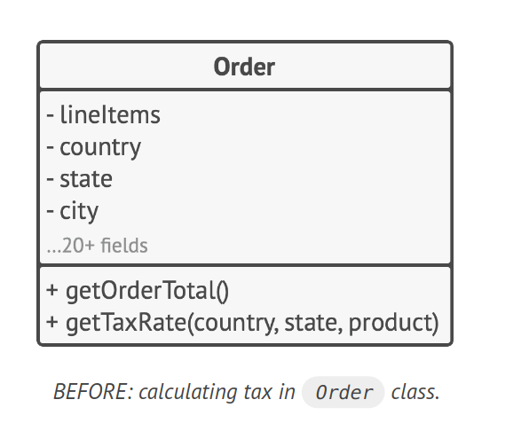
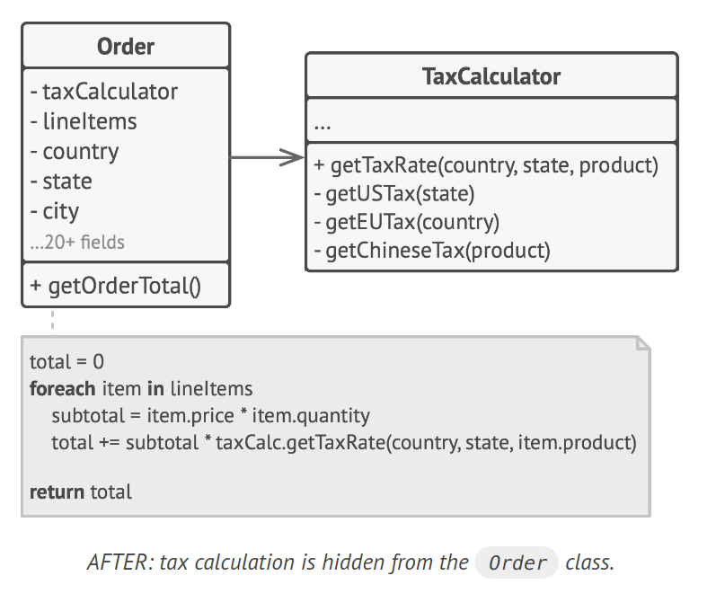

# Principle: Encapsulate What Varies

> Identify the aspects of your application that vary and separate them from what stays the same.

The primary objective of this principle is to mitigate the impact of changes. Consider your program as a ship, and changes as underwater mines. A direct hit can sink the ship. However, by compartmentalizing the ship's hull, damage can be confined to a single compartment, keeping the ship afloat even after a hit.

Similarly, in programming, we can isolate the varying parts of the program into independent modules, shielding the rest of the code from potential adverse effects. This approach reduces the time spent on getting the program back to a working state, implementing, and testing changes. Consequently, more time can be devoted to feature implementation.

## Encapsulation at Method Level

Consider an e-commerce website with a `getOrderTotal` method that calculates the total order cost, including taxes. The tax-related code is likely to change frequently due to varying tax rates and regulations. To handle this, we can extract the tax calculation logic into a separate method, encapsulating it from the original method.

```java
// BEFORE: Tax calculation code is mixed with the rest of the method's code.
getOrderTotal(order) {
    // ...
    if (order.country == "US") {
        total += total * 0.07; // US sales tax
    } else if (order.country == "EU") {
        total += total * 0.20; // European VAT
    }
    // ...
}

// AFTER: Tax-related changes are isolated inside a single method.
getOrderTotal(order) {
    // ...
    total += total * getTaxRate(order.country);
    // ...
}

getTaxRate(country) {
    if (country == "US") {
        return 0.07; // US sales tax
    } else if (country == "EU") {
        return 0.20; // European VAT
    } else {
        return 0;
    }
}
```

## Encapsulation at Class Level

Over time, a method may accumulate more responsibilities, blurring the primary responsibility of the containing class. In such cases, extracting everything to a new class can simplify and clarify the code.



```java
// BEFORE: Calculating tax in Order class.
Order {
    getOrderTotal() {
        // ...
    }
}
```
Objects of the `Order` class delegate all tax-related work to a
special object that does just that.



```java
// AFTER: Tax calculation is delegated to a specialized TaxCalculator class.
Order {
    getOrderTotal() {
        // ...
        total += total * taxCalculator.getTaxRate(order.country);
        // ...
    }
}

TaxCalculator {
    getTaxRate(country) {
        // Tax calculation logic...
    }
}
```
