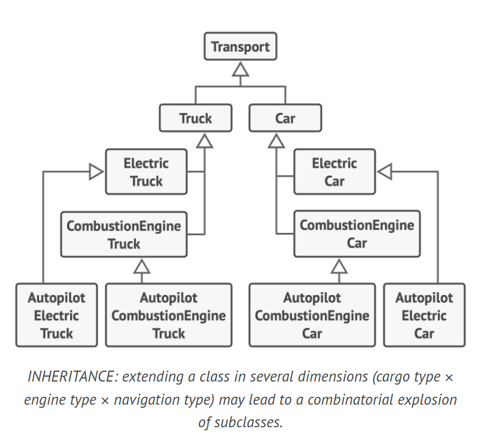
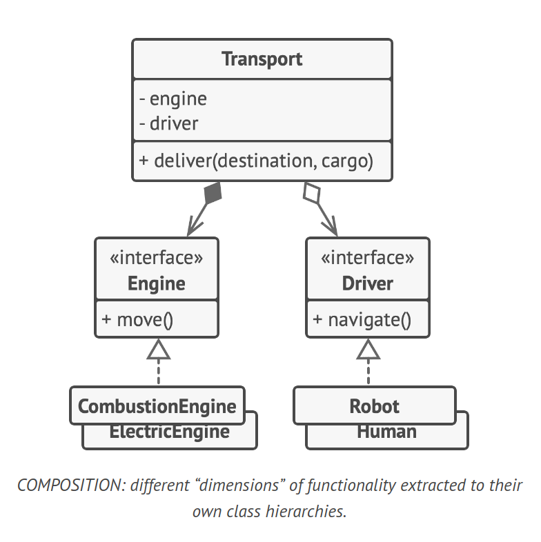

# Principle: Favor Composition Over Inheritance

Inheritance is a straightforward method for reusing code between classes. However, it comes with several drawbacks:

- A subclass cannot reduce the interface of the superclass.
- Overriding methods requires ensuring the new behavior is compatible with the base one.
- Inheritance breaks encapsulation as the internal details of the parent class become available to the subclass.
- Subclasses are tightly coupled to superclasses, making changes in a superclass potentially disruptive.
- Attempting to reuse code through inheritance can lead to bloated class hierarchies.

An alternative to inheritance is composition, which represents a "has a" relationship between classes (e.g., a car has an engine), as opposed to the "is a" relationship of inheritance (e.g., a car is a transport).

This principle also applies to aggregation, a variant of composition where one object may reference another but doesn't manage its lifecycle.

## Example

Consider a catalog app for a car manufacturer. The company makes cars and trucks, which can be electric or gas, and have either manual controls or an autopilot.



```java
// INHERITANCE: Each additional parameter results in multiplying the number of subclasses.
class Transport {
    void deliver() {}
}

class Truck extends Transport {}
class Car extends Transport {}

class ElectricTruck extends Truck {}
class CombustionEngineTruck extends Truck {}

class AutopilotElectricTruck extends ElectricTruck {}
class AutopilotCombustionEngineTruck extends CombustionEngineTruck {}

class ElectricCar extends Car {}
class CombustionEngineCar extends Car {}

class AutopilotElectricCar extends ElectricCar {}
class AutopilotCombustionEngineCar extends CombustionEngineCar {}
```

Instead of car
objects implementing a behavior on their own, they can dele-
gate it to other objects.



```java
// COMPOSITION: Car objects delegate behavior to other objects.
interface Engine {
    void move();
}

interface Driver {
    void navigate();
}

class CombustionEngine implements Engine {
    public void move() {
        System.out.println("Combustion engine is moving the vehicle.");
    }
}

class ElectricEngine implements Engine {
    public void move() {
        System.out.println("Electric engine is moving the vehicle.");
    }
}

class Human implements Driver {
    public void navigate() {
        System.out.println("Human is navigating the vehicle.");
    }
}

class Robot implements Driver {
    public void navigate() {
        System.out.println("Robot is navigating the vehicle.");
    }
}

class Transport {
    private Engine engine;
    private Driver driver;

    Transport(Engine engine, Driver driver) {
        this.engine = engine;
        this.driver = driver;
    }

    void deliver(String destination, String cargo) {
        System.out.println("Starting delivery of " + cargo + " to " + destination);
        driver.navigate();
        engine.move();
        System.out.println("Delivered " + cargo + " to " + destination);
    }
}
```

With composition, you can replace a behavior at runtime. For instance, you can replace an engine object linked to a car object just by assigning a different engine object to the car.
