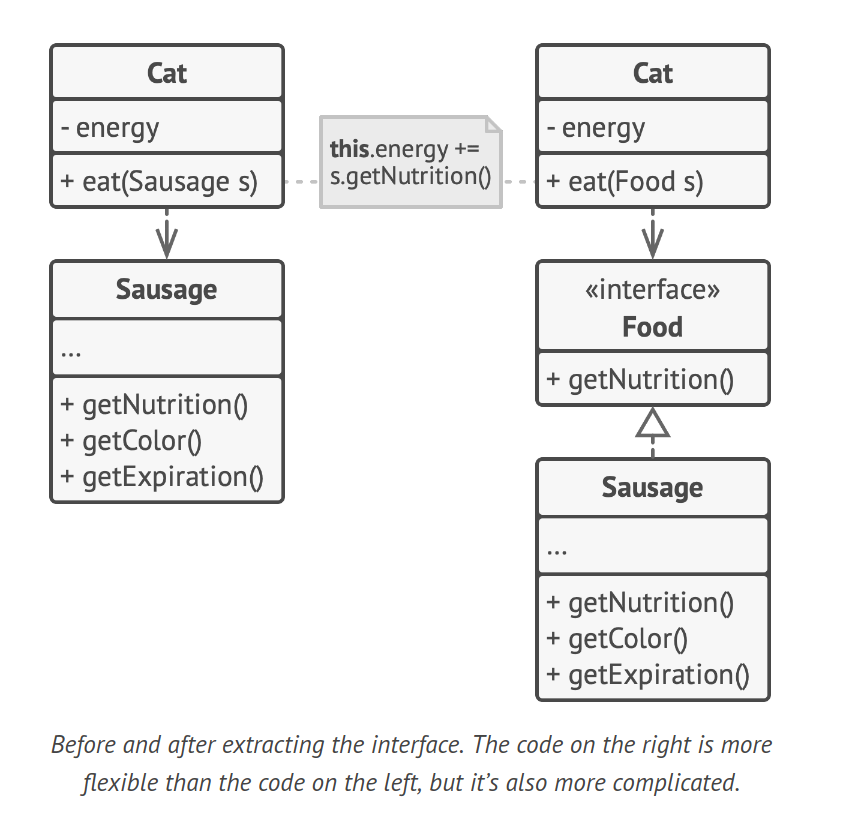
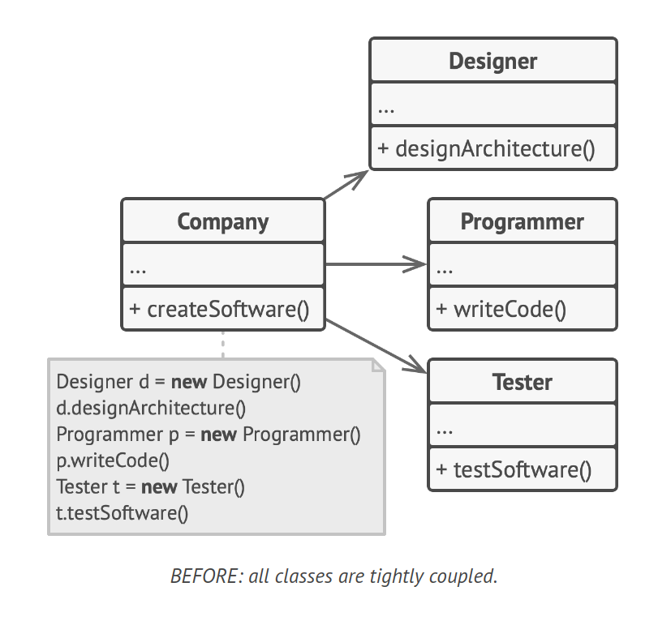
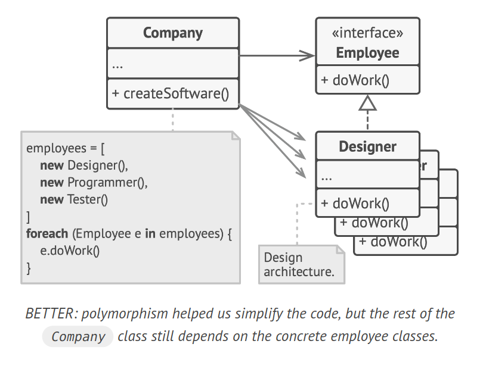
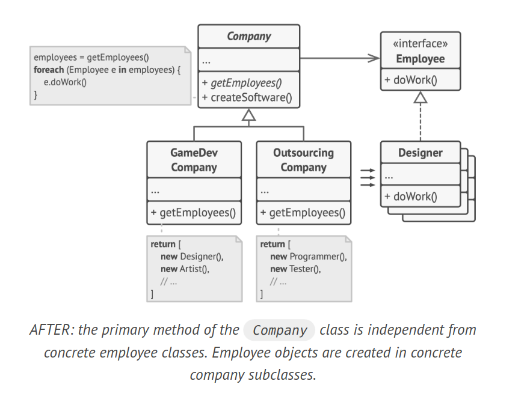

# Principle: Program to an Interface, not an Implementation

> Program to an interface, not an implementation. Depend
on abstractions, not on concrete classes

A flexible design is one that can be easily extended without breaking existing code. Consider a cat that can eat any food versus one that can only eat sausages. The former is more flexible because its diet can be extended with any food, while sausages are just a subset of "any food".

When setting up collaboration between two classes, one common approach is to make one class dependent on the other. However, a more flexible approach involves the following steps:

1. Identify what one object requires from the other, i.e., which methods it executes.
2. Define these methods in a new interface or abstract class.
3. Implement this interface in the class that is a dependency.
4. Make the second class dependent on the interface rather than the concrete class.



This approach allows for a more flexible connection between objects. Although the code may initially seem more complex, this setup can be beneficial for potential extension points or if others may want to extend your code.

## Example

Consider a software development company simulator with different classes representing various employee types.



```java
// BEFORE: All classes are tightly coupled.
class Designer {
    void design() {
        // Implementation
    }
}

class Programmer {
    void program() {
        // Implementation
    }
}

class Tester {
    void test() {
        // Implementation
    }
}

class Company {
    Designer designer = new Designer();
    Programmer programmer = new Programmer();
    Tester tester = new Tester();

    void doWork() {
        designer.design();
        programmer.program();
        tester.test();
    }
}
```

After doing that, we can apply polymorphism inside the
`Company` class, treating various employee objects via the
`Employee` interface.



```java
// AFTER: Polymorphism simplifies the code, but the Company class still depends on concrete employee classes.
interface Employee {
    void doWork();
}

class Designer implements Employee {
    public void doWork() {
        System.out.println("Designing...");
    }
}

class Programmer implements Employee {
    public void doWork() {
        System.out.println("Programming...");
    }
}

class Tester implements Employee {
    public void doWork() {
        System.out.println("Testing...");
    }
}

class Company {
    List<Employee> employees = Arrays.asList(new Designer(), new Programmer(), new Tester());

    void doWork() {
        for (Employee employee : employees) {
            employee.doWork();
        }
    }

    void createSoftware() {
        System.out.println("Starting software creation process...");
        doWork();
        System.out.println("Software creation process completed.");
    }
}
```

Despite the simplification, the `Company` class remains coupled to the employee classes. If we introduce new types of companies that work with other types of employees, we'll need to override most of the `Company` class instead of reusing the code.

To address this, we can declare the method for getting employees as abstract. Each concrete company will implement this method differently, creating only those employees that it needs.



```java
// AFTER: The primary method of the Company class is independent from concrete employee classes.
abstract class Company {
    List<Employee> employees;

    abstract List<Employee> getEmployees();

    void doWork() {
        employees = getEmployees();
        for (Employee employee : employees) {
            employee.doWork();
        }
    }

    void createSoftware() {
        System.out.println("Starting software creation process...");
        doWork();
        System.out.println("Software creation process completed.");
    }
}

class GameDevCompany extends Company {
    List<Employee> getEmployees() {
        return Arrays.asList(new Designer(), new Programmer());
    }
}

class OutsourcingCompany extends Company {
    List<Employee> getEmployees() {
        return Arrays.asList(new Tester());
    }
}
```

After this change, the `Company` class becomes independent from various employee classes. Now, we can extend this class and introduce new types of companies and employees while still reusing a portion of the base company class. Extending the base company class doesn't break any existing code that already relies on it.

This is an example of the Factory Method pattern in action, which we will discuss in detail later.
