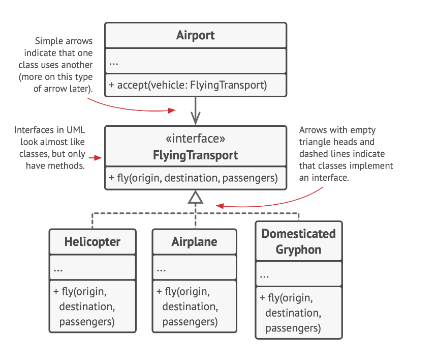

# Encapsulation

Encapsulation is another fundamental concept in Object-Oriented Programming. It's the ability of an object to hide parts of its state and behaviors from other objects, exposing only a limited interface to the rest of the program.

To illustrate, consider the example of starting a car engine. You only need to turn a key or press a button. You don’t need to connect wires under the hood, rotate the crankshaft and cylinders, and initiate the power cycle of the engine. These details are hidden under the hood of the car. You have only a simple interface: a start switch, a steering wheel, and some pedals. This illustrates how each object has an interface—a public part of an object, open to interactions with other objects.

To encapsulate something means to make it private, and thus accessible only from within the methods of its own class. There’s a less restrictive mode called protected that makes a member of a class available to subclasses as well.

Interfaces and abstract classes/methods of most programming languages are based on the concepts of abstraction and encapsulation. In modern object-oriented programming languages, the interface mechanism (usually declared with the `interface` or `protocol` keyword) lets you define contracts of interaction between objects.

Imagine that you have a `FlyingTransport` interface with a method `fly(origin, destination, passengers)`. When designing an air transportation simulator, you could restrict the `Airport` class to work only with objects that implement the `FlyingTransport` interface. After this, you can be sure that any object passed to an airport object, whether it’s an `Airplane`, a `Helicopter` or a `DomesticatedGryphon` would be able to arrive or depart from this type of airport.

You could change the implementation of the `fly` method in these classes in any way you want. As long as the signature of the method remains the same as declared in the interface, all instances of the `Airport` class can work with your flying objects just fine.
