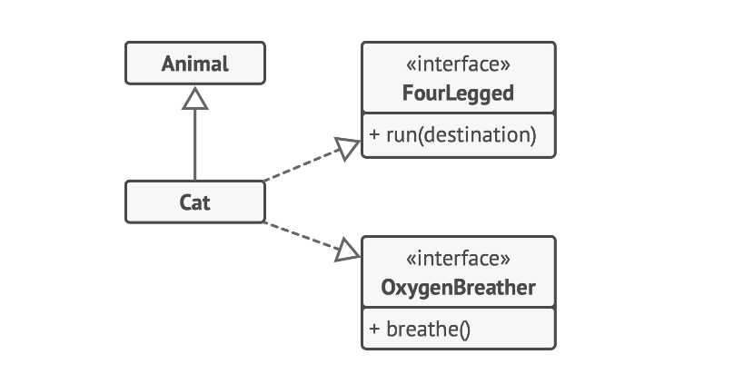

# Inheritance

Inheritance is another key concept in Object-Oriented Programming. It's the ability to build new classes on top of existing ones. The main benefit of inheritance is code reuse. If you want to create a class that’s slightly different from an existing one, there’s no need to duplicate code. Instead, you extend the existing class and put the extra functionality into a resulting subclass, which inherits fields and methods of the superclass.

The consequence of using inheritance is that subclasses have the same interface as their parent class. You can’t hide a method in a subclass if it was declared in the superclass. You must also implement all abstract methods, even if they don’t make sense for your subclass.



```java
interface FourLegged {
    void walk();
}

interface OxygenBreather {
    void breathe();
}

class Animal implements FourLegged, OxygenBreather {
    @Override
    public void walk() {
        System.out.println("Animal is walking on four legs.");
    }

    @Override
    public void breathe() {
        System.out.println("Animal is breathing oxygen.");
    }
}

class Cat extends Animal {
    @Override
    public void walk() {
        System.out.println("Cat is walking on four legs.");
    }

    @Override
    public void breathe() {
        System.out.println("Cat is breathing oxygen.");
    }
}
```

In most programming languages a subclass can extend only one superclass. On the other hand, any class can implement several interfaces at the same time. But, as mentioned before, if a superclass implements an interface, all of its subclasses must also implement it.

This concept allows us to create a hierarchy of classes that share common attributes and behaviors, but also have their own specific ones. It's a powerful tool for organizing code and making it more modular and easier to maintain.
