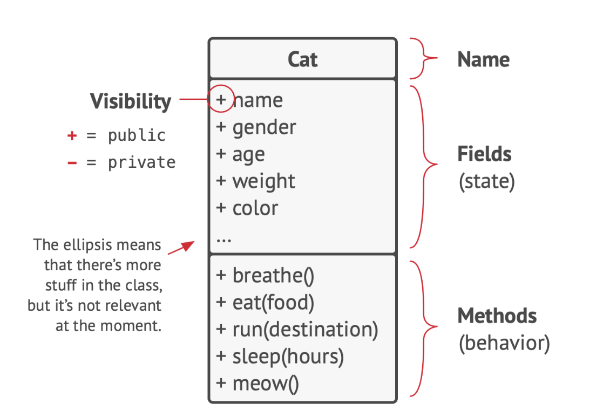
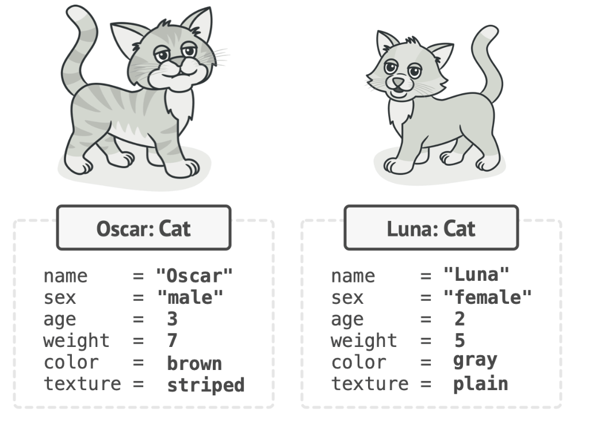
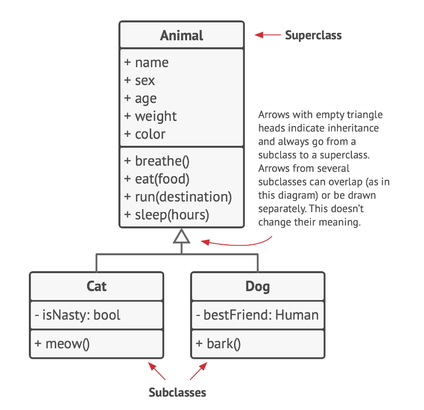
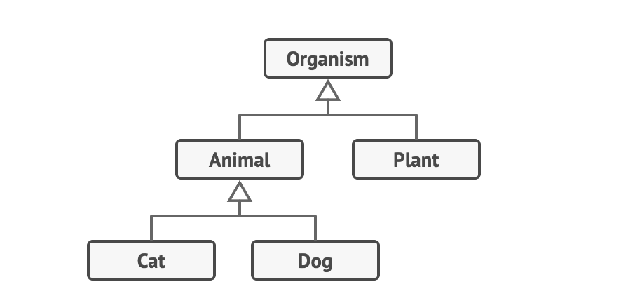
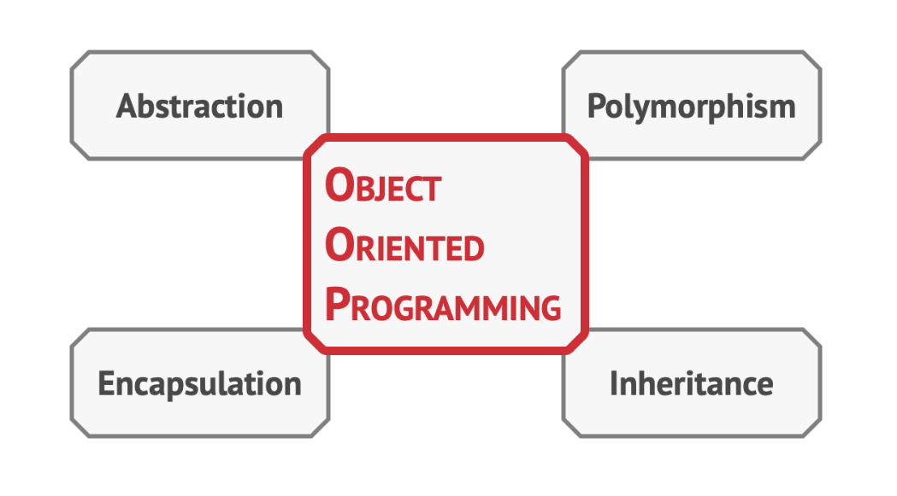

# Object Oriented Programming (OOP)

Object-oriented programming is a paradigm based on the con-
cept of wrapping pieces of data, and behavior related to that
data, into special bundles called objects, which are construct-
ed from a set of “blueprints”, defined by a programmer, called
classes.

## Objects, classes

To illustrate the concepts of Object-Oriented Programming (OOP), let's consider an example involving cats. 

Consider a cat named Oscar. In the context of OOP, Oscar is an object, specifically an instance of the `Cat` class. Each `Cat` object has a set of standard attributes, such as name, sex, age, weight, color, and favorite food. These attributes are known as the class's fields.

Cats also exhibit common behaviors, such as breathing, eating, running, sleeping, and meowing. In OOP, these behaviors are represented as the class's methods. Together, the fields and methods are referred to as the members of the class.

The data stored in an object's fields is often referred to as its state, while the object's methods define its behavior. In other words, objects are instances of classes, each with its own state and behavior.

Consider another cat, Luna, which belongs to your friend. Luna is also an instance of the `Cat` class and has the same set of attributes as Oscar. However, the values of these attributes differ: Luna is female, has a different color, and weighs less.

In summary, a class serves as a blueprint that defines the structure for objects, which are concrete instances of that class.

## Class hierarchies

## Understanding Class Hierarchies in OOP

While we've discussed the concept of a single class, real-world programs typically involve multiple classes. Some of these classes may be organized into class hierarchies. Let's delve into what this means.

Consider a dog named Fido, owned by your neighbor. Interestingly, dogs and cats share several common attributes, such as name, sex, age, and color. They also exhibit similar behaviors, such as breathing, sleeping, and running. This commonality suggests that we can define a base `Animal` class that encapsulates these shared attributes and behaviors.

Such a base class is referred to as a superclass, and its derivatives are known as subclasses. Subclasses inherit the state and behavior from their superclass, defining only the attributes or behaviors that are unique to them. For instance, the `Cat` class might have a `meow` method, while the `Dog` class has a `bark` method.

In response to specific business requirements, we might further generalize our class structure. For example, we could create an `Organism` class that serves as a superclass for `Animal` and `Plant` classes. This structure forms a class hierarchy, where the `Cat` class inherits attributes and behaviors from both the `Animal` and `Organism` classes.

In a class hierarchy, subclasses have the ability to override the methods they inherit from their parent classes. This override can either completely replace the default behavior or augment it with additional functionality.

## Pillars of OOP

Object-Oriented Programming (OOP) is a programming paradigm that uses objects and their interactions to design applications and software. It provides a clear modular structure for programs. The key principles of OOP are encapsulation, inheritance, and polymorphism.

