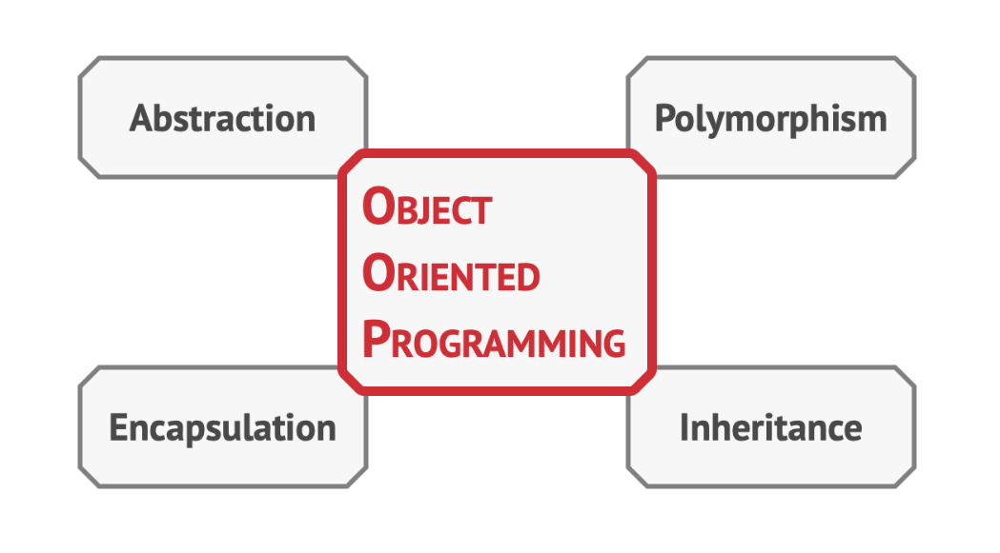

# Design Patterns in Java

In software engineering, a design pattern is a general repeatable solution to a commonly occurring problem in software design. A design pattern isn't a finished design that can be transformed directly into code. It is a description or template for how to solve a problem that can be used in many different situations.

## Uses of Design Patterns

Design patterns can speed up the development process by providing tested, proven development paradigms. Effective software design requires considering issues that may not become visible until later in the implementation. Reusing design patterns helps to prevent subtle issues that can cause major problems and improves code readability for coders and architects familiar with the patterns.

Design patterns provide general solutions, documented in a format that doesn't require specifics tied to a particular problem. In addition, patterns allow developers to communicate using well-known, well understood names for software interactions. Common design patterns can be improved over time, making them more robust than ad-hoc designs.

This repository contains examples of design patterns implemented in Java. Each folder in the repository represents a different design pattern. Inside each folder, you'll find a Java implementation of the pattern and a `README.md` file explaining the pattern.

## Object Oriented Programming (OOP)

Object-Oriented Programming (OOP) is a programming paradigm that uses objects and their interactions to design applications and software. It provides a clear modular structure for programs. The key principles of OOP are encapsulation, inheritance, and polymorphism.



### Polymorphism

Polymorphism is a principle in OOP that allows objects of different types to be treated as objects of a parent type. It's like taking an animal from a bag - we don't know for sure what it is. However, if we cuddle it hard enough, the animal will emit a specific sound of joy, depending on its concrete class.

The program doesn't know the concrete type of the object contained inside the `a` variable; but, thanks to the special mechanism called polymorphism, the program can trace down the subclass of the object whose method is being executed and run the appropriate behavior.

Polymorphism is the ability of a program to detect the real class of an object and call its implementation even when its real type is unknown in the current context. You can also think of polymorphism as the ability of an object to "pretend" to be something else, usually a class it extends or an interface it implements. In our example, the dogs and cats in the bag were pretending to be generic animals.

```java
Animal[] bag = {new Cat(), new Dog()};

for (Animal a : bag) {
    a.makeSound();
}

// Output:
// Meow!
// Woof!
```

### Inheritance

Inheritance is another key concept in Object-Oriented Programming. It's the ability to build new classes on top of existing ones. The main benefit of inheritance is code reuse. If you want to create a class that’s slightly different from an existing one, there’s no need to duplicate code. Instead, you extend the existing class and put the extra functionality into a resulting subclass, which inherits fields and methods of the superclass.

The consequence of using inheritance is that subclasses have the same interface as their parent class. You can’t hide a method in a subclass if it was declared in the superclass. You must also implement all abstract methods, even if they don’t make sense for your subclass.

In most programming languages a subclass can extend only one superclass. On the other hand, any class can implement several interfaces at the same time. But, as mentioned before, if a superclass implements an interface, all of its subclasses must also implement it.

This concept allows us to create a hierarchy of classes that share common attributes and behaviors, but also have their own specific ones. It's a powerful tool for organizing code and making it more modular and easier to maintain.

### Encapsulation

Encapsulation is another fundamental concept in Object-Oriented Programming. It's the ability of an object to hide parts of its state and behaviors from other objects, exposing only a limited interface to the rest of the program.

To illustrate, consider the example of starting a car engine. You only need to turn a key or press a button. You don’t need to connect wires under the hood, rotate the crankshaft and cylinders, and initiate the power cycle of the engine. These details are hidden under the hood of the car. You have only a simple interface: a start switch, a steering wheel, and some pedals. This illustrates how each object has an interface—a public part of an object, open to interactions with other objects.

To encapsulate something means to make it private, and thus accessible only from within the methods of its own class. There’s a less restrictive mode called protected that makes a member of a class available to subclasses as well.

Interfaces and abstract classes/methods of most programming languages are based on the concepts of abstraction and encapsulation. In modern object-oriented programming languages, the interface mechanism (usually declared with the `interface` or `protocol` keyword) lets you define contracts of interaction between objects.

Imagine that you have a `FlyingTransport` interface with a method `fly(origin, destination, passengers)`. When designing an air transportation simulator, you could restrict the `Airport` class to work only with objects that implement the `FlyingTransport` interface. After this, you can be sure that any object passed to an airport object, whether it’s an `Airplane`, a `Helicopter` or a `DomesticatedGryphon` would be able to arrive or depart from this type of airport.

You could change the implementation of the `fly` method in these classes in any way you want. As long as the signature of the method remains the same as declared in the interface, all instances of the `Airport` class can work with your flying objects just fine.

### Abstraction

Abstraction is a key concept in Object-Oriented Programming. It's the process of hiding the implementation details and showing only the functionality to the users. In other words, it deals with the outside view of an object (interface).

Most of the time when you’re creating a program with OOP, you shape objects of the program based on real-world objects. However, objects of the program don’t represent the originals with 100% accuracy (and it’s rarely required that they do). Instead, your objects only model attributes and behaviors of real objects in a specific context, ignoring the rest.

For example, an `Airplane` class could probably exist in both a flight simulator and a flight booking application. But in the former case, it would hold details related to the actual flight, whereas in the latter class you would care only about the seat map and which seats are available.

Abstraction is a model of a real-world object or phenomenon, limited to a specific context, which represents all details relevant to this context with high accuracy and omits all the rest. This allows us to reduce complexity by splitting our system into smaller parts.

## Relations Between Objects

In addition to inheritance and implementation, there are other types of relations between objects:

### Dependency

Dependency is the most basic and the weakest type of relations between classes. There is a dependency between two classes if some changes to the definition of one class might result in modifications to another class. Dependency typically occurs when you use concrete class names in your code.

### Association

Association is a relationship in which one object uses or interacts with another. In UML diagrams, the association relationship is shown by a simple arrow drawn from an object and pointing to the object it uses. Association can be seen as a specialized kind of dependency, where an object always has access to the objects with which it interacts.

### Aggregation

Aggregation is a specialized type of association that represents “one-to-many”, “many-to-many” or “whole-part” relations between multiple objects. Usually, under aggregation, an object “has” a set of other objects and serves as a container or collection.

### Composition

Composition is a specific kind of aggregation, where one object is composed of one or more instances of the other. The distinction between this relation and others is that the component can only exist as a part of the container.

### Implementation

Implementation is when a class defines methods declared in an interface. Objects of the class can be treated as objects of the interface.

## Patterns

The patterns are divided into three categories: Creational, Structural, and Behavioral.

### Creational Design Patterns

These design patterns are all about class instantiation. This pattern can be further divided into class-creation patterns and object-creational patterns. While class-creation patterns use inheritance effectively in the instantiation process, object-creation patterns use delegation effectively to get the job done.

- [Abstract Factory](./AbstractFactory)
- [Builder](./Builder)
- [Factory Method](./FactoryMethod)
- [Object Pool](./ObjectPool)
- [Prototype](./Prototype)
- [Singleton](./Singleton)

### Structural Design Patterns

These design patterns are all about Class and Object composition. Structural class-creation patterns use inheritance to compose interfaces. Structural object-patterns define ways to compose objects to obtain new functionality.

- [Adapter](./Adapter)
- [Bridge](./Bridge)
- [Composite](./Composite)
- [Decorator](./Decorator)
- [Facade](./Facade)
- [Flyweight](./Flyweight)
- [Private Class Data](./PrivateClassData)
- [Proxy](./Proxy)

### Behavioral Design Patterns

These design patterns are all about Class's objects communication. Behavioral patterns are those patterns that are most specifically concerned with communication between objects.

- [Chain of responsibility](./ChainOfResponsibility)
- [Command](./Command)
- [Interpreter](./Interpreter)
- [Iterator](./Iterator)
- [Mediator](./Mediator)
- [Memento](./Memento)
- [Null Object](./NullObject)
- [Observer](./Observer)
- [State](./State)
- [Strategy](./Strategy)
- [Template method](./TemplateMethod)
- [Visitor](./Visitor)

## Criticism

The concept of design patterns has been criticized by some in the field of computer science. The criticisms include targeting the wrong problem, lacking formal foundations, leading to inefficient solutions, and not differing significantly from other abstractions.

## Usage

To run the examples, navigate to the directory of the pattern you want to explore and compile the Java files.

```bash
cd strategy
javac *.java
java Main
```

## Contributing
Contributions are welcome. Please open an issue or submit a pull request.

## License
MIT