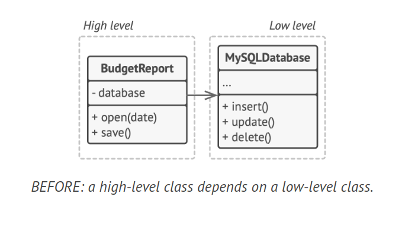
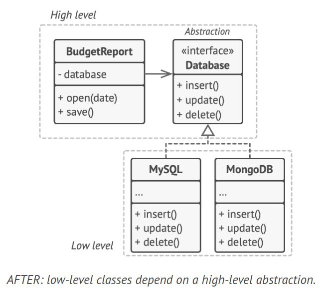

# Dependency Inversion Principle

> High-level classes shouldn’t depend on low-level class-
es. Both should depend on abstractions. Abstractions
shouldn’t depend on details. Details should depend on
abstractions.

The Dependency Inversion Principle (DIP) suggests that high-level modules, which provide complex logic, should be easily reusable and unaffected by changes in low-level modules, which provide utility features. To achieve this, DIP introduces a few key points:

1. High-level modules should not depend on low-level modules. Both should depend on abstractions.
2. Abstractions should not depend on details. Details should depend on abstractions.

## Description

In many cases, high-level modules depend on low-level modules, which can make the high-level modules difficult to reuse and maintain. DIP addresses this issue by ensuring that high-level modules depend on abstractions, not on concrete implementations of low-level modules.

This principle often goes hand in hand with the Open/Closed Principle: you can extend low-level modules without affecting high-level modules if both depend on the same abstractions.

## Example

Consider a high-level `BudgetReport` class that uses a low-level `Database` class for reading and persisting its data. Any change in the `Database` class, such as when a new version of the database server gets released, may affect the `BudgetReport` class, which isn't supposed to care about the data storage details.

### Before

In this scenario, the high-level class depends on a low-level class.



```java
class MySQLDatabase {
    void insert() {
        System.out.println("MySQLDatabase inserting...");
    }

    void update() {
        System.out.println("MySQLDatabase updating...");
    }

    void delete() {
        System.out.println("MySQLDatabase deleting...");
    }

    void read(String date) {
        System.out.println("MySQLDatabase reading data of date: " + date);
    }
}

class BudgetReport {
    private MySQLDatabase database;

    BudgetReport(MySQLDatabase database) {
        this.database = database;
    }

    void open(String date) {
        database.read(date);
    }

    void save() {
        database.update();
    }
}
```

### After

To fix this problem, you can create a high-level interface that describes read/write operations and make the `BudgetReport` class use that interface instead of the `Database` class. Then you can change or extend the `Database` class to implement the new read/write interface declared by the business logic.



```java
interface Database {
    void read(String date);
    void update();
}

class MySQLDatabase implements Database {
    public void read(String date) {
        System.out.println("MySQLDatabase reading data of date: " + date);
    }

    public void update() {
        System.out.println("MySQLDatabase updating...");
    }
}

class MongoDBDatabase implements Database {
    public void read(String date) {
        System.out.println("MongoDBDatabase reading data of date: " + date);
    }

    public void update() {
        System.out.println("MongoDBDatabase updating...");
    }
}

class BudgetReport {
    private Database database;

    BudgetReport(Database database) {
        this.database = database;
    }

    void open(String date) {
        database.read(date);
    }

    void save() {
        database.update();
    }
}
```

As a result, the direction of the original dependency has been inverted: low-level classes are now dependent on high-level abstractions.
