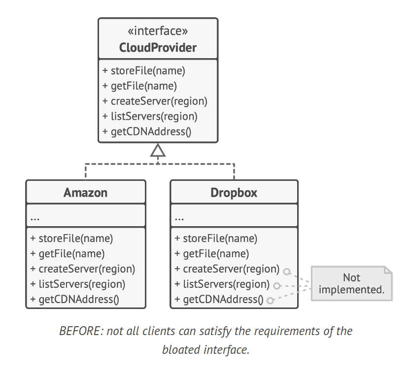
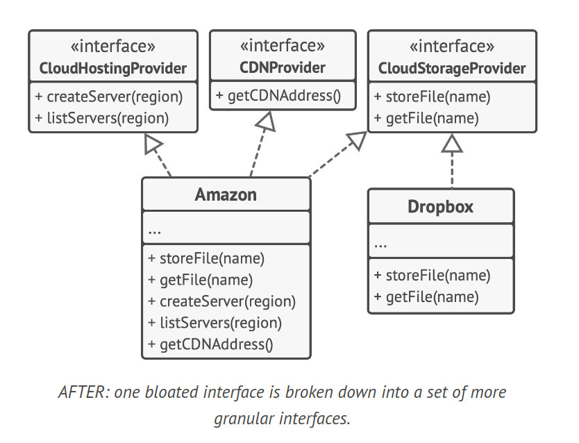

# Interface Segregation Principle

> Clients shouldn’t be forced to depend on methods they
do not use

The Interface Segregation Principle (ISP) states that no client should be forced to depend on interfaces they do not use. This principle deals with the disadvantages of "fat" interfaces.

## Description

Interfaces are a powerful tool in object-oriented programming. They define a contract for classes to follow. However, when an interface becomes too "fat" or bloated, it can become a problem. A "fat" interface is one that has too many responsibilities, forcing implementing classes to handle methods they don't need.

According to the ISP, you should break down these "fat" interfaces into more granular and specific ones. Clients should implement only those methods that they really need. Otherwise, a change to a "fat" interface would break even clients that don’t use the changed methods.

Class inheritance lets a class have just one superclass, but it doesn’t limit the number of interfaces that the class can implement at the same time. Hence, there’s no need to cram tons of unrelated methods to a single interface. Break it down into several more refined interfaces—you can implement them all in a single class if needed. However, some classes may be fine with implementing just one of them.

## Example

Imagine that you created a library that makes it easy to integrate apps with various cloud computing providers. While in the initial version it only supported Amazon Cloud, it covered the full set of cloud services and features.

At the time you assumed that all cloud providers have the same broad spectrum of features as Amazon. But when it came to implementing support for another provider, it turned out that most of the interfaces of the library are too wide. Some methods describe features that other cloud providers just don’t have.

### Before

Not all clients can satisfy the requirements of the bloated interface. While you can still implement these methods and put some stubs there, it wouldn’t be a pretty solution.



```java
interface CloudProvider {
    void storeFile(String name);
    String getFile(String name);
    void createServer(String region);
    String listServer(String region);
    String getCDNAddress();
}

class Amazon implements CloudProvider {
    public void storeFile(String name) {
        System.out.println("Amazon storing file: " + name);
    }

    public String getFile(String name) {
        System.out.println("Amazon getting file: " + name);
        return name;
    }

    public void createServer(String region) {
        System.out.println("Amazon creating server in region: " + region);
    }

    public String listServer(String region) {
        System.out.println("Amazon listing servers in region: " + region);
        return region;
    }

    public String getCDNAddress() {
        System.out.println("Amazon getting CDN address");
        return "Amazon CDN address";
    }
}

class Dropbox implements CloudProvider {
    public void storeFile(String name) {
        System.out.println("Dropbox storing file: " + name);
    }

    public String getFile(String name) {
        System.out.println("Dropbox getting file: " + name);
        return name;
    }

    public void createServer(String region) {
        throw new UnsupportedOperationException("Dropbox doesn't support this operation");
    }

    public String listServer(String region) {
        throw new UnsupportedOperationException("Dropbox doesn't support this operation");
    }

    public String getCDNAddress() {
        throw new UnsupportedOperationException("Dropbox doesn't support this operation");
    }
}
```

### After

The better approach is to break down the interface into parts. Classes that are able to implement the original interface can now just implement several refined interfaces. Other classes can implement only those interfaces which have methods that make sense for them.



```java
interface CloudStorageProvider {
    void storeFile(String name);
    String getFile(String name);
}

interface CloudHostingProvider {
    void createServer(String region);
    String listServer(String region);
}

interface CDNProvider {
    String getCDNAddress();
}

class Amazon implements CloudStorageProvider, CloudHostingProvider, CDNProvider {
    public void storeFile(String name) {
        System.out.println("Amazon storing file: " + name);
    }

    public String getFile(String name) {
        System.out.println("Amazon getting file: " + name);
        return name;
    }

    public void createServer(String region) {
        System.out.println("Amazon creating server in region: " + region);
    }

    public String listServer(String region) {
        System.out.println("Amazon listing servers in region: " + region);
        return region;
    }

    public String getCDNAddress() {
        System.out.println("Amazon getting CDN address");
        return "Amazon CDN address";
    }
}

class Dropbox implements CloudStorageProvider {
    public void storeFile(String name) {
        System.out.println("Dropbox storing file: " + name);
    }

    public String getFile(String name) {
        System.out.println("Dropbox getting file: " + name);
        return name;
    }
}
```

One bloated interface is broken down into a set of more granular interfaces.

## Conclusion

As with the other principles, you can go too far with this one. Don’t further divide an interface which is already quite specific. Remember that the more interfaces you create, the more complex your code becomes. Keep the balance.
