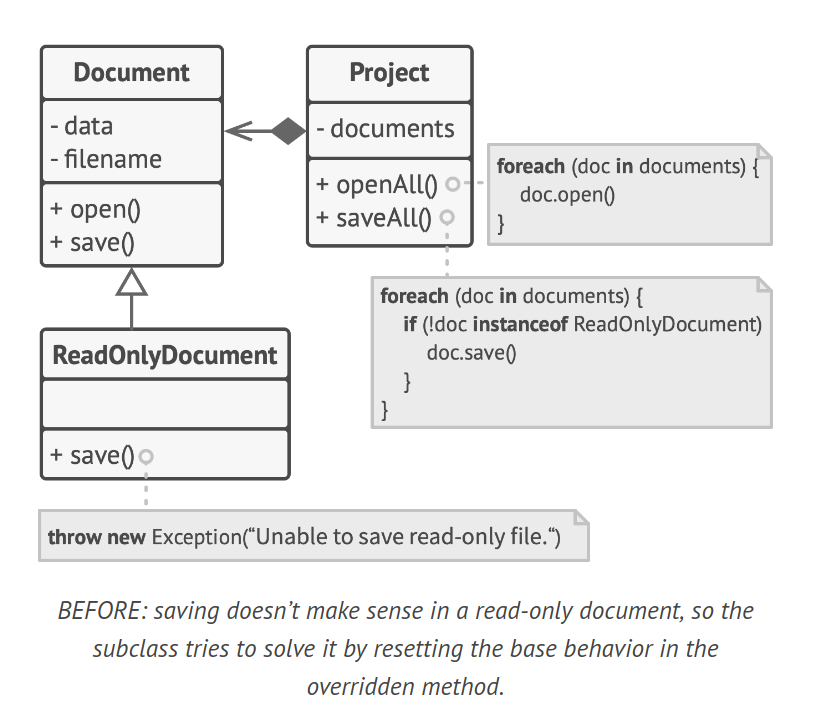
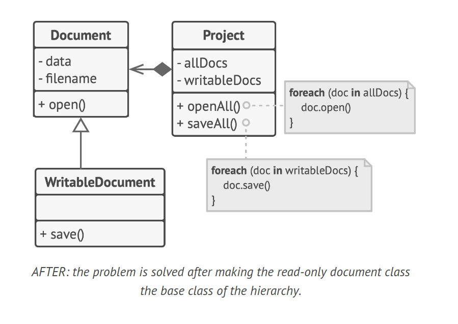

# Liskov Substitution Principle

The Liskov Substitution Principle (LSP) is a concept in Object-Oriented Programming that states that subclasses should remain compatible with the behavior of the superclass. This principle is named after Barbara Liskov, who defined it in 1987 in her work.

## Key Concepts

- **Parameter types**: In a subclass method, parameter types should match or be more abstract than those in the superclass method.
- **Return types**: The return type in a subclass method should match or be a subtype of the return type in the superclass method.
- **Exceptions**: A method in a subclass shouldn’t throw types of exceptions which the base method isn’t expected to throw.
- **Pre-conditions**: A subclass shouldn’t strengthen pre-conditions.
- **Post-conditions**: A subclass shouldn’t weaken post-conditions.
- **Invariants**: Invariants of a superclass must be preserved in the subclass.
- **Private fields**: A subclass shouldn’t change values of private fields of the superclass.

## Example

Consider a hierarchy of document classes that violates the LSP. A `ReadOnlyDocument` subclass has a `save` method that throws an exception if someone tries to call it. The base method doesn’t have this restriction, which means that the client code will break if we don’t check the document type before saving it.



```java
class Document {
    String data;
    String filename;

    void open() {
        // Open the document
    }

    void save() {
        // Save the document
    }
}

class ReadOnlyDocument extends Document {
    @Override
    void save() {
        throw new UnsupportedOperationException("Unable to save read-only file.");
    }
}

class Project extends Document {
    List<Document> documents;

    void openAll() {
        for (Document doc : documents) {
            doc.open();
        }
    }

    void saveAll() {
        for (Document doc : documents) {
            if (!(doc instanceof ReadOnlyDocument)) {
                doc.save();
            }
        }
    }
}
```

This problem can be solved by redesigning the class hierarchy. The `ReadOnlyDocument` becomes the base class of the hierarchy, and the `WritableDocument` is now a subclass which extends the base class and adds the saving behavior.



```java
// AFTER
class Document {
    String data;
    String filename;

    void open() {
        System.out.println("Reading document: " + filename);
    }
}

class WritableDocument extends Document {
    void save() {
        System.out.println("Writing document: " + filename);
    }
}

class Project extends Document {
    List<Document> allDocs;
    List<WritableDocument> writableDocs;

    void openAll() {
        for (Document doc : allDocs) {
            doc.open();
        }
    }

    void saveAll() {
        for (WritableDocument doc : writableDocs) {
            doc.save();
        }
    }
}
```

## Conclusion

The Liskov Substitution Principle is critical when developing libraries and frameworks because your classes are going to be used by other people whose code you can’t directly access and change. It helps to ensure that a subclass remains compatible with the code that was able to work with objects of the superclass.
