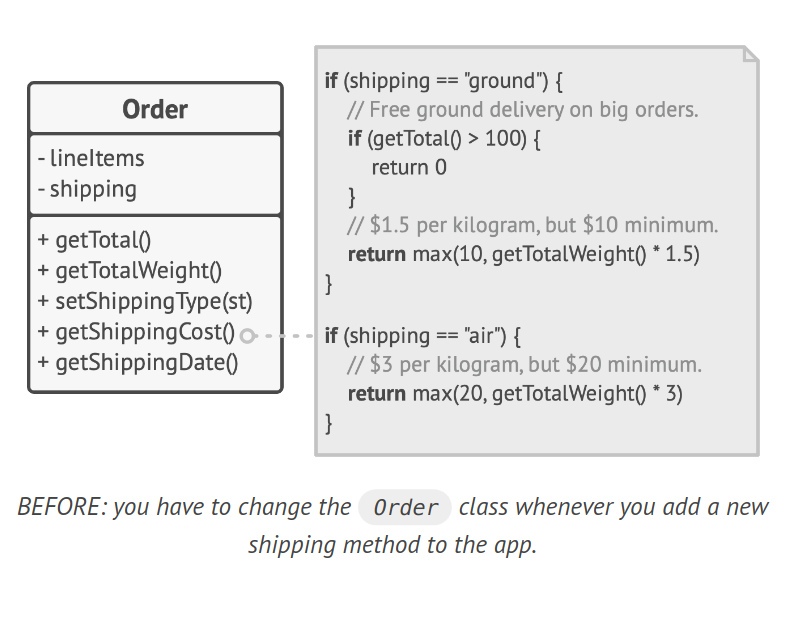
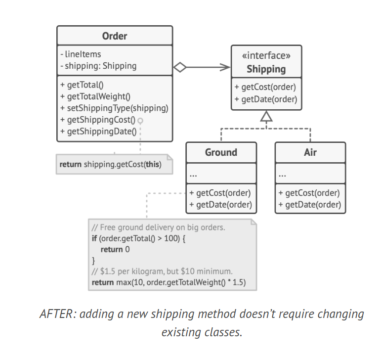

# Open/Closed Principle

> Classes should be open for extension but closed for
modification.

The Open/Closed Principle states that a class should be open for extension but closed for modification. This means that a class should be developed in a way that it can allow its behavior to be extended without modifying its source code.

A class is considered open if it can be extended or subclassed, and it's considered closed if it's ready to be used by other classes. This principle aims to prevent any issues that might arise from changing existing code when implementing new features.

## Example

Consider an e-commerce application with an `Order` class that calculates shipping costs. If all shipping methods are hardcoded inside the `Order` class, adding a new shipping method would require changing the `Order` class, risking potential breakage.

**BEFORE**: You have to change the `Order` class whenever you add a new shipping method to the app.



```java
class Order {
    List<Item> lineItems;
    String shipping;

    double getTotal() {
        // Calculate total...
    }

    double getTotalWeight() {
        // Calculate total weight...
    }

    String getShippingType() {
        return this.shipping;
    }

    Date getShippingDate() {
        // Calculate shipping date...
    }

    double getShippingCost() {
        if (shipping.equals("ground")) {
            if (getTotal() > 100) return 0;
            else return Math.max(10, getTotalWeight() * 1.5);
        }
        if (shipping.equals("air")) {
            return Math.max(10, getTotalWeight() * 3);
        }
        return 0;
    }
}
```

To solve this problem, you can apply the Strategy pattern. Start by extracting shipping methods into separate classes with a common interface.

**AFTER**: Adding a new shipping method doesn't require changing existing classes.

Now, when you need to implement a new shipping method, you can derive a new class from the `Shipping` interface without touching any of the `Order` class' code. The client code of the `Order` class will link orders with a shipping object of the new class whenever the user selects this shipping method in the UI.



```java
interface Shipping {
    double getCost(Order order);
    Date getDate(Order order);
}

class Ground implements Shipping {
    public double getCost(Order order) {
        if (order.getTotal() > 100) return 0;
        else return Math.max(10, order.getTotalWeight() * 1.5);
    }

    public Date getDate(Order order) {
        // Calculate shipping date for ground shipping...
        return order.getShippingDate();
    }
}

class Air implements Shipping {
    public double getCost(Order order) {
        return Math.max(10, order.getTotalWeight() * 3);
    }

    public Date getDate(Order order) {
        // Calculate shipping date for air shipping...
        return order.getShippingDate();
    }
}

class Order {
    List<Item> lineItems;
    Shipping shipping;

    Order(List<Item> lineItems, Shipping shipping) {
        this.lineItems = lineItems;
        this.shipping = shipping;
    }

    double getTotal() {
        // Calculate total...
        return lineItems.stream().mapToDouble(Item::getPrice).sum();
    }

    double getTotalWeight() {
        // Calculate total weight...
        return lineItems.stream().mapToDouble(Item::getWeight).sum();
    }

    double getShippingCost() {
        return shipping.getCost(this);
    }

    Date getShippingDate() {
        return shipping.getDate(this);
    }
}
```

As a bonus, this solution lets you move the delivery time calculation to more relevant classes, adhering to the Single Responsibility Principle.
