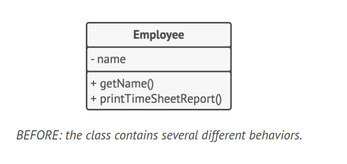
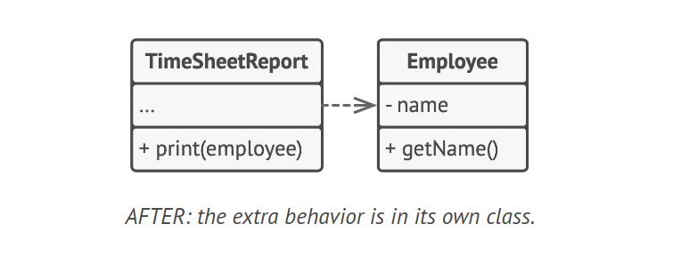

# Single Responsibility Principle

The Single Responsibility Principle states that a class should have just one reason to change. This means that every class should be responsible for a single part of the functionality provided by the software, and that responsibility should be entirely encapsulated by the class.

The main goal of this principle is reducing complexity. It's not necessary to invent a sophisticated design for a small program. However, as your program grows and changes, classes can become so large that it's hard to remember their details. Code navigation slows down, and you may have to scan through whole classes or even an entire program to find specific things. If a class does too many things, you risk breaking other parts of the class when you make changes.

If you find it hard to focus on specific aspects of the program one at a time, it may be time to divide some classes into parts.

## Example

Consider an `Employee` class that manages employee data and also formats a timesheet report. This class has two reasons to change: changes to the employee data management and changes to the format of the timesheet report.

**BEFORE**: The `Employee` class contains several different behaviors.



```java
class Employee {
    String name;
    String position;
    // Other employee data...

    // Methods for managing employee data...
    void printReport() {
        // Code for formatting and printing the timesheet report...
        System.out.println("Printing timesheet report for " + employee.getName());
    }
}
```

To solve this problem, move the behavior related to printing timesheet reports into a separate class. This allows you to move other report-related code to the new class as well.

**AFTER**: The timesheet report formatting behavior is in its own class, and the `Employee` class is now responsible for managing employee data only.



```java
class Employee {
    String name;
    String position;
    // Other employee data...

    // Methods for managing employee data...
}

class TimesheetReport {
    Employee employee;

    TimesheetReport(Employee employee) {
        this.employee = employee;
    }

    void printReport() {
        // Code for formatting and printing the timesheet report...
        System.out.println("Printing timesheet report for " + employee.name);
    }
}
```
